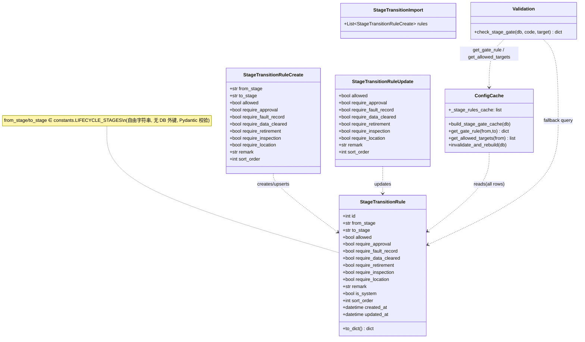
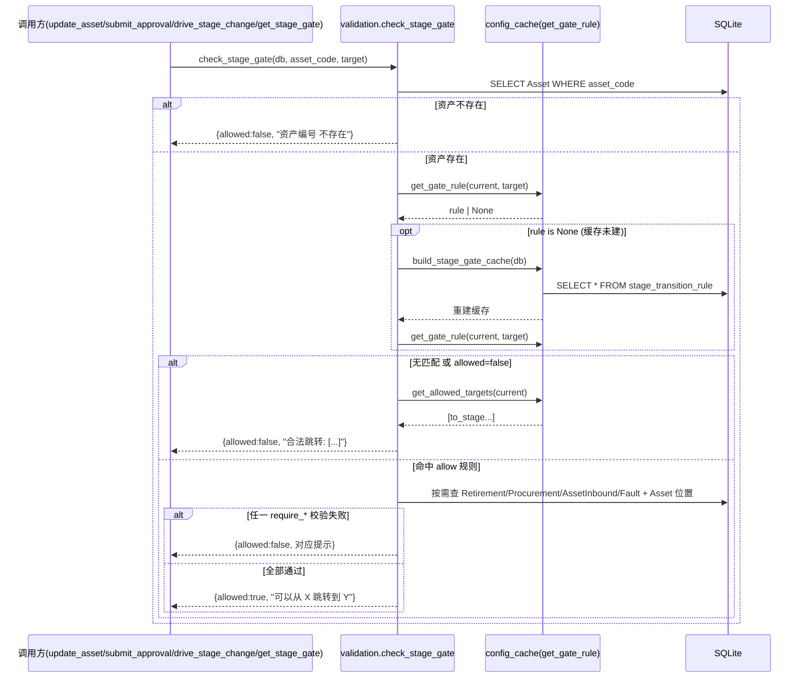
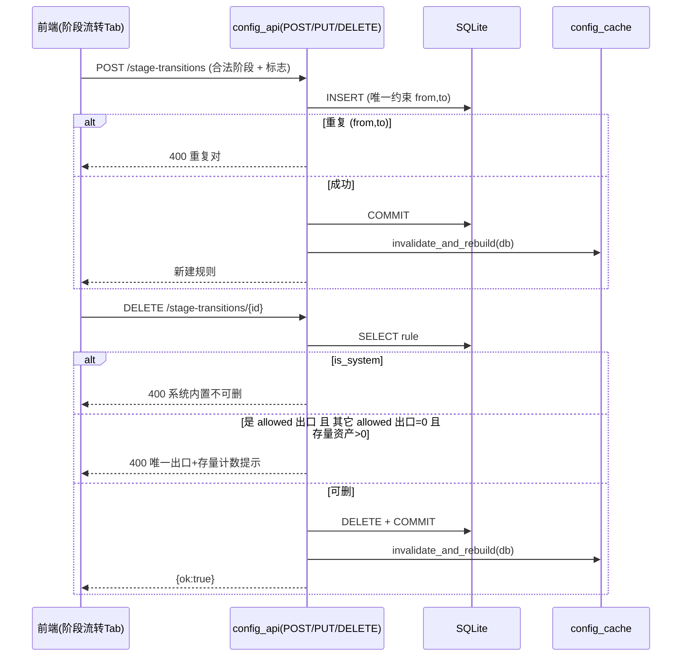
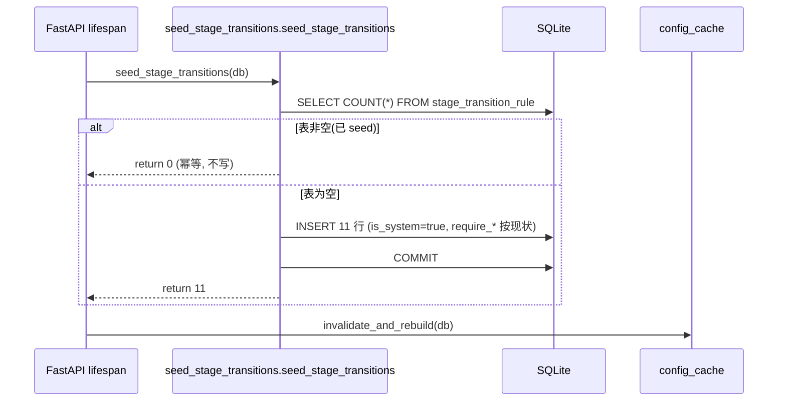
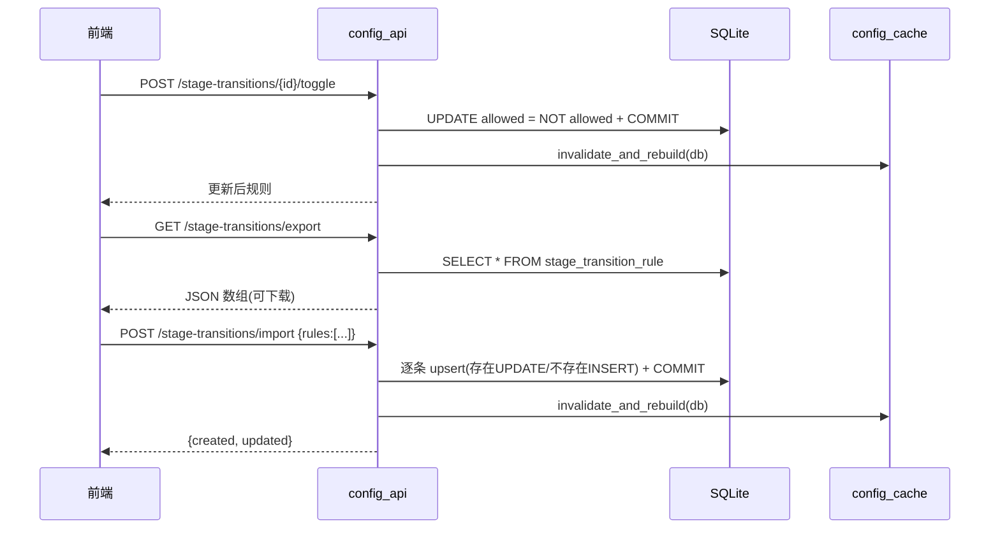
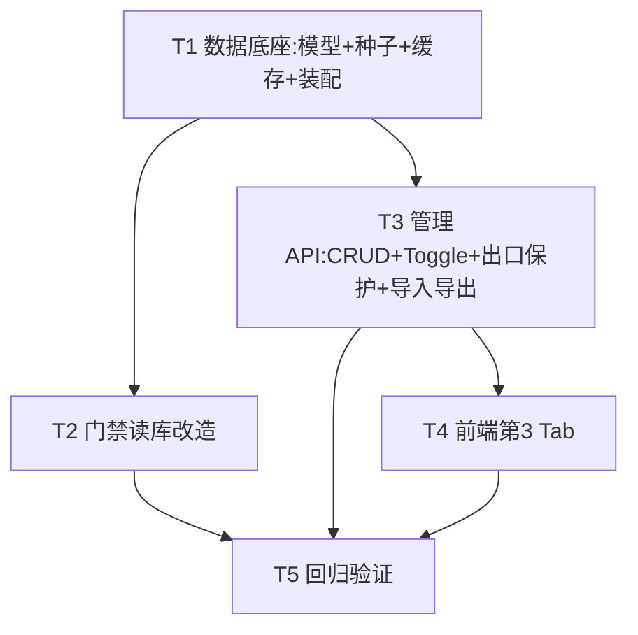

# 架构设计文档（增量）：系统配置模块 P1 — 阶段流转矩阵可配置

> 文档版本：v1.0（架构师产出，供工程师实现）
> 作者：高见远（software-architect）
> 日期：2026-07-09
> 依赖：P0 配置中心已落地并生产验证（字典/枚举 + 资产分类 + `/api/config` + `config:manage` + 缓存失效 + `count_references`）。本文档为**增量设计**，只描述 P1 新增/变更部分，复用 P0 能力处注明「复用」。
> 配套 PRD：`asset-lifecycle-manager/PRD_系统配置模块_P1.md`
> 配套 P0 设计：`asset-lifecycle-manager/deliverables/design-config-module-P0.md`

---

## 0. 主理人已拍板结论（O1–O5）与设计基线

| 编号 | 结论 | 对设计的影响 |
|------|------|--------------|
| O1 | 前置条件 **一并数据化**——抽成 `stage_transition_rule` 的标志列（seed=现状 4 类），门禁整体读库 | 模型含 5 个 `require_*` 标志；`check_stage_gate` 读表后按标志执行前置校验 |
| O2 | 删除规则时**出口保护**——若该 `from_stage` 唯一 `allowed` 出口被删且存在存量资产 → 禁止删除并提示该阶段存量计数 | `DELETE /stage-transitions/{id}` 增加出口判断（复用 `count_references` 思路） |
| O3 | `LIFECYCLE_STAGES` **维持 constants 不变**；下拉取 `dropdowns.lifecycle_stages` | 阶段枚举不数据化；模型 `from_stage/to_stage` 为自由字符串，按 `constants.LIFECYCLE_STAGES` 校验 |
| O4 | 导入用 **JSON + upsert**（`(from_stage,to_stage)` 存在则更新、否则插入） | `POST /stage-transitions/import` 语义；导出返回 JSON 数组 |
| O5 | `require_approval` **仅落库默认 true，运行时暂不生效** | 模型含该列并 seed=true；P1 门禁**不**读取它（"免审批直改"留 P2-04） |

**硬约束（来自 team-lead）**
- 唯一硬编码流转矩阵位于 `validation.check_stage_gate`；改写它后 **4 个调用方零改动**自动切换。
- 明确 **OUT OF SCOPE**：`workflow_engine.validate_stage` 的阶段清单、`get_target_stage`、阶段列表数据化、规则变更审计/版本、审批路由联动。

---

## 1. 实现方案（Implementation Approach）

### 1.1 技术栈与依赖
- 后端：FastAPI + SQLAlchemy 1.4+ + SQLite（**沿用现有，无新增第三方依赖**）。
- 前端：Vue3 单文件 SPA（`frontend/index.html`，CDN 引 Vue/Element Plus），**无构建步骤、无新依赖**。
- 结论：**P1 不引入任何新包**（`requirements.txt` 不变）。

### 1.2 核心难点与对策
| 难点 | 对策 |
|------|------|
| 去硬编码：11 对矩阵 + 4 类前置条件下沉 DB | 新增 `stage_transition_rule` 表；`seed_stage_transitions.py` 幂等写入现状；`check_stage_gate` 改为读表 |
| 存量零风险（V2） | `check_stage_gate` 读库后逐条等价于原硬编码逻辑（见 §3.4 / §4.1），返回契约 `{"allowed":bool,"message":str}` 不变 → 4 调用方零改动 |
| 出口保护（O2） | 删除前统计 `from_stage` 的其它 `allowed` 出口 + `assets` 该阶段存量；唯一出口且存量>0 则 400 拒绝 |
| 即时生效 | 写 API 成功后复用 P0 `invalidate_and_rebuild(db)`，新增阶段流转缓存随之重建 |
| 引用/冲突保护范式一致 | 复用 P0 `config:manage` 权限、`invalidate_and_rebuild`、`count_references` 思路 |

### 1.3 架构模式
- 沿用 P0「**常量→DB + lifespan seed + 进程内缓存**」范式（与 `workflow_templates` / `config_dict` 对称）。
- 路由沿用 P0 `config_router`（前缀 `/api/config`，全部 `require_permission("config:manage")` + 写后 `invalidate_and_rebuild`）。
- **单一集成入口原则**：仅改写 `validation.check_stage_gate` 一个函数；`main.py:update_asset`(696)、`main.py:get_stage_gate`(740)、`approval.submit_approval`(107)、`approval.drive_stage_change`(190) 均经此入口，自动切换，无需改动。

---

## 2. 文件清单（File List）

### 2.1 新增文件
| 文件 | 说明 |
|------|------|
| `backend/seed_stage_transitions.py` | 幂等 seed（对称 `seed_config_dict.py`），仅空表时写 11 行规则，`is_system=true` |
| `qa-test-config-module-P1.py` | P1 回归测试（存量零风险 + 新功能用例） |

### 2.2 修改文件
| 文件 | 改动点 |
|------|--------|
| `backend/database.py` | 新增 `StageTransitionRule` 模型（含唯一约束 `(from_stage,to_stage)`） |
| `backend/config_cache.py` | 新增 `_stage_rules_cache` + `build_stage_gate_cache` / `get_gate_rule` / `get_allowed_targets`；`invalidate_and_rebuild` 同步重建阶段缓存 |
| `backend/validation.py` | 重写 `check_stage_gate` 读 `stage_transition_rule` 表 + `require_*` 前置校验（契约不变） |
| `backend/config_api.py` | 新增阶段流转规则 CRUD / toggle / 出口保护 / 导入导出 端点（同 `config_router`） |
| `backend/main.py` | `lifespan` 挂载 `seed_stage_transitions(db)`；新增 `from seed_stage_transitions import ...` |
| `frontend/index.html` | `configSubTab` 新增第 3 个 `el-tab-pane name="stage"`；`loadConfig` 加载规则；新增 stage 相关函数与导出/导入按钮 |

> 不改动：`approval.py`、`workflow_engine.py`、`schemas.py`（门禁不再经 schemas）、`constants.py`（仅读取 `LIFECYCLE_STAGES`）、`auth.py`（复用 `config:manage`）。

---

## 3. 数据结构与接口（Data Structures & Interfaces）

### 3.1 数据模型 `StageTransitionRule`（`backend/database.py`）

```python
from datetime import datetime
from sqlalchemy import Column, Integer, String, Boolean, Text, DateTime, UniqueConstraint

class StageTransitionRule(Base):
    __tablename__ = "stage_transition_rule"
    id = Column(Integer, primary_key=True, autoincrement=True)
    from_stage = Column(String(20), nullable=False)
    to_stage = Column(String(20), nullable=False)
    allowed = Column(Boolean, default=True, nullable=False)          # 该流转是否启用
    require_approval = Column(Boolean, default=True, nullable=False) # O5: 仅落库, P1 不消费
    require_fault_record = Column(Boolean, default=False, nullable=False)
    require_data_cleared = Column(Boolean, default=False, nullable=False)
    require_retirement = Column(Boolean, default=False, nullable=False)
    require_inspection = Column(Boolean, default=False, nullable=False)
    require_location = Column(Boolean, default=False, nullable=False)
    remark = Column(Text, nullable=True)
    is_system = Column(Boolean, default=False, nullable=False)        # seed 行=true, 不可删
    sort_order = Column(Integer, default=0, nullable=False)
    created_at = Column(DateTime, default=datetime.utcnow)
    updated_at = Column(DateTime, default=datetime.utcnow, onupdate=datetime.utcnow)
    __table_args__ = (UniqueConstraint("from_stage", "to_stage", name="uq_stage_transition"),)

    def to_dict(self) -> dict:
        return {c.name: getattr(self, c.name) for c in self.__table__.columns}
```

> `from_stage`/`to_stage` 为自由字符串（**非 DB 外键**），取值约束为 `constants.LIFECYCLE_STAGES` 7 阶段，由 Pydantic 校验（非法 → 422，见 §7）。

### 3.2 请求体 Schema（`backend/config_api.py` 内联）

```python
from pydantic import BaseModel, Field, field_validator
from typing import List, Optional
from constants import LIFECYCLE_STAGES

class StageTransitionRuleCreate(BaseModel):
    from_stage: str
    to_stage: str
    allowed: bool = True
    require_approval: bool = True
    require_fault_record: bool = False
    require_data_cleared: bool = False
    require_retirement: bool = False
    require_inspection: bool = False
    require_location: bool = False
    remark: Optional[str] = None
    sort_order: int = 0
    @field_validator("from_stage", "to_stage")
    @classmethod
    def _valid_stage(cls, v):
        if v not in LIFECYCLE_STAGES:
            raise ValueError(f"非法阶段值: {v}（须为 {LIFECYCLE_STAGES} 之一）")
        return v

class StageTransitionRuleUpdate(BaseModel):
    allowed: Optional[bool] = None
    require_approval: Optional[bool] = None
    require_fault_record: Optional[bool] = None
    require_data_cleared: Optional[bool] = None
    require_retirement: Optional[bool] = None
    require_inspection: Optional[bool] = None
    require_location: Optional[bool] = None
    remark: Optional[str] = None
    sort_order: Optional[int] = None

class StageTransitionImport(BaseModel):
    rules: List[StageTransitionRuleCreate]
```

### 3.3 管理 API（`config_router`，前缀 `/api/config`）

| 方法 | 路径 | 说明 | 权限 | 关键行为 |
|------|------|------|------|----------|
| GET | `/stage-transitions` | 列表（含禁用） | config:manage | 按 `from_stage, sort_order` 排序返回全部 |
| POST | `/stage-transitions` | 新增 | config:manage | 校验阶段合法(422)；重复 `(from,to)` → 400；`is_system=False` |
| PUT | `/stage-transitions/{id}` | 更新标志/允许/备注 | config:manage | 写后 `invalidate_and_rebuild` |
| DELETE | `/stage-transitions/{id}` | 删除（出口保护） | config:manage | 见 §3.5；`is_system` 行禁止删(400) |
| POST | `/stage-transitions/{id}/toggle` | 启停(允许/禁止) | config:manage | 翻转 `allowed`；写后失效 |
| GET | `/stage-transitions/export` | 导出 JSON | config:manage | 返回全部规则数组 |
| POST | `/stage-transitions/import` | 批量导入(JSON, upsert) | config:manage | 见 §3.6 |

所有写接口成功 commit 后调用 `invalidate_and_rebuild(db)`（重建枚举 + 阶段缓存）。

### 3.4 `check_stage_gate` 读库等价实现（契约不变）

```python
# backend/validation.py —— 仅重写此函数，签名与返回契约保持
# 返回: {"allowed": bool, "message": str}  ← 4 调用方依赖此契约，不可变

def check_stage_gate(db: Session, asset_code: str, target_stage: str) -> dict:
    asset = db.query(Asset).filter(Asset.asset_code == asset_code).first()
    if not asset:
        return {"allowed": False, "message": f"资产编号 {asset_code} 不存在"}
    current = asset.lifecycle_stage

    rule = get_gate_rule(current, target_stage)          # 读 _stage_rules_cache
    if rule is None:
        build_stage_gate_cache(db)                       # 缓存未建时回退
        rule = get_gate_rule(current, target_stage)
    if rule is None or not rule["allowed"]:
        legal = get_allowed_targets(current)             # 该阶段所有 allowed 出口
        return {"allowed": False,
                "message": f"不允许从 '{current}' 跳转到 '{target_stage}'。合法跳转: {legal or ['（无允许出口）']}"}

    # 按 require_* 标志执行前置校验（与原硬编码 4 分支逐条等价）
    if rule["require_retirement"]:
        r = db.query(Retirement).filter(Retirement.asset_code == asset_code).first()
        if not r or not r.application_no:
            return {"allowed": False, "message": "需要先在退役报废表填写报废申请单号"}
    if rule["require_data_cleared"]:
        r = db.query(Retirement).filter(Retirement.asset_code == asset_code).first()
        if not r or not r.data_cleared or r.data_cleared != "已清除":
            return {"allowed": False, "message": "需要先确认数据已清除"}
    if rule["require_inspection"]:
        p = db.query(Procurement).filter(Procurement.asset_code == asset_code).first()
        ib = db.query(AssetInbound).filter(AssetInbound.asset_code == asset_code).first()
        if p and p.inspection_result and p.inspection_result != "合格":
            return {"allowed": False, "message": "上架需要验收结果为'合格'"}
        if ib and ib.inspection_result and ib.inspection_result != "合格":
            return {"allowed": False, "message": "上架需要验收结果为'合格'"}
    if rule["require_location"]:
        if not asset.room or not asset.cabinet or not asset.u_position:
            miss = [m for m, v in (("机房", asset.room), ("机柜", asset.cabinet), ("U位", asset.u_position)) if not v]
            return {"allowed": False, "message": f"需要完整位置信息，缺少: {','.join(miss)}"}
    if rule["require_fault_record"]:
        if db.query(Fault).filter(Fault.asset_code == asset_code).count() == 0:
            return {"allowed": False, "message": "维修阶段恢复运行需要至少一条故障记录"}
        if db.query(Fault).filter(Fault.asset_code == asset_code, Fault.recovery_date == None).first():
            return {"allowed": False, "message": "恢复运行需要先填写所有故障的恢复日期"}
    return {"allowed": True, "message": f"可以从 '{current}' 跳转到 '{target_stage}'"}
```

> **等价性核对**：`require_inspection` 两分支精确复刻原 `在途→上架` 逻辑（procurement/inbound 任一存在且非"合格"即拦截）；`require_retirement`+`require_data_cleared` 双标志对应原 `待报废→已报废` 双校验；`require_location`、`require_fault_record` 同原。返回文案可微调，但**拦截点与通过条件 100% 一致**。

### 3.5 出口保护（DELETE 逻辑，O2）

```python
@config_router.delete("/stage-transitions/{rule_id}")
def delete_stage_transition(rule_id: int, db=Depends(get_db), _=Depends(require_permission("config:manage"))):
    rule = db.query(StageTransitionRule).filter(StageTransitionRule.id == rule_id).first()
    if not rule:
        raise HTTPException(404, "流转规则不存在")
    if rule.is_system:
        raise HTTPException(400, "系统内置规则不可删除")
    # 出口保护：仅当本规则是 allowed 出口、且该阶段其它 allowed 出口为 0、且存在存量资产时禁止
    if rule.allowed:
        other = db.query(StageTransitionRule).filter(
            StageTransitionRule.from_stage == rule.from_stage,
            StageTransitionRule.allowed == True,
            StageTransitionRule.id != rule.id,
        ).count()
        if other == 0:
            asset_cnt = db.query(Asset).filter(Asset.lifecycle_stage == rule.from_stage).count()
            if asset_cnt > 0:
                raise HTTPException(400, f"该阶段仅有此一条允许出口且存在 {asset_cnt} 条存量资产，禁止删除（可改为停用）")
    db.delete(rule)
    db.commit()
    _after_write(db)
    return {"ok": True}
```

### 3.6 导入（upsert）语义（O4）

```python
@config_router.post("/stage-transitions/import")
def import_stage_transitions(body: StageTransitionImport, db=Depends(get_db), _=Depends(require_permission("config:manage"))):
    created = updated = 0
    for item in body.rules:                       # 阶段合法性已由 Pydantic 校验(422)
        existing = db.query(StageTransitionRule).filter(
            StageTransitionRule.from_stage == item.from_stage,
            StageTransitionRule.to_stage == item.to_stage,
        ).first()
        if existing:
            for f in ["allowed","require_approval","require_fault_record","require_data_cleared",
                      "require_retirement","require_inspection","require_location","remark","sort_order"]:
                setattr(existing, f, getattr(item, f))
            updated += 1
        else:
            db.add(StageTransitionRule(**item.model_dump(), is_system=False))
            created += 1
    db.commit()
    _after_write(db)
    return {"created": created, "updated": updated}
```

### 3.7 类图（Mermaid classDiagram）



---

## 4. 程序调用流程（Program Call Flow）

### 4.1 `check_stage_gate` 读库流程（单一入口，4 调用方复用）



### 4.2 规则 CRUD + 出口保护流程



### 4.3 幂等 Seed 流程（lifespan）



### 4.4 Toggle + 导入/导出流程



---

## 5. Seed 内容（精确，11 行，与现状 100% 一致）

| # | from_stage | to_stage | allowed | require_retirement | require_data_cleared | require_inspection | require_location | require_fault_record | require_approval | is_system |
|---|-----------|----------|---------|--------------------|-----------------------|--------------------|------------------|-----------------------|------------------|-----------|
| 1 | 规划 | 在途 | true | false | false | false | false | false | true | true |
| 2 | 规划 | 上架 | true | false | false | false | false | false | true | true |
| 3 | 在途 | 上架 | true | false | false | **true** | false | false | true | true |
| 4 | 在途 | 运行 | true | false | false | false | false | false | true | true |
| 5 | 上架 | 运行 | true | false | false | false | **true** | false | true | true |
| 6 | 运行 | 维修 | true | false | false | false | false | false | true | true |
| 7 | 运行 | 待报废 | true | false | false | false | false | false | true | true |
| 8 | 运行 | 在途 | true | false | false | false | false | false | true | true |
| 9 | 维修 | 运行 | true | false | false | false | false | **true** | true | true |
| 10 | 维修 | 待报废 | true | false | false | false | false | false | true | true |
| 11 | 待报废 | 已报废 | true | **true** | **true** | false | false | false | true | true |

> 映射依据：PRD §6.2（11 对）+ §6.3（4 类前置条件）。`require_approval` 全 true（O5 默认）。

---

## 6. 依赖清单（Required Packages）

**无新增依赖。** P1 完全复用现有栈：
- 后端：fastapi / sqlalchemy / pydantic / uvicorn（已在 `requirements.txt`）
- 前端：Vue3 / Element Plus（CDN，已在 `frontend/index.html`）

---

## 7. 任务分解（Task List，按依赖排序、最小化改动）

> 设计目标：**改一处函数、4 调用方零改动**。因此若干任务天然只触及单一目标模块——这是「最小化改动」原则的预期结果，非粒度不足。

| Task | 名称 | 涉及文件 | 依赖 | 优先级 | 对应 PRD |
|------|------|----------|------|--------|----------|
| **T1** | 数据底座：模型 + 幂等种子 + 阶段缓存 + 装配 | `backend/database.py`、`backend/seed_stage_transitions.py`(新)、`backend/config_cache.py`、`backend/main.py` | 无 | P0 | T-01, T-02 |
| **T2** | 门禁读库改造（单一入口） | `backend/validation.py` | T1 | P0 | T-09 |
| **T3** | 管理 API：CRUD + Toggle + 出口保护 + 导入导出 | `backend/config_api.py` | T1 | P0 | T-03, T-04, T-05, T-10, T-11 |
| **T4** | 前端第 3 个 Tab：矩阵视图 + 规则表格 + 导入导出 | `frontend/index.html` | T3 | P1 | T-06, T-07, T-08 |
| **T5** | 回归验证：存量零风险 + 新功能用例 | `qa-test-config-module-P1.py`(新) | T2,T3,T4 | P1 | 验收 V2 / T-11 |

**各任务交付要点**
- **T1**：`StageTransitionRule` 模型（唯一约束 `(from_stage,to_stage)`）；`seed_stage_transitions.py` 写 11 行（§5）；`config_cache` 新增 `build_stage_gate_cache/get_gate_rule/get_allowed_targets`，`invalidate_and_rebuild` 同步重建；`main.py` lifespan 在 `seed_config_dict(db)` 后挂载 `seed_stage_transitions(db)`。
- **T2**：仅重写 `check_stage_gate` 读表（§3.4）。**`approval.py` / `main.py` 调用方零改动**。返回契约不变。
- **T3**：在 `config_router` 内新增 §3.3 七端点；出口保护（§3.5）；导入 upsert（§3.6）；全部 `require_permission("config:manage")` + 写后失效。
- **T4**：`el-tabs` 新增 `<el-tab-pane label="阶段流转配置" name="stage">`；矩阵视图（按 `from_stage` 聚合 allowed 出口）；规则表格（下拉取 `dropdowns.lifecycle_stages`，toggle/编辑/删除复用 P0 交互）；导出/导入按钮对接 §3.3。
- **T5**：校验 11 对行为与原硬编码逐条一致、存量资产流转零报错；出口保护 400 + 计数；导入导出往返一致；非法阶段 422 / 重复 400 / 被引用 400。

### 7.1 任务依赖图（Mermaid graph）



---

## 8. 共享知识（Shared Knowledge）

- **错误码约定（T-11）**：Pydantic **schema 校验失败 → 422**（如非法阶段值，经 `field_validator` 抛出）；**业务校验失败 → 400**（重复 `(from,to)`、出口保护、被引用、`is_system` 不可删）；**资源不存在 → 404**。注：与 P0 一致，非法阶段值走 schema 层返回 422（非 400）。
- **`require_*` 值约定**：`Boolean` 列，seed 默认 `false`；仅 §5 标注行为 `true`。门禁仅消费 `require_retirement/require_data_cleared/require_inspection/require_location/require_fault_record`；**`require_approval` 在 P1 不被门禁读取**（O5，留 P2-04）。
- **唯一约束**：`(from_stage, to_stage)` 唯一；新增重复对 → `IntegrityError` → 捕获转 400。
- **出口保护语义**：仅当被删规则 `allowed=true` 且同 `from_stage` 无其他 `allowed` 出口且 `assets` 该阶段存量>0 时禁止删除（提示计数）；`allowed=false` 的禁用规则删除不受此限。
- **缓存一致性**：写 API 成功 commit 后必调 `invalidate_and_rebuild(db)`（重建枚举 + 阶段缓存）；`check_stage_gate` 优先读缓存，缓存空时回退查 DB 并重建。
- **阶段枚举来源**：`constants.LIFECYCLE_STAGES`（7 阶段）为唯一阶段真相；前端下拉经 `GET /api/config/dropdowns` 的 `lifecycle_stages` 字段。**P1 不数据化阶段列表**。
- **权限复用**：阶段流转配置不新增权限项，全部复用 P0 `config:manage`（admin/ops_manager 拥有；viewer/ops_engineer 无 → 403）。

---

## 9. 待澄清 / 开放项（Anything UNCLEAR）

1. **矩阵视图展示口径**：设计默认矩阵视图展示「`allowed=true` 的有效出口」（禁用规则不计入矩阵）。若产品希望矩阵始终展示全部 11 对（含禁用态以灰色标记），需在 T4 前端区分「有效矩阵」与「全量规则表」——建议维持默认（有效矩阵=当前实际拦截口径），以与门禁行为一致。
2. **导入空文件/格式错误**：设计默认导入体为 JSON 数组（`{"rules":[...]}` 或纯数组）。空数组 → 返回 `{created:0, updated:0}`（幂等 no-op）；非 JSON / 缺字段 → Pydantic/FastAPI 自动 422。是否需支持 CSV 导入？O4 已定 JSON，故**不支持 CSV**（如需后续补）。
3. **`require_approval` 运行时**：P1 仅落库，审批流仍全量走 `approval.py`（含 `skip_gate_types`）。"免审批直改"为 P2-04，不在本期。
4. **审计/版本（P2-03）**：规则 CRUD 暂不写 `audit_logs`（PRD §4.3 流程图虽画了 audit_logs 箭头，但 §3.2 P2 明确"规则变更审计/版本"为 P2）。若 team-lead 要求 P1 即写审计，需追加 `AuditLog` 写入（小改，可并入 T3）。
5. **`workflow_engine.validate_stage` 阶段清单**：硬编码 `["上架","运行","在途","维修"]` 属故障降级范围判定（非流转矩阵），**明确不在 P1**，保持现状。
6. **存量零风险验证基线**：建议 T5 以 `generate_full_test_data.py` 生成的存量数据（含各阶段资产、Retirement/Procurement/Inbound/Fault 记录）跑门禁往返，核对与原硬编码拦截点一致。

---

## 附：与 P0 复用点速查

| P0 能力 | P1 复用方式 |
|---------|-------------|
| `config:manage` 权限 | T3/T4 全部阶段流转接口复用，无新增权限项 |
| `invalidate_and_rebuild(db)` | 写后调用；并扩展重建阶段流转缓存 |
| `count_references` 思路 | T3 出口保护新增「阶段出口」判断（查询 `assets` 该阶段存量） |
| `seed_config_dict.py` 幂等范式 | 对称新建 `seed_stage_transitions.py`，lifespan 并列挂载 |
| `config_router` 风格 | T3 端点全部挂在既有 `config_router`（前缀 `/api/config`） |
| 前端 `configSubTab` Tab 结构 + 对话框/表格交互 | T4 新增第 3 个 pane，复用 P0 字典表格编辑模式 |
| `DROPDOWN_FIELD_TO_SOURCE["lifecycle_stages"]="constants"` | T4 阶段下拉直接复用，不数据化 |
