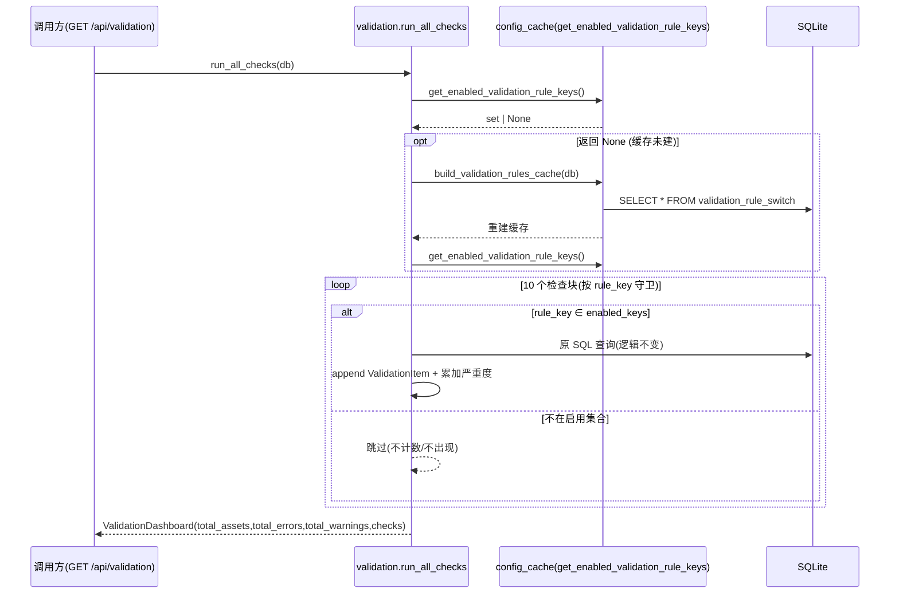
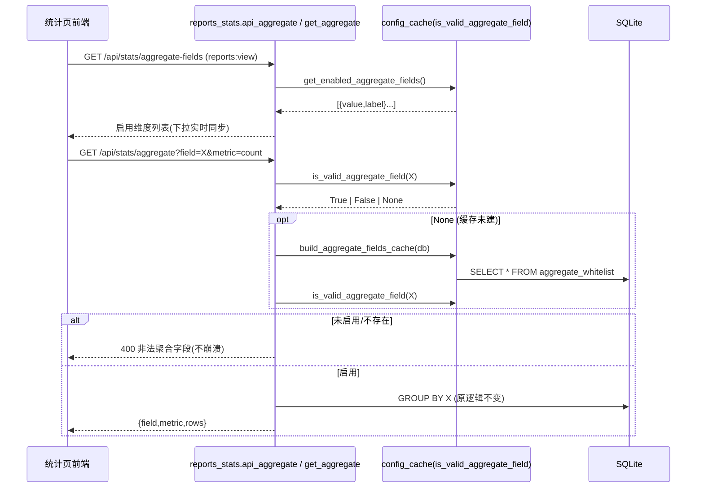
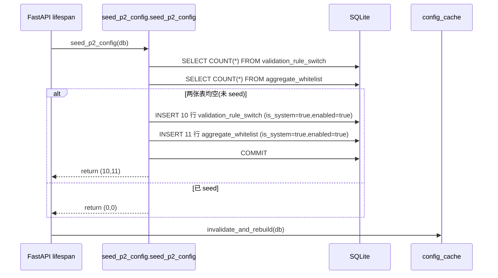
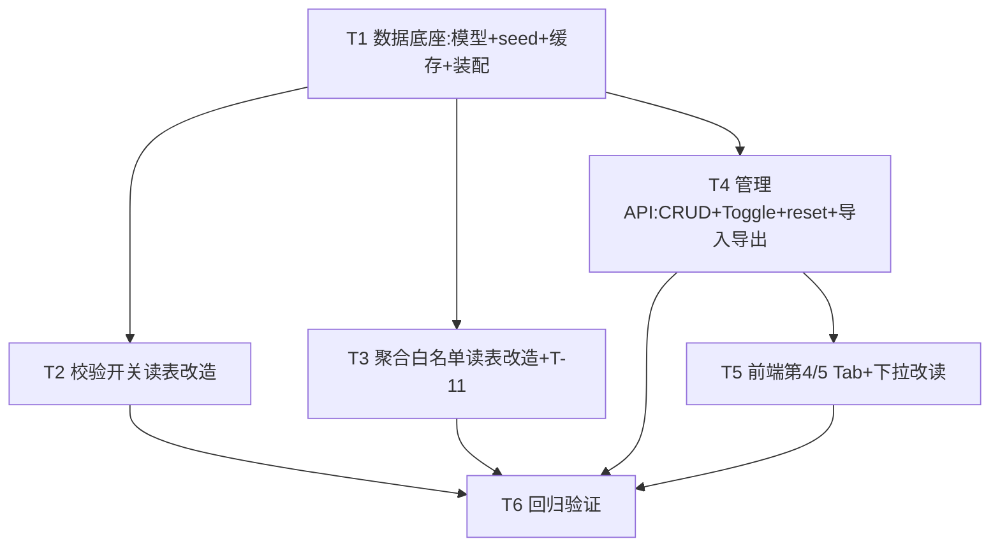

# 架构设计文档（增量）：系统配置模块 P2 — 校验规则开关 + 聚合白名单可配置

> 文档版本：v1.0（架构师产出，供工程师实现）
> 作者：高见远（software-architect）
> 日期：2026-07-10
> 依赖：P0 配置中心（字典/分类）+ P1 配置中心（阶段流转矩阵）均已落地并生产验证：`/api/config` + `config:manage` + 进程内缓存 `invalidate_and_rebuild` + `count_references` 引用保护范式 + 对称 `seed` 范式 + 前端 `configSubTab` Tab 结构。本文档为**增量设计**，只描述 P2 新增/变更部分，复用 P0/P1 能力处注明「复用」。
> 配套 PRD：`asset-lifecycle-manager/PRD_系统配置模块_P2.md`
> 配套 P1 设计：`asset-lifecycle-manager/DESIGN_系统配置模块_P1.md`（本文档风格与其对齐）

---

## 0. 主理人已拍板结论（O1–O5）与设计基线

| 编号 | 结论 | 对设计的影响 |
|------|------|--------------|
| O1 | 校验规则开关**粒度 = 单条规则**（10 条，与 `rule_key` 一一对应） | 模型以 `rule_key` 为唯一键；`run_all_checks` 按 `rule_key` 查开关 |
| O2 | 聚合白名单**粒度 = 维度级**（11 字段各自独立启停，与原常量 1:1） | `aggregate_whitelist` 以 `field_key` 为唯一键，逐行启停 |
| O3 | 允许新增非原 11 字段的 `Asset` 合法列名作为聚合维度 | `POST /aggregate-fields` 校验 `field_key ∈ Asset.__table__.columns`（非法→422） |
| O4 | 系统出厂项（`is_system=true`）**禁物理删**，仅可停用/启用；提供「恢复默认」兜底面板 | DELETE 接口对 `is_system` 行返回 400；reset 接口恢复出厂态 |
| O5 | 回滚形态 = 本期「恢复默认」+ 导入导出快照（粗粒度够用），版本快照审计留 P3 | 仅实现 reset + import/export；审计/版本留 P3 |

**硬约束（来自主理人）**
- **单一集成入口（校验）**：仅改 `validation.py:run_all_checks()`，按 `rule_key` 查 `validation_rule_switch` 表，`disabled` 则跳过该条；4 类调用方（`/api/validation` 及任何触发校验处）**零改动**自动切换；返回结构与 severity 不变。
- **单一集成入口（聚合）**：仅改 `reports_stats.py:get_aggregate()`，由读 `constants.AGGREGATE_FIELD_WHITELIST` 改为读白名单表；统计端点调用方零改动。
- **明确 OUT OF SCOPE**：阶段门禁（P1 已处理）、版本快照审计（留 P3）、报表导出列白名单、跨资产分组、统计口径写死 GROUP BY。
- **默认安全 + 引用保护 + 回滚兜底**必须显式落地（§5 数据安全约束已在 PRD §5，设计中 §1.2/§3/§8 对应）。

> ⚠️ **命名一致性决策（已采纳）**：任务简报中写作 `aggregation_whitelist`，PRD §3.2.1 T-07 写作 `aggregate_whitelist`。本文档**统一采用 `aggregate_whitelist`**（与现有常量 `AGGREGATE_FIELD_WHITELIST` 同名系，避免双拼写源）。如主理人坚持 `aggregation_whitelist`，仅需全文一次重命名，不影响设计结构。

---

## 1. 实现方案（Implementation Approach）

### 1.1 技术栈与依赖
- 后端：FastAPI + SQLAlchemy 1.4+ + SQLite（**沿用现有，无新增第三方依赖**）。
- 前端：Vue3 单文件 SPA（`frontend/index.html`，CDN 引 Vue/Element Plus/ECharts），**无构建步骤、无新依赖**。
- 结论：**P2 不引入任何新包**（`requirements.txt` 不变）。

### 1.2 核心难点与对策

| 难点 | 对策 |
|------|------|
| 去硬编码：10 项校验常开下沉 DB | 新增 `validation_rule_switch` 表；`seed_p2_config.py` 幂等写 10 行（全 enabled）；`run_all_checks` 先取「已启用 `rule_key` 集合」，逐块 `if key in enabled` 才执行并计入仪表盘 |
| 去硬编码：聚合维度白名单下沉 DB | 新增 `aggregate_whitelist` 表；`seed_p2_config.py` 幂等写 11 行（全 enabled）；`get_aggregate` 改查表；统计页下拉改读 `GET /api/stats/aggregate-fields` |
| 默认零回退 / 存量零误伤 | seed = 现状（校验全开 / 聚合 11 全开）；任何开关/白名单改配**只改变「是否校验 / 是否可聚合」口径**，从不删改台账数据 |
| 引用/出口保护 | `is_system=true` 的 seed 行禁止物理删除（仅可停用）；聚合维度禁用后接口对该字段返回 400（与现状一致，不崩溃） |
| 即时生效 | 写 API 成功后复用 P0 `invalidate_and_rebuild(db)`，新增「校验开关」「聚合白名单」两项缓存随之重建 |
| 回滚兜底 | 两子页各提供「恢复默认」按钮 → `POST /.../reset` 重置为 seed 出厂值；导入导出（JSON upsert）做快照备份 |
| 前端降级 | 统计页聚合下拉只展示启用维度；已保存看板若引用了被禁用维度，前端显「该维度已停用」提示而非白屏/报错 |

### 1.3 架构模式
- 沿用 P0「**常量 → DB + lifespan seed + 进程内缓存**」范式（与 `stage_transition_rule` / `config_dict` 对称）。
- 路由沿用 P0 `config_router`（前缀 `/api/config`，全部 `require_permission("config:manage")` + 写后 `invalidate_and_rebuild`）。
- 读接口 `GET /api/stats/aggregate-fields` 沿用 `reports:view` 权限（统计页读取），与 `config:manage`（管理写）分离。
- **单一集成入口原则**：仅改写 `validation.run_all_checks` 与 `reports_stats.get_aggregate` 两个函数；`main.py:get_validation_dashboard`(1319) 与 `stats_router:api_aggregate`(434) 及前端统计页经上述入口自动切换，无需改动。

---

## 2. 文件清单（File List）

### 2.1 新增文件
| 文件 | 说明 |
|------|------|
| `backend/seed_p2_config.py` | 幂等 seed（对称 `seed_stage_transitions.py`），仅空表时写 10 条校验开关 + 11 条聚合白名单，`is_system=true`，挂载 `main.py` lifespan |
| `qa-test-config-module-P2.py` | P2 回归测试（存量零风险 + 新功能用例） |

### 2.2 修改文件
| 文件 | 改动点 |
|------|--------|
| `backend/database.py` | 新增 `ValidationRuleSwitch`、`AggregateWhitelist` 两个模型（含唯一约束 `rule_key` / `field_key`，含 `to_dict()`） |
| `backend/config_cache.py` | 新增 `_validation_rules_cache` + `build_validation_rules_cache` / `get_enabled_validation_rule_keys`；新增 `_aggregate_fields_cache` + `build_aggregate_fields_cache` / `is_valid_aggregate_field` / `get_enabled_aggregate_fields`；`invalidate_and_rebuild` 同步重建两项新缓存；`import` 增加两模型 |
| `backend/validation.py` | 重写 `run_all_checks`：开头取「已启用 `rule_key` 集合」，逐块 `if key in enabled` 才执行并计入（契约不变） |
| `backend/reports_stats.py` | `get_aggregate` 由读 `AGGREGATE_FIELD_WHITELIST` 改为 `is_valid_aggregate_field(field)`；新增 `GET /api/stats/aggregate-fields` 端点（T-11）；`import` 增加 `AggregateWhitelist` |
| `backend/config_api.py` | 在 `config_router` 内新增校验开关 CRUD/toggle/reset/导入导出 + 聚合白名单 CRUD/toggle/reset/导入导出（共约 20 端点，全 `config:manage`） |
| `backend/main.py` | `lifespan` 在 `seed_stage_transitions(db)` 后挂载 `seed_p2_config(db)`；`from seed_p2_config import seed_p2_config` |
| `frontend/index.html` | `configSubTab` 新增第 4、第 5 个 `el-tab-pane`（校验规则开关 / 聚合白名单配置）；统计页聚合下拉由硬编码 `aggregateFields` 改为读 `GET /api/stats/aggregate-fields` |

> 不改动：`schemas.py`（`ValidationItem`/`ValidationDashboard` 契约不变）、`constants.py`（保留 `AGGREGATE_FIELD_WHITELIST` 仅作回退常量，不再作为唯一真相）、`auth.py`（复用 `config:manage` / `reports:view`）、`import_export_reports.py`（固定报表不读白名单）、`check_stage_gate`（P1 已处理）。

---

## 3. 数据结构与接口（Data Structures & Interfaces）

### 3.1 数据模型 `ValidationRuleSwitch`（`backend/database.py`）

```python
from datetime import datetime
from sqlalchemy import Column, Integer, String, Boolean, Text, DateTime, UniqueConstraint

class ValidationRuleSwitch(Base):
    """资产生命周期校验规则开关（10 项校验数据库化，design §3.1）。

    rule_key 与 validation.run_all_checks 的 10 个检查分支一一对应且稳定；
    severity 取值固定 '严重'/'中等'，与现状一致；enabled 默认 true（=当前常开行为）；
    is_system 行由 seed 写入，禁止物理删除（仅可停用）。
    """
    __tablename__ = "validation_rule_switch"

    id = Column(Integer, primary_key=True, autoincrement=True)
    rule_key = Column(String(40), unique=True, nullable=False, comment="稳定键(empty_code/duplicate_code/...)")
    check_name = Column(String(50), nullable=False, comment="校验名称(只读)")
    description = Column(Text, nullable=True, comment="检查逻辑说明(只读)")
    severity = Column(String(10), nullable=False, comment="'严重'|'中等'(只读)")
    enabled = Column(Boolean, default=True, nullable=False, comment="是否启用该校验")
    remark = Column(Text, nullable=True, comment="管理员备注(可改)")
    is_system = Column(Boolean, default=True, nullable=False, comment="系统内置(seed写入,不可删)")
    sort_order = Column(Integer, default=0, nullable=False, comment="排序")
    created_at = Column(DateTime, default=datetime.utcnow, comment="创建时间")
    updated_at = Column(DateTime, default=datetime.utcnow, onupdate=datetime.utcnow, comment="更新时间")

    def to_dict(self) -> dict:
        return {c.name: getattr(self, c.name) for c in self.__table__.columns}
```

### 3.2 数据模型 `AggregateWhitelist`（`backend/database.py`）

```python
class AggregateWhitelist(Base):
    """自定义字段聚合维度白名单（AGGREGATE_FIELD_WHITELIST 数据库化，design §3.2）。

    field_key 为 Asset 模型合法列名（唯一）；field_label 为展示名；
    metric_support 默认 'count,original_value'（P3 可扩展更多指标）；
    enabled 默认 true；is_system 行由 seed 写入不可删。
    """
    __tablename__ = "aggregate_whitelist"

    id = Column(Integer, primary_key=True, autoincrement=True)
    field_key = Column(String(50), unique=True, nullable=False, comment="Asset 列名(唯一)")
    field_label = Column(String(50), nullable=False, comment="展示名")
    metric_support = Column(String(50), default="count,original_value", nullable=False, comment="支持指标")
    enabled = Column(Boolean, default=True, nullable=False, comment="是否允许按该维度聚合")
    remark = Column(Text, nullable=True, comment="管理员备注(可改)")
    is_system = Column(Boolean, default=True, nullable=False, comment="系统内置(seed写入,不可删)")
    sort_order = Column(Integer, default=0, nullable=False, comment="排序")
    created_at = Column(DateTime, default=datetime.utcnow, comment="创建时间")
    updated_at = Column(DateTime, default=datetime.utcnow, onupdate=datetime.utcnow, comment="更新时间")
    __table_args__ = (UniqueConstraint("field_key", name="uq_aggregate_field"),)

    def to_dict(self) -> dict:
        return {c.name: getattr(self, c.name) for c in self.__table__.columns}
```

### 3.3 请求体 Schema（`backend/config_api.py` 内联）

```python
from pydantic import BaseModel, Field, field_validator
from typing import List, Optional
from database import Asset

# ——— 校验规则开关 ———
class ValidationRuleUpdate(BaseModel):
    enabled: Optional[bool] = None
    remark: Optional[str] = None

class ValidationRuleImportItem(BaseModel):
    rule_key: str
    enabled: bool = True
    remark: Optional[str] = None

class ValidationRuleImport(BaseModel):
    rules: List[ValidationRuleImportItem]

# ——— 聚合白名单 ———
ASSET_COLUMNS = set(Asset.__table__.columns.keys())  # 合法列名集合

class AggregateFieldCreate(BaseModel):
    field_key: str = Field(..., description="Asset 列名(唯一,须为合法列)")
    field_label: str = Field(..., description="展示名")
    metric_support: str = "count,original_value"
    remark: Optional[str] = None
    sort_order: int = 0

    @field_validator("field_key")
    @classmethod
    def _valid_column(cls, v):
        # 非法列名 → schema 校验失败 → 422（design §8）
        if v not in ASSET_COLUMNS:
            raise ValueError(f"非法聚合字段: {v}（非 Asset 合法列名）")
        return v

class AggregateFieldUpdate(BaseModel):
    field_label: Optional[str] = None
    enabled: Optional[bool] = None
    remark: Optional[str] = None

class AggregateFieldImportItem(BaseModel):
    field_key: str
    field_label: str
    enabled: bool = True
    metric_support: str = "count,original_value"
    remark: Optional[str] = None

class AggregateFieldImport(BaseModel):
    fields: List[AggregateFieldImportItem]
```

### 3.4 管理 API（`config_router`，前缀 `/api/config`）

| 方法 | 路径 | 说明 | 权限 | 关键行为 |
|------|------|------|------|----------|
| GET | `/validation-rules` | 校验开关列表（含禁用） | config:manage | 按 `sort_order,id` 排序返回全部 |
| PUT | `/validation-rules/{id}` | 更新（仅 `enabled`/`remark`；`rule_key`/`check_name`/`severity` 只读） | config:manage | 写后 `invalidate_and_rebuild` |
| POST | `/validation-rules/{id}/toggle` | 启停 | config:manage | 翻转 `enabled`；写后失效 |
| GET | `/validation-rules/export` | 导出 JSON | config:manage | 返回全部规则数组 |
| POST | `/validation-rules/import` | 批量导入(JSON, 按 `rule_key` upsert) | config:manage | 存在更新/不存在插入；写后失效 |
| POST | `/validation-rules/reset` | 恢复默认（seed 出厂态） | config:manage | 见 §3.7 |
| GET | `/aggregate-fields` | 聚合维度列表（含禁用） | config:manage | 按 `sort_order,id` 排序 |
| POST | `/aggregate-fields` | 新增维度（`field_key` 须合法列名且唯一） | config:manage | 非法列→422；重复→400；`is_system=False` |
| PUT | `/aggregate-fields/{id}` | 更新（`enabled`/`remark`/`field_label`） | config:manage | 写后失效 |
| DELETE | `/aggregate-fields/{id}` | 删除（`is_system` 禁删；否则删） | config:manage | `is_system` 行→400；写后失效 |
| POST | `/aggregate-fields/{id}/toggle` | 启停 | config:manage | 翻转 `enabled`；写后失效 |
| GET | `/aggregate-fields/export` | 导出 JSON | config:manage | 返回全部维度数组 |
| POST | `/aggregate-fields/import` | 批量导入(JSON, 按 `field_key` upsert) | config:manage | 写后失效 |
| POST | `/aggregate-fields/reset` | 恢复默认（seed 出厂态） | config:manage | 见 §3.7 |

> 所有写接口成功 commit 后调用 `_after_write(db)` → `invalidate_and_rebuild(db)`（重建枚举 + 阶段 + 校验开关 + 聚合白名单四类缓存）。

### 3.5 `run_all_checks` 读开关等价实现（契约不变）

```python
# backend/validation.py —— 仅改写 run_all_checks：开头取「已启用 rule_key 集合」，逐块守卫
# 返回 ValidationDashboard(total_assets, total_errors, total_warnings, checks) 契约不变
from config_cache import build_validation_rules_cache, get_enabled_validation_rule_keys

def run_all_checks(db: Session) -> ValidationDashboard:
    """执行10项校验检查；按 validation_rule_switch 表只跑 enabled 的规则。"""
    # 单一集成入口：读进程内校验开关缓存；未建则回退查表并重建（design §4.1）
    enabled_keys = get_enabled_validation_rule_keys()
    if enabled_keys is None:
        build_validation_rules_cache(db)
        enabled_keys = get_enabled_validation_rule_keys()

    checks = []
    total_severe = 0
    total_moderate = 0

    # 1. 编号为空（严重） —— 仅当 enabled
    if "empty_code" in enabled_keys:
        empty_codes = db.query(Asset).filter(or_(Asset.asset_code == None, Asset.asset_code == '')).count()
        empty_code_records = db.query(Asset).filter(or_(Asset.asset_code == None, Asset.asset_code == '')).all()[:10]
        checks.append(ValidationItem(
            check_name="编号为空", description="资产编号为空的记录",
            count=empty_codes, severity="严重",
            details=[a.asset_code or "(空)" for a in empty_code_records]))
        total_severe += empty_codes

    # 2. SN号为空（严重） — 非报废阶段  （同样 if "empty_sn" in enabled_keys: ...）
    # 3. 位置为空（严重）   if "empty_position" in enabled_keys: ...
    # 4. 责任人为空（中等） if "empty_responsible" in enabled_keys: ...
    # 5. 阶段为空（严重）   if "empty_stage" in enabled_keys: ...
    # 6. 编号重复（严重）   if "duplicate_code" in enabled_keys: ...
    # 7. 维保已过期(运行状态)（中等） if "warranty_expired" in enabled_keys: ...
    # 8. 维保到期日早于入场日期（严重） if "warranty_date_invalid" in enabled_keys: ...
    # 9. 已报废但报废表无记录（严重） if "retired_no_record" in enabled_keys: ...
    # 10. 分表编号不在主表中（中等） if "orphan_subtable_code" in enabled_keys: ...
    #   —— 每块保持原 SQL/逻辑 100% 不变，仅在外层加 if 守卫 ——

    total_assets = db.query(Asset).count()
    return ValidationDashboard(
        total_assets=total_assets,
        total_errors=total_severe,
        total_warnings=total_moderate,
        checks=checks)
```

> **等价性核对**：默认（全 enabled）时 10 块全部执行，与原硬编码逐条一致；关闭某项 → 该项不 append、不计入 `total_errors/total_warnings`，仪表盘自动消失该项，存量数据不动。返回结构不变。

### 3.6 `get_aggregate` 读白名单等价实现（契约不变）+ T-11 端点

```python
# backend/reports_stats.py
from config_cache import build_aggregate_fields_cache, is_valid_aggregate_field, get_enabled_aggregate_fields
# AGGREGATE_FIELD_WHITELIST 保留仅作回退常量（见 §2 不改动说明）

def get_aggregate(db, field, metric="count", stage=None) -> dict:
    """对白名单字段 GROUP BY；非法/未启用字段返回 400（与现状一致）。"""
    valid = is_valid_aggregate_field(field)
    if valid is None:                       # 缓存未建
        build_aggregate_fields_cache(db)
        valid = is_valid_aggregate_field(field)
    if not valid:
        raise HTTPException(status_code=400, detail=f"非法聚合字段: {field}（不在白名单内）")
    if metric not in ("count", "original_value"):
        raise HTTPException(status_code=400, detail=f"非法聚合指标: {metric}（仅支持 count/original_value）")
    col = getattr(Asset, field)             # 白名单已保证 field 是合法列
    # ... 后续 GROUP BY 逻辑完全不变 ...

# T-11：统计页下拉数据源（reports:view，仅读启用维度）
@stats_router.get("/aggregate-fields")
def api_aggregate_fields(db: Session = Depends(get_db), _: object = Depends(require_permission("reports:view"))):
    """返回当前 enabled=true 的聚合维度 [{value,label}]，供前端下拉。"""
    fields = get_enabled_aggregate_fields()
    if fields is None:
        build_aggregate_fields_cache(db)
        fields = get_enabled_aggregate_fields() or []
    if not fields:  # 极端回退：seed 未跑时退化为常量
        fields = [{"value": f, "label": f} for f in AGGREGATE_FIELD_WHITELIST]
    return fields
```

### 3.7 「恢复默认」语义（reset）

```python
# backend/config_api.py —— 两 reset 端点实现要点
@config_router.post("/validation-rules/reset")
def reset_validation_rules(db=Depends(get_db), _=Depends(require_permission("config:manage"))):
    """恢复出厂：seed 行 enabled 重置为 true；删除管理员自定义(is_system=false)行。"""
    for row in db.query(ValidationRuleSwitch).all():
        if row.is_system:
            row.enabled = True          # 还原为全开出厂态（remark 保留管理员备注）
        else:
            db.delete(row)              # 自定义行非出厂项，重置即清掉
    db.commit(); _after_write(db)
    return {"ok": True}

@config_router.post("/aggregate-fields/reset")
def reset_aggregate_fields(db=Depends(get_db), _=Depends(require_permission("config:manage"))):
    for row in db.query(AggregateWhitelist).all():
        if row.is_system:
            row.enabled = True
        else:
            db.delete(row)
    db.commit(); _after_write(db)
    return {"ok": True}
```

> 语义：「恢复默认」= 回到 seed 出厂态（校验全开 / 聚合 11 维度全开）。自定义维度/自定义开关在重置时被清除，符合「出厂值」定义。详见 §9 待确认点 1（若主理人希望保留自定义行仅重置 seed 行，可一行调整）。

### 3.8 类图（Mermaid classDiagram）

```mermaid
classDiagram
    class ValidationRuleSwitch {
        +int id
        +str rule_key
        +str check_name
        +str description
        +str severity
        +bool enabled
        +str remark
        +bool is_system
        +int sort_order
        +datetime created_at
        +datetime updated_at
        +to_dict() dict
    }
    class AggregateWhitelist {
        +int id
        +str field_key
        +str field_label
        +str metric_support
        +bool enabled
        +str remark
        +bool is_system
        +int sort_order
        +datetime created_at
        +datetime updated_at
        +to_dict() dict
    }
    class ValidationRuleUpdate {
        +bool enabled
        +str remark
    }
    class ValidationRuleImport {
        +List~ValidationRuleImportItem~ rules
    }
    class AggregateFieldCreate {
        +str field_key
        +str field_label
        +str metric_support
        +str remark
        +int sort_order
    }
    class AggregateFieldUpdate {
        +str field_label
        +bool enabled
        +str remark
    }
    class AggregateFieldImport {
        +List~AggregateFieldImportItem~ fields
    }
    class ConfigCache {
        +_validation_rules_cache: list
        +_aggregate_fields_cache: list
        +build_validation_rules_cache(db)
        +get_enabled_validation_rule_keys() set
        +build_aggregate_fields_cache(db)
        +is_valid_aggregate_field(field) bool
        +get_enabled_aggregate_fields() list
        +invalidate_and_rebuild(db)
    }
    class Validation {
        +run_all_checks(db) ValidationDashboard
    }
    class ReportsStats {
        +get_aggregate(db, field, metric, stage) dict
        +api_aggregate_fields() list
    }
    class SeedP2Config {
        +seed_p2_config(db) int
    }
    class ConfigApi {
        +GET /validation-rules
        +PUT /validation-rules/{id}
        +POST /validation-rules/{id}/toggle
        +GET /validation-rules/export
        +POST /validation-rules/import
        +POST /validation-rules/reset
        +GET /aggregate-fields
        +POST /aggregate-fields
        +PUT /aggregate-fields/{id}
        +DELETE /aggregate-fields/{id}
        +POST /aggregate-fields/{id}/toggle
        +GET /aggregate-fields/export
        +POST /aggregate-fields/import
        +POST /aggregate-fields/reset
    }

    ValidationRuleUpdate ..> ValidationRuleSwitch : updates
    ValidationRuleImport ..> ValidationRuleSwitch : upsert by rule_key
    AggregateFieldCreate ..> AggregateWhitelist : creates
    AggregateFieldUpdate ..> AggregateWhitelist : updates
    AggregateFieldImport ..> AggregateWhitelist : upsert by field_key

    ConfigCache ..> ValidationRuleSwitch : reads(all rows)
    ConfigCache ..> AggregateWhitelist : reads(all rows)
    Validation ..> ConfigCache : get_enabled_validation_rule_keys
    ReportsStats ..> ConfigCache : is_valid_aggregate_field / get_enabled_aggregate_fields
    SeedP2Config ..> ValidationRuleSwitch : writes 10 seed rows
    SeedP2Config ..> AggregateWhitelist : writes 11 seed rows
    ConfigApi ..> ValidationRuleSwitch : CRUD + reset
    ConfigApi ..> AggregateWhitelist : CRUD + reset
    ConfigApi ..> ConfigCache : invalidate_and_rebuild
    note for ValidationRuleSwitch "rule_key 唯一; severity∈{严重,中等}\nis_system 行禁物理删"
    note for AggregateWhitelist "field_key 唯一且须为 Asset 列名\nis_system 行禁物理删"
```

---

## 4. 程序调用流程（Program Call Flow）

### 4.1 `run_all_checks` 读开关流程（单一入口，调用方零改动）



### 4.2 `get_aggregate` 读白名单流程 + 统计页下拉源



### 4.3 幂等 Seed 流程（lifespan）



### 4.4 Toggle + 恢复默认 + 导入/导出流程

```mermaid
sequenceDiagram
    participant FE as 前端(校验/聚合 Tab)
    participant API as config_api(POST/PUT/DELETE/reset/import/export)
    participant DB as SQLite
    participant CC as config_cache
    FE->>API: POST /validation-rules/{id}/toggle (或 /aggregate-fields/{id}/toggle)
    API->>DB: UPDATE enabled = NOT enabled + COMMIT
    API->>CC: invalidate_and_rebuild(db)
    API-->>FE: 更新后行
    FE->>API: POST /validation-rules/reset (或 /aggregate-fields/reset)
    API->>DB: seed 行 enabled=true; DELETE 自定义行 + COMMIT
    API->>CC: invalidate_and_rebuild(db)
    API-->>FE: {ok:true}
    FE->>API: GET /validation-rules/export (或 /aggregate-fields/export)
    API->>DB: SELECT * FROM 表
    API-->>FE: JSON 数组(可下载)
    FE->>API: POST /validation-rules/import {rules:[...]} (或 /aggregate-fields/import)
    API->>DB: 逐条 upsert(按 rule_key/field_key) + COMMIT
    API->>CC: invalidate_and_rebuild(db)
    API-->>FE: {created, updated}
```

---

## 5. Seed 内容（精确，与现状 100% 一致）

### 5.1 `validation_rule_switch`（10 行，全部 `enabled=true`、`is_system=true`）

| # | rule_key | check_name | severity | description（摘要） | sort_order |
|---|----------|-----------|----------|---------------------|-----------|
| 1 | `empty_code` | 编号为空 | 严重 | 资产编号为空 | 1 |
| 2 | `empty_sn` | SN号为空 | 严重 | 非报废阶段 SN 为空 | 2 |
| 3 | `empty_position` | 位置为空 | 严重 | 非报废阶段 机房/机柜/U位任一为空 | 3 |
| 4 | `empty_responsible` | 责任人为空 | 中等 | 上架/运行/维修阶段无责任人 | 4 |
| 5 | `empty_stage` | 阶段为空 | 严重 | 生命周期阶段为空 | 5 |
| 6 | `duplicate_code` | 编号重复 | 严重 | 资产编号出现>1次 | 6 |
| 7 | `warranty_expired` | 维保已过期(运行状态) | 中等 | 运行阶段维保已过期 | 7 |
| 8 | `warranty_date_invalid` | 维保到期日早于入场日期 | 严重 | warranty_expire_date < entry_date | 8 |
| 9 | `retired_no_record` | 已报废但报废表无记录 | 严重 | 阶段=已报废 且 Retirement 表无记录 | 9 |
| 10 | `orphan_subtable_code` | 分表编号不在主表中 | 中等 | 7 个子表 asset_code 不在 assets 主表 | 10 |

> 映射依据：PRD §7.2。rule_key 与 `run_all_checks` 各 `if "<rule_key>" in enabled_keys:` 守卫一一对应。

### 5.2 `aggregate_whitelist`（11 行，全部 `enabled=true`、`is_system=true`、`metric_support="count,original_value"`）

| # | field_key（Asset 列名） | field_label | sort_order |
|---|--------------------------|-------------|-----------|
| 1 | `lifecycle_stage` | 生命周期阶段 | 1 |
| 2 | `asset_category` | 资产分类 | 2 |
| 3 | `room` | 机房 | 3 |
| 4 | `cabinet` | 机柜 | 4 |
| 5 | `department` | 所属部门 | 5 |
| 6 | `ownership` | 产权归属 | 6 |
| 7 | `brand` | 品牌 | 7 |
| 8 | `model` | 型号 | 8 |
| 9 | `responsible_person` | 责任人 | 9 |
| 10 | `warranty_status` | 维保状态 | 10 |
| 11 | `project_name` | 项目名称 | 11 |

> 映射依据：PRD §7.4（与原 `AGGREGATE_FIELD_WHITELIST` 完全一致）。新增自定义维度（`is_system=false`）时 `field_key` 须为 `Asset.__table__.columns` 中的合法列名（O3）。

---

## 6. 依赖清单（Required Packages）

**无新增依赖。** P2 完全复用现有栈：
- 后端：fastapi / sqlalchemy / pydantic / uvicorn（已在 `requirements.txt`）
- 前端：Vue3 / Element Plus / ECharts（CDN，已在 `frontend/index.html`）

---

## 7. 任务分解（Task List，按依赖排序、最小化改动）

| Task | 名称 | 涉及文件 | 依赖 | 优先级 | 对应 PRD |
|------|------|----------|------|--------|----------|
| **T1** | 数据底座：两模型 + 幂等 seed + 缓存扩展 + lifespan 装配 | `backend/database.py`、`backend/seed_p2_config.py`(新)、`backend/config_cache.py`、`backend/main.py` | 无 | P0 | T-01,T-02,T-07,T-08 |
| **T2** | 校验开关读表改造（单一入口） | `backend/validation.py` | T1 | P0 | T-05,T-06 |
| **T3** | 聚合白名单读表改造（单一入口）+ T-11 读接口 | `backend/reports_stats.py` | T1 | P0 | T-12,T-13,T-11 |
| **T4** | 管理 API：两套 CRUD + toggle + reset + 导入导出（写后失效） | `backend/config_api.py` | T1 | P0 | T-03,T-04,T-09,T-10,T-11 |
| **T5** | 前端第 4/5 Tab + 统计页下拉改读接口 | `frontend/index.html` | T4 | P1 | T-03~T-13（UI） |
| **T6** | 回归验证：存量零风险 + 新功能用例 | `qa-test-config-module-P2.py`(新) | T2,T3,T4,T5 | P1 | 验收 V3/V4 |

**各任务交付要点**
- **T1**：新增 `ValidationRuleSwitch` / `AggregateWhitelist` 模型（唯一约束 `rule_key` / `field_key`，含 `to_dict()`）；`seed_p2_config.py` 写 10+11 行（§5）；`config_cache` 新增 `build_validation_rules_cache/get_enabled_validation_rule_keys` + `build_aggregate_fields_cache/is_valid_aggregate_field/get_enabled_aggregate_fields`，`invalidate_and_rebuild` 同步重建；`main.py` lifespan 在 `seed_stage_transitions(db)` 后挂 `seed_p2_config(db)`。
- **T2**：仅改写 `run_all_checks` —— 开头取「已启用 rule_key 集合」，10 个检查块外层加 `if "<rule_key>" in enabled_keys:` 守卫（§3.5）。**`/api/validation` 端点与前端校验仪表盘契约不变**。
- **T3**：仅改写 `get_aggregate` —— `if field not in AGGREGATE_FIELD_WHITELIST` 改为 `is_valid_aggregate_field(field)`（§3.6）；新增 `GET /api/stats/aggregate-fields`（T-11）。其它固定报表（`get_comprehensive_report` 等）不受影响。
- **T4**：在 `config_router` 内新增 §3.4 全部端点；DELETE 出口保护（`is_system` 行→400）；新增维度 `field_key` 列名校验（422）/唯一校验（400）；导入 upsert（按 `rule_key`/`field_key`）；全部 `require_permission("config:manage")` + 写后失效。
- **T5**：`configSubTab` 新增第 4 个 `el-tab-pane name="valRules"`（校验规则开关：表格 + 启用开关 + 编辑 remark + 恢复默认 + 导入导出）与第 5 个 `el-tab-pane name="aggConf"`（聚合白名单：表格 + 新增维度对话框 + 启停 + 删除 + 恢复默认 + 导入导出）；统计页聚合下拉由硬编码 `aggregateFields` 改为 `loadAggregateFields()` 读 `GET /api/stats/aggregate-fields`，被禁用维度实时移除并降级提示。
- **T6**：校验默认（全开）行为与原硬编码逐条一致、存量资产零改动；关闭单项后仪表盘消失该项；聚合禁用某维度后接口对该字段返回 400、前端下拉移除；reset 回到出厂态；导入导出往返一致；非法 `field_key`→422 / 重复→400 / `is_system` 删除→400 / 无权限→403。

### 7.1 任务依赖图（Mermaid graph）



---

## 8. 共享知识（Shared Knowledge）

- **错误码约定（T-04/T-10/T-11/T-12）**：
  - **Pydantic schema 校验失败 → 422**：如新增聚合维度 `field_key` 非 `Asset` 合法列名（经 `field_validator` 抛出）。
  - **业务校验失败 → 400**：重复 `field_key`/重复 `rule_key` 冲突、聚合接口对该字段返回「非法聚合字段」、`is_system` 行禁止物理删除（提示「系统内置不可删」）。
  - **资源不存在 → 404**：PUT/DELETE/toggle 的 id 不存在。
  - **无权限 → 403**：非 `config:manage` 调管理接口；非 `reports:view` 调统计读接口。
- **`rule_key` 取值约定（固定 10 个，见 §5.1）**：`empty_code/empty_sn/empty_position/empty_responsible/empty_stage/duplicate_code/warranty_expired/warranty_date_invalid/retired_no_record/orphan_subtable_code`。代码中以 `if "<rule_key>" in enabled_keys` 匹配原检查分支，新增校验不在 P2 范围。
- **`field_key` 取值约定**：必须是 `Asset.__table__.columns` 中的合法列名（如 `lifecycle_stage`/`asset_category`/`room`/`department`/`responsible_person`/`brand`/`model`/`ownership`/`warranty_status`/`project_name`/`cabinet` 等）。跨表字段（如 `Retirement.application_no`）**不合法**（白名单仅控制 `Asset` 单表 GROUP BY，O3）。
- **缓存一致性**：写 API 成功 commit 后必调 `invalidate_and_rebuild(db)`（重建枚举 + 阶段 + 校验开关 + 聚合白名单四类缓存）；`run_all_checks`/`get_aggregate` 优先读缓存，缓存空时回退查 DB 并重建。
- **恢复默认语义**：reset = seed 行 `enabled` 重置为 true + 删除 `is_system=false` 自定义行，回到精确出厂态（见 §3.7、§9 待确认 1）。
- **权限复用**：校验开关与聚合白名单管理均不新增权限项，全部复用 P0 `config:manage`（admin/ops_manager 拥有；viewer/ops_engineer 无 → 403）；T-11 读取接口复用 `reports:view`。
- **缓存回退兜底**：`get_enabled_aggregate_fields()` 在极端未 seed 场景返回常量 `AGGREGATE_FIELD_WHITELIST` 降级列表，保证统计页不白屏（§3.6）。
- **前端命名约定**：为避免与顶层 `currentTab==='validation'`（校验仪表盘）冲突，配置子页 `configSubTab` 第 4 个 `name="valRules"`（标签文案「校验规则开关」），第 5 个 `name="aggConf"`（标签文案「聚合白名单配置」）。

---

## 9. 待澄清 / 开放项（Anything UNCLEAR）

1. **reset 是否清除自定义行**：本文档 §3.7 设计 reset = 「seed 行 enabled=true + 删除自定义行」，得到精确出厂态。若主理人希望 reset 仅重置 seed 行、保留管理员自定义维度（仅把它们一并启用），改为「所有行 enabled=true」即可。请确认采用哪种口径。
2. **新增维度 `field_key` 候选范围**：O3 允许新增任意合法 `Asset` 列名。`AggregateFieldCreate.field_validator` 已校验列名合法性（422）。前端「新增维度」对话框是（a）硬编码一份候选列下拉，还是（b）提供 `GET /api/config/aggregate-field-columns` 返回全部 `Asset` 列名供下拉？本文档默认（a）前端常量 + 后端校验；如需（b）可在 T4 补一个只读列枚举端点（极小改动）。
3. **`constants.AGGREGATE_FIELD_WHITELIST` 处置**：本文档保留该常量仅作回退（§2 标注「不改动」），并在 T3 后不再作为唯一真相。是否彻底删除该常量？建议保留为回退常量（零成本），如要彻底删除需同步删 `reports_stats.py` 的 import。
4. **P0 设计文档缺失**：任务简报列出的 `DESIGN_系统配置模块_P0.md` 在仓库当前路径未找到；本文档复用关系依据 P1 设计「附：与 P0 复用点速查」及实际代码（`config_cache.py` / `config_api.py`）推断，不影响 P2 增量设计。
5. **审计/版本（P3-03）**：P2 的 reset/import 不写 `audit_logs`；若主理人要求 P2 即记审计，需在 T4 各写接口追加 `AuditLog` 写入（小改，可并入）。
6. **存量零风险验证基线**：建议 T6 以现有存量数据（含各阶段资产、Retirement/Procurement/Inbound/Fault 记录）跑 `run_all_checks` 与 `get_aggregate` 往返，核对默认态与原硬编码逐条一致。

---

## 附：与 P0/P1 复用点速查

| P0/P1 能力 | P2 复用方式 |
|---------|-------------|
| `config:manage` 权限 | T4 全部校验/聚合管理接口复用，无新增权限项；T-11 读接口复用 `reports:view` |
| `invalidate_and_rebuild(db)` | 写后调用；并扩展重建「校验开关」「聚合白名单」两项缓存 |
| `count_references` 思路 | 聚合白名单 DELETE 对 `is_system` 行禁删（400），自定义行无引用约束直接删 |
| `seed_*` 幂等范式 | 对称新建 `seed_p2_config.py`，lifespan 并列挂载（在 stage seed 后） |
| `config_router` 风格 | T4 端点全部挂在既有 `config_router`（前缀 `/api/config`） |
| 前端 `configSubTab` Tab 结构 + 对话框/表格/toggle 交互 | T5 新增第 4、5 个 pane，复用 P0 字典表格开关/编辑/导入导出交互 |
| `DROPDOWN_FIELD_TO_SOURCE` / 阶段枚举 | 维持不变（聚合白名单不进入下拉枚举体系，独立接口 T-11） |
