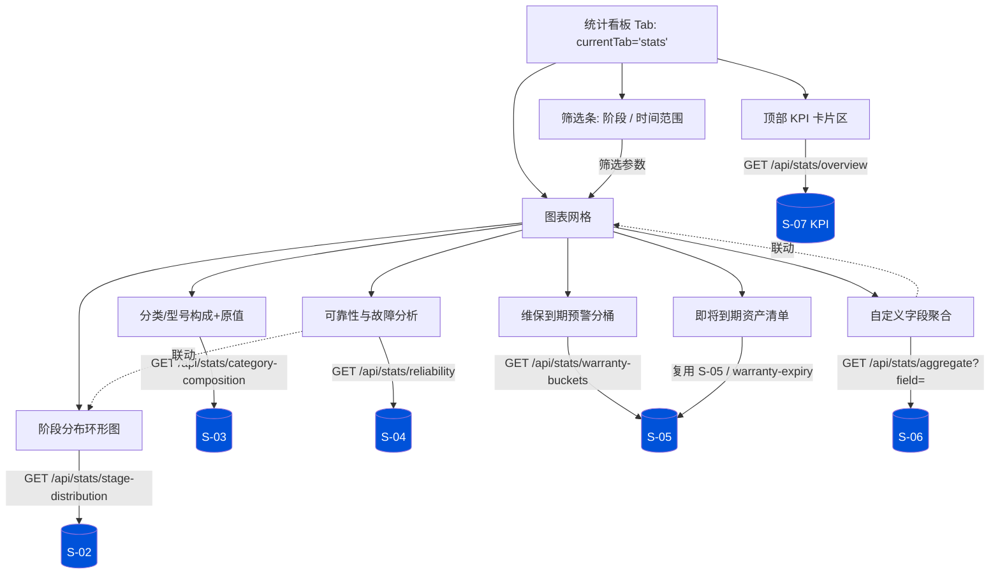

# 产品需求文档（PRD）：IT 资产全生命周期管理系统 v3.0.0 — 报表统计模块（统计看板）

> 文档版本：v0.1（简单版 PRD，供架构师产出设计）
> 作者：许清楚（产品经理）
> 日期：2026-07-07
> 范围：新增「统计看板」模块，覆盖 5 个统计维度 + KPI 看板，后端聚合接口 + 前端 ECharts 可视化

---

## 1. 产品目标

围绕 IT 资产全生命周期（规划→在途→上架→运行→维修→待报废→已报废）沉淀运营数据，为运维团队与管理人员提供**统一、可视化、可下钻**的统计看板。当前系统仅有「综合报表」与「维保到期」两个以 CSS 条形图呈现的文本型报表入口（位于 `reports` tab），缺乏图形化、可交互、可按字段自定义的分析能力。

本模块目标：在复用现有 `/api/reports/*` 与 `/api/stats` 数据能力的基础上，新增一个基于 **ECharts** 的统计看板页面（新 tab），覆盖**生命周期阶段分布、分类/型号构成与原值、可靠性与故障分析、维保到期预警、按字段自定义聚合**五大维度，并以顶部 KPI 卡片 + 图表网格的布局，支撑日常运维监控、容量规划与向上汇报场景。要求聚焦可落地，不重复造轮子，所有字段/接口契约与现有源码保持一致。

---

## 2. 用户故事（按角色）

| 角色 | 用户故事 |
|------|----------|
| 运维主管（ops_manager） | 作为运维主管，我希望在统计看板一眼看到总资产数、总原值、故障总数、即将到期数等 KPI，并能按分类/型号/机房下钻分析，以便快速掌握资产家底与风险敞口、向领导汇报。 |
| 运维工程师（ops_engineer） | 作为运维工程师，我希望按故障维度查看 MTBF、各阶段故障率与 Top N 故障资产排行，并能按字段（如机房/责任人）自定义聚合，以便定位高频故障设备、安排维保与备件。 |
| 领导汇报视角（viewer / 管理层） | 作为只读/管理层用户，我希望看板以图形化方式呈现阶段分布、维保到期预警分桶与即将到期资产清单，并支持导出 Excel/PDF，以便用于周报/月报与管理决策，无需接触明细台账。 |

---

## 3. 需求池（P0 / P1 / P2）

> 优先级说明：**P0**=必须交付（5 维度+看板页+后端聚合接口+基础权限）；**P1**=应交付（导出、筛选、图表联动）；**P2**=可选增强（对比、订阅等）。
> 验收标准均为可度量条件。

### P0 — 核心交付

| 编号 | 描述 | 优先级 | 验收标准 |
|------|------|--------|----------|
| S-01 | **后端聚合接口集**：新增统计聚合模块（建议文件 `backend/reports_stats.py`，或在 `import_export_reports.py` 扩展），提供看板所需的聚合数据；统一前缀 `/api/stats/*`，权限复用 `reports:view` | P0 | 5 个维度 + KPI 接口均可经 `/api/stats/*` 返回 JSON；无权限用户调用返回 403；admin/ops_manager/ops_engineer/viewer 均可访问 |
| S-02 | **生命周期阶段分布接口** `GET /api/stats/stage-distribution`：返回 7 阶段（`LIFECYCLE_STAGES`）的资产计数与占比 | P0 | 返回结构含 `stages:[{stage,count,ratio}]`，7 阶段全覆盖（含计数为 0 的阶段）；ratio 为 0~1 浮点，Σratio≈1 |
| S-03 | **分类/型号构成与原值接口** `GET /api/stats/category-composition`：按 `asset_category` 与 `model` 汇总台数与原值（原值口径见 §5-1） | P0 | 返回 `by_category:[{category,count,original_value}]` 与 `by_model:[{model,category,count,original_value}]`；支持按 `category` 过滤型号 |
| S-04 | **可靠性与故障分析接口** `GET /api/stats/reliability`：故障次数、系统级 MTBF、各阶段故障率、Top N 故障资产排行；可复用现有 `/api/reports/fault-analysis` 的 `top_fault_assets`，但需补充 MTBF 与各阶段故障率 | P0 | 返回 `total_faults`、`mtbf_days`、`by_stage_failure_rate:[{stage,asset_count,fault_count,rate}]`、`top_fault_assets:[{asset_code,fault_count}]`（默认 Top10，支持 `top_n` 参数） |
| S-05 | **维保到期预警分桶接口** `GET /api/stats/warranty-buckets`：按到期时间分桶（已过期 / 30天内 / 60天内 / 90天内 / 90天以上），返回各桶数量 + 即将到期资产清单；**沿用现有口径** `warranty_expire_date` 且 `lifecycle_stage IN {上架,运行,维修}`（即 `ACTIVE_STAGES`），整合现有 `/api/reports/warranty-expiry` 能力而非新建重复逻辑 | P0 | 返回 `buckets:{expired,within_30,within_60,within_90,over_90}` 计数 + `expiring_list`（含 `asset_code,days_left,warranty_expire_date` 等）；分桶互斥且覆盖全部在保资产 |
| S-06 | **通用「按字段聚合」接口** `GET /api/stats/aggregate?field=<字段>&metric=count|original_value`：对白名单内的低基数字段 GROUP BY，返回各取值的计数与原值汇总 | P0 | 仅接受白名单字段（见 §5-3），非法字段返回 400；返回 `rows:[{value,count,original_value}]` 按 count 降序 |
| S-07 | **KPI 概览接口** `GET /api/stats/overview`：返回看板顶部 4 张卡片数据（总资产数、总原值、故障总数、即将到期数） | P0 | 返回 `total_assets,total_original_value,total_faults,warranty_expiring_soon`（30 天内）四个字段，单次请求即可驱动顶部 KPI 卡片 |
| S-08 | **前端统计看板新 tab**：在 SPA 侧边栏新增「统计看板」菜单项（建议 `currentTab==='stats'`），与现有 `dashboard/assets/reports/审批` 等并列；通过 CDN 引入 ECharts（与 Vue3/Element Plus 同 CDN 风格） | P0 | 新增 tab 可点击切换并渲染；ECharts 全局对象可用；不破坏现有 tab |
| S-09 | **5 维度图表渲染**：阶段分布（环形图）、分类/型号构成（柱状/饼图 + 原值）、可靠性与故障（故障等级/根因/TopN 条形）、维保预警（分桶柱状 + 清单表）、自定义字段（动态柱状/饼图） | P0 | 5 个图表卡片均能正确渲染并随数据更新；图表容器内无 JS 报错 |
| S-10 | **基础权限**：所有统计接口与看板页复用现有 `reports:view` 权限（该权限已授予全部 4 个内置角色），不新增权限项 | P0 | 无 `reports:view` 角色访问被拒（当前 4 角色均具备，回归验证不破坏现有报表） |

### P1 — 应交付

| 编号 | 描述 | 优先级 | 验收标准 |
|------|------|--------|----------|
| S-11 | **维度/筛选控件**：看板支持阶段筛选（多选/全部）、时间范围筛选（入口日期或故障日期区间） | P1 | 选择筛选后，相关图表与 KPI 按筛选条件重新请求并刷新；「全部」可重置 |
| S-12 | **图表联动**：点击阶段环形图扇区 / 自定义字段柱条，可联动过滤其他图表或下钻明细（至少阶段↔故障维度联动） | P1 | 点击后关联图表刷新或弹出明细；无联动死循环 |
| S-13 | **导出 Excel**：将当前看板视图（KPI + 各维度汇总数据）导出为 Excel | P1 | 点击导出生成 `.xlsx`，内容与当前筛选条件一致；复用现有 `openpyxl` 导出能力 |
| S-14 | **导出 PDF**：将看板当前视图导出为 PDF（截图/打印） | P1 | 导出 PDF 含 KPI 与图表快照，版式可读 |
| S-15 | **维保到期清单整合**：看板内「维保到期预警」卡片直接展示即将到期资产清单（复用 S-05 / 现有 `/api/reports/warranty-expiry`），无需跳转到旧报表 | P1 | 清单可排序/分页，显示剩余天数与到期日 |

### P2 — 可选增强

| 编号 | 描述 | 优先级 | 验收标准 |
|------|------|--------|----------|
| S-16 | **阶段分布趋势**：在阶段分布维度增加按时间（按月）的趋势折线（可选） | P2 | 提供时间轴切换，展示各阶段资产数随月份变化 |
| S-17 | **自定义时间范围对比**：支持两时间段环比/同比对比（如本月 vs 上月） | P2 | 选择对比区间后，关键指标显示变化量与百分比 |
| S-18 | **报表订阅**：定时（日/周）将看板快照推送给指定用户 | P2 | 可配置订阅频率与接收人，到点生成并推送 |
| S-19 | **看板布局自定义/收藏**：用户可调整卡片顺序或隐藏卡片 | P2 | 布局偏好本地持久化（localStorage） |

---

## 4. UI 设计稿（统计看板页面）

### 4.1 页面结构（ASCII 草图）

```
┌──────────────────────────────────────────────────────────────────────────┐
│ 侧边栏菜单                                        │  顶部栏: 统计看板    │
│  · 总览 dashboard                                 ├────────────────────────┤
│  · 校验 validation                               │  KPI 卡片区 (S-07)    │
│  · 数据导入导出 importExport                      │  ┌────┐┌────┐┌────┐┌────┐│
│  · 报表统计 reports (现有)                        │  │总资产││总原值││故障数││将到期││
│  ▶ 统计看板 stats  (新增, 高亮)                   │  └────┘└────┘└────┘└────┘│
│  · 资产台账 assets                                ├────────────────────────┤
│  · 故障维修 faults  ...                           │  筛选条: [阶段▾] [时间范围▾][刷新]│
│                                                  ├────────────────────────┤
│                                                  │  图表网格 (S-09)        │
│                                                  │  ┌─────────┐┌─────────┐ │
│                                                  │  │阶段环形图││分类/型号 │ │
│                                                  │  │ (S-02)  ││构成+原值│ │
│                                                  │  └─────────┘└─────────┘ │
│                                                  │  ┌─────────┐┌─────────┐ │
│                                                  │  │可靠性故障││维保到期 │ │
│                                                  │  │(S-04)   ││分桶(S-05)│ │
│                                                  │  └─────────┘└─────────┘ │
│                                                  │  ┌──────────────────┐  │
│                                                  │  │自定义字段聚合(S-06)│  │
│                                                  │  │ [字段选择▾][指标▾] │  │
│                                                  │  └──────────────────┘  │
│                                                  │  维保即将到期清单表(S-15)│
└──────────────────────────────────────────────────────────────────────────┘
```

### 4.2 布局与数据流（Mermaid）



### 4.3 技术提示（供工程师参考，非产品验收项）
- 前端复用现有 `api(url, opts)` 封装（自动带 `Bearer` token）与 `hasPerm('reports:view')` 显隐逻辑；ECharts 经 CDN 引入：`<script src="https://cdn.jsdelivr.net/npm/echarts@5.5.0/dist/echarts.min.js"></script>`。
- 图表需在 tab 激活（`currentTab==='stats'`）且 DOM 挂载后 `echarts.init()` 并 `setOption`；监听 `window.resize` 调用 `chart.resize()`；切换离开时 `dispose()` 防内存泄漏。
- 后端新增聚合函数建议集中放置（新文件 `reports_stats.py` 或扩展 `import_export_reports.py`），在 `main.py` 中按现有 `require_permission("reports:view")` 模式挂载路由。

---

## 5. 待确认问题（需主理人/用户拍板）

1. **【核心】「资产原值 original_value」字段来源**：经源码确认，`Asset` 模型**没有 `original_value` 字段**（用户需求中假设的字段不存在）。现有唯一货币聚合是 `comprehensiveReport.total_purchase_cost = SUM(Procurement.total_price)`（采购总价，非逐资产原值）。
   - 方案 A（推荐，落地成本中）：在 `Asset` 新增 `original_value Float` 列，导入/移入时回填，统计直接 `SUM(original_value)`。需同步 `migrate.py` 与导入模板。
   - 方案 B（低成本）：用 `Procurement.total_price` 按 `asset_code` 关联到资产做近似聚合（注意 `Procurement.asset_code` 可空、非 1:1）。
   - **请确认采用哪种，以及原值单位（元）。**

2. **MTBF 计算口径**：建议 `MTBF(天) = Σ(各资产运营天数) / 故障总次数`；单资产运营天数 `= (退役/下架日期 ? 下架日期 : 今天) − entry_date`，仅统计 `entry_date` 非空资产。**请确认**：① 是否仅统计 `ACTIVE_STAGES`（上架/运行/维修）资产？② 是否同时提供「逐资产 MTBF」用于排行？③ 分母为全部 Fault 记录还是仅 P1/P2？

3. **自定义分析字段白名单**：建议白名单（低基数字段，来自 `Asset`）：`lifecycle_stage`、`asset_category`、`room`、`cabinet`、`department`、`ownership`、`brand`、`model`、`responsible_person`、`warranty_status`、`project_name`。**请确认白名单范围**，以及是否允许按 `original_value`（如方案 A 落地后）做指标汇总。

4. **统计接口权限**：现有 4 个报表接口已统一使用 `reports:view`，且 `reports:view` 已授予全部内置角色（admin/ops_manager/ops_engineer/viewer）。**建议统计看板与 `/api/stats/*` 直接复用 `reports:view`，不新增权限项**。请确认是否同意（如坚持新增 `stats:view` 需同步改 `auth.py` 与 `DEFAULT_ROLES`）。

5. **导出格式优先级**：P1 要求 Excel + PDF。请确认优先级（建议 Excel 优先于 PDF）及导出范围（当前筛选视图 vs 全量）。

6. **新 tab 与现有 `reports` tab 的关系**：现有 `reports` tab 已展示「综合报表」CSS 条形图。新「统计看板」为图形化增强版。**请确认**：并行共存（两个入口）还是用统计看板**取代/整合**现有 `reports` tab？

7. **分类维度展示口径**：`asset_category` 在库中存中文（服务器/网络设备/…），分类码（SVR/NET/STO/SEC/UPS/PDU/AC/KVM/OTH）目前仅为 `main.py` 移入逻辑内的局部字典、未集中定义（且用户给的 SRV/STG/PWR 与实际 STO/PDU 不一致）。**请确认**：分类聚合展示用中文名还是分类码？若用码，建议将映射抽到 `constants.py` 供统计复用。

8. **维保分桶口径**：沿用现有口径（`warranty_expire_date` 且 `lifecycle_stage IN ACTIVE_STAGES`）。**请确认**「已过期」是否也限定在 ACTIVE_STAGES（当前综合报表与 `/api/stats` 均限定，建议保持一致）。

---

## 6. 源码契约确认（阅读记录）

> 以下为本 PRD 字段/接口结论的依据，确保与现有代码契约一致。

**已阅读文件**
- `backend/database.py` — 数据模型
- `backend/constants.py` — 枚举/阶段常量
- `backend/auth.py` — 权限体系（`PERMISSION_DEFINITIONS`、`DEFAULT_ROLES`、`require_permission`）
- `backend/import_export_reports.py` — 现有报表聚合函数
- `backend/main.py` — 路由与权限装饰器（重点 `/api/stats`、`/api/reports/*`、`/api/config/dropdowns`、`/api/distinct-values`、分类码映射）
- `frontend/index.html` — SPA 结构、`api()` 封装、tab 与 CDN 引入

**确认的关键契约**
1. **资产主表 `Asset` 关键字段**：`asset_code`(唯一)、`asset_category`(中文分类)、`brand`、`model`、`sn`、`lifecycle_stage`、`entry_date`(Date)、`responsible_person`、`warranty_status`、`warranty_expire_date`(Date)、`room`、`cabinet`、`department`、`ownership`、`project_name`、`asset_category_2`。**无 `original_value` 字段**。
2. **生命周期 7 阶段**（`constants.LIFECYCLE_STAGES`）：规划 / 在途 / 上架 / 运行 / 维修 / 待报废 / 已报废；`ACTIVE_STAGES = [上架, 运行, 维修]`（维保/故障统计统一以此界定"在保/运行"资产）。
3. **故障表 `Fault`**：`asset_code, fault_level`(P1/P2-严重/P3/P4), `fault_date`, `root_cause`, `recovery_date`, `downtime_hours`, `is_recurring`, `repair_cost`。现有 `get_fault_analysis_report` 已输出 `total_faults/by_level/by_root_cause/top_fault_assets(默认Top10)/unresolved`。
4. **维保表 `Warranty`** 与 **Asset.warranty_expire_date** 双轨；现有维保到期逻辑统一以 `Asset.warranty_expire_date` + `ACTIVE_STAGES` 为准（见 `get_comprehensive_report`/`get_warranty_expiry_report`/`get_stats`）。
5. **权限**：报表类统一 `reports:view`（已含于 4 个内置角色）；KPI 用 `dashboard:view`；看板建议复用 `reports:view`。
6. **现有可复用接口**：
   - `GET /api/stats`（`dashboard:view`）：`total_assets, by_stage, by_category, warranty_expired, warranty_expiring_soon(30d), p1_p2_unresolved`
   - `GET /api/reports/comprehensive`（`reports:view`）：含 `total_assets, by_category, by_stage, by_warranty, warranty_expired/expiring(_list), fault_summary, age_distribution, change_summary, total_purchase_cost`
   - `GET /api/reports/warranty-expiry?days=90`（`reports:view`，`days` 范围 1~365）：`expired[]/expiring[]`（含 `days_left`/`days_overdue`）
   - `GET /api/reports/fault-analysis?start_date=&end_date=`（`reports:view`）
   - `GET /api/reports/change-frequency`（`reports:view`）
   - `GET /api/config/dropdowns`（`CATEGORIES/LIFECYCLE_STAGES` 等枚举，供前端选项）
   - `GET /api/distinct-values`（各字段去重值，供自定义字段下拉）
7. **前端**：`currentTab` 控制 tab；`api(url, opts)` 自动带 `Bearer` token（`localStorage.asset_token`）；CDN 为 `vue@3.5.13` + `element-plus@2.9.1`（unpkg）；**无任何图表库**，现有 `reports` tab 用纯 CSS 条形图 — 故需新增 ECharts(CDN)。
8. **分类码映射**（位于 `main.py` 移入逻辑，局部字典）实际为：`服务器→SVR, 网络设备→NET, 存储设备→STO, 安全设备→SEC, UPS→UPS, 配电设备→PDU, 空调→AC, KVM→KVM, 其他→OTH`（用户需求中的 SRV/STG/PWR 与实现不符，已据此在 §5-7 提示）。
