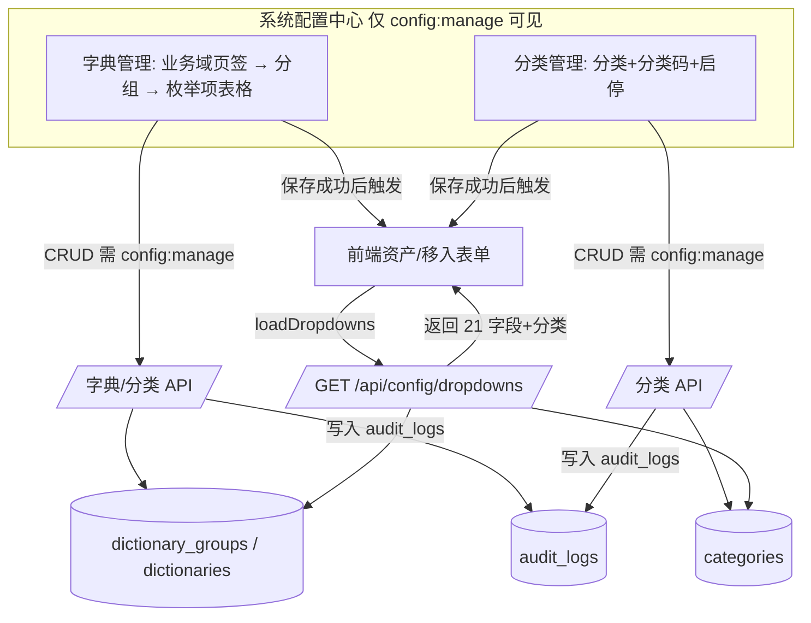

# 产品需求文档（PRD）：IT 资产全生命周期管理系统 — 系统配置模块 P0（字典/枚举配置中心 + 资产分类配置）

> 文档版本：v0.1（简单版 PRD，供架构师产出设计）
> 作者：许清楚（产品经理）
> 日期：2026-07-09
> 范围：**增量开发**——在现有系统上新增「系统配置模块 P0」，将写死在代码里的资产相关下拉选项与分类映射改为「数据库驱动 + 后台可维护」。本文档只描述本次新增/变更部分，不重复已有系统能力。

---

## 0. 项目信息

| 项 | 内容 |
|----|------|
| 项目位置 | `D:\workbuddy\运维体系重塑方案\asset-lifecycle-manager` |
| 后端 | `backend/`（FastAPI + SQLAlchemy + SQLite） |
| 前端 | `frontend/index.html`（Vue3 单文件 SPA，CDN 引 vue/element-plus/echarts） |
| 当前系统版本 | v3.0.0（新台账模板 v1.0 全面升级版） |
| 编程语言 | Python 3.13（后端）/ Vue3 + Element Plus（前端） |
| 本期范围 | P0：字典/枚举管理（A） + 资产分类管理（B） |
| 明确不做 | P1：阶段流转矩阵 `valid_transitions` 入库可配；P2：校验规则开关、聚合白名单可配置 |
| 原始需求复述 | 将 `constants.py` 中约 20 组写死枚举与 `CATEGORY_CODE_MAP`（中文↔分类码，资产编号 `DC-CL-[分类码]-[序号]` 依赖它）抽成可维护的数据表，支持后台 CRUD，并保证存量 100 台资产数据零报错。 |

---

## 1. 产品目标

当前系统的资产相关下拉选项（故障级别、处置方式、根因、维保状态、退役类别、移入/移出类型、所有权类型等共 **19 组**，覆盖前端 21 个下拉字段中的 19 个）与资产分类映射（`CATEGORY_CODE_MAP`）均**写死在 `constants.py` 与 `main.py` 三处硬编码字典**中。任何业务变更（新增一个处置方式、调整分类码、停用某个枚举）都必须改代码、重启后端，且**存量校验在 `schemas.py` 用 Literal 写死**，无法由运维人员自助维护。

本模块目标：以**最小侵入、存量零报错**为第一原则，新增一个统一可维护的「系统配置中心」，把枚举选项与分类映射下沉为数据库数据，并提供后台 CRUD 与 RBAC 权限隔离，使运维主管/管理员可自助维护业务字典，解除「改枚举=改代码」的强耦合。

| # | 产品目标（清晰、正交） |
|---|------------------------|
| G1 | **可维护性**：资产相关枚举与分类映射由数据库驱动、后台可 CRUD（增/删/改/启停/排序），无需改代码重启即可生效。 |
| G2 | **存量零风险**：首次启动把 `constants.py` 现有枚举与分类 seed 进新表，存量资产数据与所有写接口校验 100% 兼容、零报错。 |
| G3 | **安全与一致**：被引用的枚举/分类不可误删（引用保护）；配置能力仅对「系统管理员/运维主管」开放（RBAC）；前端下拉随后台配置实时刷新，避免前后端不一致。 |

---

## 2. 用户故事（按角色）

| 角色 | 用户故事 |
|------|----------|
| 运维主管（ops_manager） | 作为运维主管，我希望在后台直接新增/停用一个故障级别或处置方式、调整资产分类与分类码，而不需要找开发改代码重启，以便快速响应业务变化并控制谁能改配置。 |
| 系统管理员（admin） | 作为系统管理员，我希望所有业务枚举与分类映射集中在一处维护、有启停与排序能力，并能看到某选项被多少资产引用（删除前预警），以便安全治理配置数据。 |
| 运维工程师（ops_engineer） | 作为运维工程师（无配置权限），我希望资产表单里的下拉选项始终与后台最新配置一致、不出现「代码里有但页面上没有」的过期选项，以便准确录入数据。 |
| 只读用户（viewer） | 作为只读用户，我希望配置页面对我不可见、且不影响我查看资产与报表，以便职责隔离、降低误操作风险。 |

---

## 3. 需求池（P0 / P1 / P2）

> 优先级：**P0**=必须交付；**P1**=应交付（本期仅列入需求池，不实现）；**P2**=可选增强（仅列入，不实现）。
> 验收标准均为可度量条件。

### 3.1 P0 — A：字典/枚举管理

> 覆盖前端 `GET /api/config/dropdowns` 返回的 21 字段中的 **17 个枚举分组**（`categories` 归 B、`lifecycle_stages` 归 P1，均不在本子项）。旧常量 → 业务域/分组 → 下拉字段映射见 §6.3。

| 编号 | 描述 | 优先级 | 验收标准 |
|------|------|--------|----------|
| A-01 | **数据模型 `dictionary_groups` + `dictionaries`**：`dictionary_groups(id, domain_code, domain_name, group_code, group_name, sort_order, is_system)`；`dictionaries(id, group_code, value, code, sort_order, enabled, is_system, remark, created_at, updated_at)`。`dictionaries.group_code` 外键关联 `dictionary_groups`；同分组内 `value` 唯一；`enabled` 默认 true。 | P0 | 两表建表成功；同 `group_code` 下重复 `value` 入库报错；`code` 可空（枚举一般不用，分类码场景见 B）。 |
| A-02 | **业务域/分组管理**：按业务域（如「故障维修」「退役报废」「移入移出」「维保续保」「变更迁移」「采购入库」「资产台账」）分组展示与管理枚举；分组本身可排序、可停用。 | P0 | 配置页左侧按业务域→分组两级树/页签展示；分组下挂其枚举项列表。 |
| A-03 | **字典 CRUD API**（均要求 `config:manage`）：新增/编辑/删除/启停/排序枚举项，以及分组管理。 | P0 | 经 `require_permission("config:manage")` 保护；无权限调用返回 403；增改后 `sort_order` 生效。 |
| A-04 | **种子迁移（幂等）**：首次启动（lifespan）把 `constants.py` 现有 17 组枚举 seed 进 `dictionaries`，并建好分组；`is_system=true` 标记系统内置项。 | P0 | 可重跑幂等；seed 后 `GET /api/config/dropdowns` 各枚举字段与改造前 `constants.py` 完全一致；存量资产数据零报错。 |
| A-05 | **引用保护 / 删除保护**：删除枚举项前，检查是否被 `assets` 或子表（`faults/warranties/retirements/inbound/outbound/changes/procurement`）的对应字段引用；被引用则**禁止物理删除**，返回引用计数与提示（也可设计为「仅允许停用」二选一，见 §5-O2）。 | P0 | 对已存在于故障表的某 `fault_level` 调用删除 → 返回 4xx + 引用数；未引用项可删。 |
| A-06 | **启停（enabled）**：枚举项可停用；停用项默认不出现在新增表单下拉（避免误选），但**历史已存数据仍正常显示**（列表/详情回显不受影响）。 | P0 | 停用一个 `warranty_status` 后，新增表单下拉不含它；已存该状态的资产在列表/详情仍正确显示原值。 |
| A-07 | **下拉接口改造**：`GET /api/config/dropdowns` 改为从 `dictionaries` 表按 `group_code` 聚合返回，**响应结构（21 字段名、类型）保持不变**，以兼容前端。 | P0 | 替换实现后前端 `loadDropdowns()` 无需改动即可工作；返回字段集合 = 改造前 21 字段（其中 `categories`/`lifecycle_stages` 来源见 B/P1）。 |
| A-08 | **校验改造需求（提给架构师）**：`schemas.py` 中 13 处 `_VALID_*` Literal 校验（`asset_category`、`lifecycle_stage`、`warranty_status`、`ownership`、`change_type`、`fault_level`、`receive_type`、`inspection_result`、`outbound_category`、`retire_category`、`disposal_method`、`warranty_type`、`procurement_approval_status`）以及**导入流程（`import_export_reports.py`）**的同类校验，从写死枚举改为**运行时查 DB**（仅允许 `enabled=true` 的选项）。架构师落地，PM 仅提需求。 | P0 | 资产建档/编辑/导入接口：提交非 DB 中 enabled 枚举值 → 返回 422/400 明确错误；与改造前校验语义一致。 |
| A-09 | **RBAC 权限 `config:manage`**：在 `auth.py` 的 `PERMISSION_DEFINITIONS` 新增 `config:manage = "系统配置管理"`；加入 `PERMISSION_GROUPS` 的「系统管理」分组；`DEFAULT_ROLES` 中**仅 `admin` 与 `ops_manager` 拥有**，`ops_engineer`/`viewer` 不拥有。 | P0 | `role:view` 角色管理中 `config:manage` 可见可勾选；`ops_engineer`/`viewer` 调配置 API 返回 403；回归不破坏现有 50 项权限。 |
| A-10 | **前端配置页入口显隐 + 操作**：侧边栏新增「系统配置」菜单项，按 `hasPerm('config:manage')` 显隐；配置页内分组树 + 枚举项表格（增/删/改/启停/拖拽排序），保存后触发 `loadDropdowns()` 刷新内存选项。 | P0 | 无权限用户侧边栏无「系统配置」入口；有权限用户可完成 CRUD；保存后资产表单下拉即时更新。 |

### 3.2 P0 — B：资产分类管理

> `CATEGORY_CODE_MAP`（中文名↔分类码）当前写死于 `constants.py`，并被 `main.py` 资产编号生成逻辑在 **POST/PUT 移入**两处各硬编码一份（且三份不一致，见 §6.2）。本子项将其抽为可维护数据。

| 编号 | 描述 | 优先级 | 验收标准 |
|------|------|--------|----------|
| B-01 | **数据模型 `categories`**：`id, category_name(中文), category_code(分类码), sort_order, enabled, is_system, remark, created_at, updated_at`；`category_name` 与 `category_code` 各自唯一约束。 | P0 | 建表成功；重复 `category_code`（如 SVR）或 `category_name`（如 服务器）入库报错。 |
| B-02 | **分类 CRUD API**（要求 `config:manage`）：新增/编辑/删除/启停分类，分类码必填且符合 `[A-Z0-9]{2,4}` 格式。 | P0 | 新增「GPU 服务器 / GPU」后，资产表单分类下拉出现该项且资产编号前缀可用 GPU；分类码非法被拒。 |
| B-03 | **种子迁移（幂等）**：把 `CATEGORY_CODE_MAP` 的映射 seed 进 `categories`（`is_system=true`）；seed 时**自动 reconcile 三处不一致**（以 main.py 局部字典为准，补全 `PDU→PDU`，详见 §6.2）。 | P0 | 可重跑幂等；seed 后分类下拉与原 `CATEGORIES`/`CATEGORY_CODE_MAP` 一致；存量资产 `asset_category` 全部命中 `categories` 表（零 orphan）。 |
| B-04 | **引用保护 / 删除保护**：被 `assets.asset_category` 或 `asset_inbound.asset_category` 引用的分类（或正在作为某资产编号前缀 `DC-CL-[code]-`）**禁止物理删除**，仅可停用；删除前返回引用计数。 | P0 | 对存有资产的「服务器/SVR」调用删除 → 返回 4xx + 引用数；无引用分类可删。 |
| B-05 | **分类码驱动资产编号（统一数据源）**：`DC-CL-{category_code}-NNN` 生成逻辑（现散落 `main.py` 移入 POST/PUT 两处）统一改为读取 `categories` 表查 `category_code`；新增分类即自动获得编号前缀能力。**禁止再 import 已被删除的 `CATEGORY_CODE_MAP`**（参照 `workflow_templates` 迁移范式）。 | P0 | 移入验收合格自动建档时，资产编号前缀 = `categories` 中对应 `category_code`；三份硬编码字典删除后系统无引用报错。 |
| B-06 | **分类下拉接口**：`GET /api/config/dropdowns` 的 `categories` 字段改为读 `categories` 表（enabled 列表），响应结构不变。 | P0 | 前端 `dropdowns.categories` 来源切换为 DB 后行为一致；停用分类不出现在新增下拉。 |
| B-07 | **前端分类联动**：资产建档/编辑表单的「资产分类」下拉、移入表单「资产分类」下拉改为从新接口拉取（已随 A-07/A-10 的 `loadDropdowns` 一并生效）。 | P0 | 两类表单分类下拉值与后台 `categories` 表一致，配置变更后刷新。 |

### 3.3 P0 — 架构前置关键需求（交付总监要求，6 点可追溯）

| # | 关键需求（来自架构前置要求） | 落地点（需求编号） | 状态 |
|---|------------------------------|--------------------|------|
| K1 | **存量兼容 + 种子迁移**：首次启动必须把 `constants.py` 现有枚举与分类 seed 进新表，保证存量 100 台资产零报错。 | A-04、B-03 | P0 |
| K2 | **删除保护 / 引用保护**：被资产或其他表引用的枚举值不可物理删除，只能「停用」；或直接禁止删除并提示引用数。 | A-05、B-04 | P0 |
| K3 | **校验改造需求**：资产写接口（建档/编辑/导入）枚举字段校验，从 `schemas.py` 的 Literal/写死枚举改为运行时查 DB。 | A-08 | P0（架构师落地） |
| K4 | **RBAC**：新增权限（建议 `config:manage`），仅「系统管理员/运维主管」具备；运维工程师、只读用户无此权限；配置页面入口按权限显隐。 | A-09、A-10 | P0 |
| K5 | **前端联动**：资产表单各下拉改为从新接口拉动态选项；配置变更后前端选项能刷新（缓存失效），避免前后端不一致。 | A-07、A-10、B-06、B-07 | P0 |
| K6 | **业务分组**：字典按业务域分组展示与管理（如「故障维修」「退役报废」「移入移出」「维保」等），分组可参考 `constants.py` 现有结构。 | A-02 | P0 |

### 3.4 P1 — 应交付（本期仅列入需求池，不实现）

| 编号 | 描述 | 优先级 | 验收标准（草案） |
|------|------|--------|------------------|
| P1-01 | **7 阶段流转矩阵 `valid_transitions` 入库可配**：`validation.py` 的 `valid_transitions` 与 `LIFECYCLE_STAGES` 管理迁入 `dictionaries`/独立表，支持后台配置阶段与合法跳转。 | P1 | 后台可增删阶段、配置跳转边；阶段门禁读取 DB；存量校验语义不变。 |
| P1-02 | **字典接口前端缓存版本号**：`GET /api/config/dropdowns` 返回 `version`/`updated_at` 字段，前端据此判断是否需要刷新（弱网/多标签页一致性）。 | P1 | 配置变更后 `version` 自增；前端对比版本决定是否重新拉取。 |

### 3.5 P2 — 可选增强（仅列入，不实现）

| 编号 | 描述 | 优先级 |
|------|------|--------|
| P2-01 | **校验规则开关 / 聚合白名单可配置**：将 `AGGREGATE_FIELD_WHITELIST` 等数据完整性关键路径改为可配置（暂不动，属数据完整性关键路径）。 | P2 |
| P2-02 | **字典审计日志增强**：所有字典/分类 CRUD 写入 `audit_logs`（action=create/update/delete，resource_type=dictionary/category），支撑合规追溯。 | P2 |
| P2-03 | **导入模板枚举校验联动**：Excel 导入时按 DB 枚举做整列校验并给出「不在字典中的值」清单。 | P2 |

---

## 4. UI 设计稿（系统配置中心 + 下拉联动）

### 4.1 配置页布局（ASCII 草图）

```
┌──────────────────────────────────────────────────────────────────────┐
│ 侧边栏菜单                                        │  顶部栏: 系统配置  │
│  · 总览 dashboard                                 ├───────────────────┤
│  · 校验 validation                               │ [业务域页签]       │
│  · 数据导入导出 importExport                      │ 故障维修 | 退役报废 │
│  · 报表统计 reports                               │ 移入移出 | 维保续保 │
│  · 资产台账 assets                                │ 变更迁移 | 采购入库 │
│  ▶ 系统配置 config  (新增, 仅config:manage可见)    │ 资产台账           │
│  · 故障维修 faults ...                            ├───────────────────┤
│                                                  │ 分组: 故障级别      │
│                                                  │ [+新增][启停][排序] │
│                                                  │ ┌─────────────────┐│
│                                                  │ │ P1      启用 ↑↓ ││
│                                                  │ │ P2-严重  启用 ↑↓ ││
│                                                  │ │ P3      启用 ↑↓ ││
│                                                  │ │ P4      停用 ↑↓ ││
│                                                  │ │ (+编辑/删除)     ││
│                                                  │ └─────────────────┘│
│                                                  │ 分组: 处理方式/根因 │
│                                                  │ 分类管理 Tab →     │
│                                                  │ 服务器 SVR 启用     │
│                                                  │ 网络设备 NET 启用   │
│                                                  │ ...                │
└──────────────────────────────────────────────────────────────────────┘
```

### 4.2 页面结构（Mermaid）



### 4.3 下拉联动与缓存失效（要点）

- **单一数据源**：所有资产表单下拉统一经 `loadDropdowns()` → `GET /api/config/dropdowns`；改造后该接口从 `dictionaries` + `categories` 表读取，前端 `dropdowns` reactive 对象结构（21 字段）**保持不变**，无需逐项改组件。
- **配置即时生效**：配置页完成 CRUD 后调用一次 `loadDropdowns()`，使内存选项刷新；结合 §5-O3 决定是否引入版本号（P1-02）做跨标签页/弱网一致性。
- **停用 vs 历史值**：`enabled=false` 的项不进入新增表单下拉，但已存资产回显仍显示原值（避免历史数据「变空白」）。

---

## 5. 待确认问题（需主理人/架构师/用户拍板）

| # | 问题 | 建议默认 | 影响 |
|---|------|----------|------|
| O1 | **分类映射存储形态**：资产分类用**独立 `categories` 表**（推荐，因其含分类码、驱动资产编号、需独立引用保护），还是并入 `dictionaries` 的某一分组（如 `group_code=asset_category`）？ | 独立 `categories` 表 | 数据模型与 B-01/B-05 设计 |
| O2 | **删除保护策略**：被引用项是「**仅允许停用、禁止删除**」（推荐，最简单安全），还是「**允许删除但前置提示引用数并拦截**」？二者都需要引用计数，差异在 UI 文案与是否保留物理删除入口。 | 仅允许停用、禁止删除 | A-05 / B-04 实现 |
| O3 | **字典接口缓存版本号**：P0 是否必须支持前端缓存版本号（`version` 字段）以保证多标签页一致？还是 P0 先用「保存后主动 `loadDropdowns()`」即可，版本号留待 P1-02？ | P0 用主动刷新，版本号留 P1-02 | A-10 / P1-02 范围 |
| O4 | **`lifecycle_stages` 是否纳入 P0**：7 阶段与 `valid_transitions`（P1）强耦合，建议 P0 **不纳入**字典管理（保持硬编码），待 P1-01 一并数据化。请确认是否同意。 | P0 不纳入，留 P1 | A 子项范围（21→19 字段） |
| O5 | **`AGGREGATE_FIELD_WHITELIST` 等 P2 项**：本期明确不动；如需在配置中心预留「聚合白名单」入口请说明，否则严格按 P2 处理。 | 严格 P2，不预留 | 范围边界 |
| O6 | **种子 reconcile 口径**：`constants.py` 的 `CATEGORY_CODE_MAP` 缺 `PDU` 键，而 `main.py` 局部字典含 `PDU→PDU` 且 `CATEGORIES` 列表含「PDU」与「配电设备」两项。seed 时以哪份为准？建议以 `main.py` 局部字典为准（含 PDU），并保留「配电设备」与「PDU」两个分类名。 | 以 main.py 局部字典为准 | B-03 种子逻辑 |
| O7 | **字典分组层级**：采用「业务域(domain) → 枚举分组(group) → 枚举项(item)」三级（推荐，贴合 §K6 业务域示例），还是「分组 → 项」两级（业务域即分组）？ | 三级（domain/group/item） | A-01/A-02 模型 |
| O8 | **导入校验改造归属**：A-08 的导入流程（`import_export_reports.py`）枚举校验改 DB，是否随 P0 一并发动，还是单独排期？建议随 P0（同一数据源头）。 | 随 P0 一并 | A-08 实现排期 |

---

## 6. 源码契约确认（阅读记录）

> 以下为本次 PRD 结论的依据，确保与现有代码契约一致、可落地。

### 6.1 已阅读文件
- `backend/constants.py` — 约 20 组写死枚举 + `CATEGORY_CODE_MAP`（中文↔分类码）+ `LIFECYCLE_STAGES` + `AGGREGATE_FIELD_WHITELIST`
- `backend/database.py` — `Asset` 主表（34 列）、`Fault/Warranty/Retirement/Inbound/Outbound/Change/Procurement` 子表结构、外键约束
- `backend/schemas.py` — 13 处 `_VALID_*` Literal 校验（见 A-08）、`DropdownConfig`（21 字段）
- `backend/validation.py` — `valid_transitions`（P1 范围，本期不动）、阶段门禁
- `backend/auth.py` — `PERMISSION_DEFINITIONS`（50 项）、`PERMISSION_GROUPS`、`DEFAULT_ROLES`、`require_permission`
- `backend/main.py` — `GET /api/config/dropdowns`（451-473，单一下拉源）、移入 POST/PUT 内 `category_code_map` 局部字典（865-869 / 927-931，资产编号 `DC-CL-{code}-NNN` 生成）
- `frontend/index.html` — `dropdowns` reactive（1947-1954）、`loadDropdowns()`（2068-2070）、各表单 `el-option` 绑定（asset 表单 1476-1546、移入 1752-1775、移出 1810 等）
- `PRD_报表统计模块.md` / `PRD_报表统计模块_P2.md` / `deliverables/design-report-module.md` — 参考结构与风格

### 6.2 关键契约与已发现的不一致（需架构师注意）
1. **`CATEGORY_CODE_MAP` 三份拷贝且不一致**：
   - `constants.py`：`CATEGORY_CODE_MAP` 含 9 键，**缺 `PDU`**（有「配电设备→PDU」但无独立「PDU→PDU」）。
   - `main.py` 移入 POST（865-869）与 PUT（927-931）：局部字典含 `PDU→PDU`，共 10 键，与 `CATEGORIES` 列表一致。
   - **结论**：P0 必须统一为单数据源（`categories` 表），seed 时 reconcile（以 main.py 局部字典为准，见 §5-O6）。
2. **`/api/config/dropdowns` 是唯一前端下拉源**：返回 `DropdownConfig`（21 字段），前端 `dropdowns` 对象与 20+ 处 `el-option` 均依赖其字段名。**A-07 必须保持 21 字段响应结构不变**。
3. **`schemas.py` 写死校验清单（A-08 改造对象）**：`AssetCreate`（asset_category/lifecycle_stage/warranty_status/ownership）、`InboundCreate`（receive_type/ownership/inspection_result）、`OutboundCreate`（outbound_category）、`ChangeCreate`（change_type）、`FaultCreate`（fault_level）、`WarrantyCreate`（warranty_type）、`RetirementCreate`（retire_category/disposal_method）、`ProcurementCreate`（approval_status）——共 13 处 `@field_validator`。
4. **权限体系**：`config:manage` 为新增第 51 项权限，仅注入 `admin`/`ops_manager`；`require_permission("config:manage")` 可复用现有装饰器；`PERMISSION_GROUPS` 需新增「系统管理」分组条目（或并入现有「系统管理」组）。
5. **资产编号格式**：`DC-CL-[分类码]-[序号]`，分类码取自 `CATEGORY_CODE_MAP`；B-05 要求改为查 `categories.category_code`，且新分类自动获得前缀能力（如新增 GPU→GPU 则可生成 `DC-CL-GPU-001`）。
6. **引用字段对应关系**（A-05/B-04 引用保护查询依据）：`asset_category`→`assets`/`asset_inbound`；`fault_level`→`faults`；`warranty_status`→`assets`；`ownership`→`assets`/`asset_inbound`；`change_type`→`changes`；`retire_category`/`disposal_method`/`data_cleared`→`retirements`；`receive_type`/`inspection_result`→`asset_inbound`；`outbound_category`→`asset_outbound`；`warranty_type`/`renewal_decision`→`warranties`；`approval_status`→`procurement`。

### 6.3 旧常量 → 业务域/分组 → 下拉字段 映射（供架构师 seed 与接口聚合）

| 旧常量（constants.py） | group_code | 业务域 | DropdownConfig 字段 | 归属 |
|------------------------|-----------|--------|---------------------|------|
| `CATEGORIES` | asset_category | 资产台账 | categories | **B（categories 表）** |
| `LIFECYCLE_STAGES` | lifecycle_stage | 资产台账 | lifecycle_stages | **P1（不纳入）** |
| `WARRANTY_STATUSES` | warranty_status | 资产台账/维保 | warranty_statuses | A |
| `OWNERSHIP_TYPES` | ownership_type | 资产台账 | ownership_types | A |
| `FAULT_LEVELS` | fault_level | 故障维修 | fault_levels | A |
| `HANDLE_METHODS` | handle_method | 故障维修 | handle_methods | A |
| `ROOT_CAUSES` | root_cause | 故障维修 | root_causes | A |
| `RETIRE_CATEGORIES` | retire_category | 退役报废 | retire_categories | A |
| `DISPOSAL_METHODS` | disposal_method | 退役报废 | disposal_methods | A |
| `DATA_CLEAR_OPTIONS` | data_clear_option | 退役报废 | data_clear_options | A |
| `CHANGE_TYPES` | change_type | 变更迁移 | change_types | A |
| `COMPLETION_STATUSES` | completion_status | 变更迁移 | completion_statuses | A |
| `RECEIVE_TYPES` | receive_type | 移入移出 | receive_types | A |
| `OUTBOUND_CATEGORIES` | outbound_category | 移入移出 | outbound_categories | A |
| `INBOUND_INSPECTION_RESULTS` | inbound_inspection_result | 移入移出 | inbound_inspection_results | A |
| `INSPECTION_RESULTS` | inspection_result | 移入移出 | inspection_results | A |
| `WARRANTY_TYPES` | warranty_type | 维保续保 | warranty_types | A |
| `RENEWAL_DECISIONS` | renewal_decision | 维保续保 | renewal_decisions | A |
| `PROCUREMENT_APPROVAL_STATUSES` | procurement_approval_status | 采购入库 | procurement_approval_statuses | A |

> 合计：A 管理 **17** 个枚举分组 + B 管理 **1** 个分类（categories）；`lifecycle_stages` 留 P1；正好覆盖现有 `GET /api/config/dropdowns` 的 **21** 个字段。
