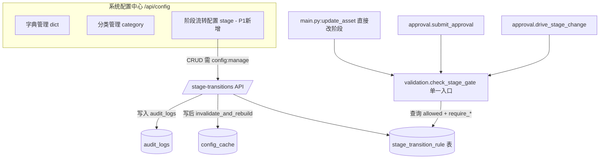

# 产品需求文档（PRD）：IT 资产全生命周期管理系统 — 系统配置模块 P1（阶段流转矩阵可配置）

> 文档版本：v0.1（简单版增量 PRD，供架构师产出设计）
> 作者：许清楚（产品经理）
> 日期：2026-07-09
> 依赖：P0 配置中心已落地并生产验证（字典/枚举 + 资产分类 + `/api/config` + `config:manage` + 缓存失效）。本文档为**增量**，只描述 P1 新增/变更部分，复用 P0 能力处注明「复用」。

---

## 0. 项目信息

| 项 | 内容 |
|----|------|
| 项目位置 | `D:\workbuddy\运维体系重塑方案\asset-lifecycle-manager` |
| 后端 | `backend/`（FastAPI + SQLAlchemy + SQLite） |
| 前端 | `frontend/index.html`（Vue3 单文件 SPA，CDN 引 vue/element-plus/echarts） |
| 当前系统版本 | v3.0.0（新台账模板 v1.0）+ P0 配置中心 |
| 编程语言 | Python 3.13（后端）/ Vue3 + Element Plus（前端） |
| 本期范围 | P1：7 阶段流转矩阵 `valid_transitions` 数据库可配置，纳入 P0 配置中心体系 |
| 明确不做 | 阶段列表（`LIFECYCLE_STAGES`）数据化（维持 constants，与 P0-O4 一致）；审批类型→目标阶段映射（由 `workflow_templates` 管辖，不在 P1） |
| 原始需求复述 | 把资产全生命周期「7 阶段流转矩阵 `valid_transitions`」从硬编码改为数据库可配置，让管理员可在后台增删改阶段流转规则，而不必动代码。 |

---

## 1. 产品目标

> 一句话：**将写死在 `validation.py` 的 7 阶段流转矩阵下沉为数据库配置，使阶段流转规则可由运维主管/管理员在后台自助维护，无需开发改代码重启。**

| # | 价值点（清晰、正交） |
|---|----------------------|
| V1 | **去硬编码**：阶段流转规则（允许/禁止的对、前置条件开关）改为数据库驱动、后台 CRUD，变更即时生效，解除「改流转=改代码」耦合。 |
| V2 | **存量零风险**：首次启动把当前硬编码矩阵（11 个允许对 + 4 类前置条件）精确 seed 进新表，所有阶段变更校验行为与改造前 100% 一致、零报错。 |
| V3 | **可追溯/可治理**：复用 P0 配置中心的 `config:manage` 权限隔离、引用/出口保护与缓存失效机制，阶段流转规则的维护与现有字典/分类治理体验一致。 |
| V4 | **可审计与可移植**：规则支持查看「当前矩阵」可视化、批量导入/导出，便于环境间迁移与变更复核。 |

---

## 2. 用户故事（运维主管/管理员视角）

| 角色 | 用户故事 |
|------|----------|
| 运维主管（ops_manager） | 作为运维主管，我希望在后台直接看到当前 7 阶段流转矩阵（哪些阶段可以跳到哪些），并能新增一条流转规则（如放开「待报废→运行」回退）或停用某条规则，而不需要找开发改代码重启，以便快速响应业务调整。 |
| 系统管理员（admin） | 作为系统管理员，我希望在配置中心统一维护阶段流转规则与每条规则的前置条件开关（是否需要故障记录、是否需要数据清除等），并能导出规则做备份、导入规则做恢复，以便安全治理与跨环境迁移。 |
| 运维工程师（ops_engineer，无配置权限） | 作为运维工程师，我希望阶段变更校验（门禁）仍然按最新配置准确拦截非法跳转，且不影响我正常发起审批，以便录入与流转不受误配影响。 |
| 只读用户（viewer） | 作为只读用户，我希望「系统配置」入口对我不可见、阶段流转配置不可改，以便职责隔离、降低误操作风险。 |

---

## 3. 需求池（P0 / P1 / P2 分级）

> 优先级：**P1**=本期必做；**P2**=可选增强（仅列入，不实现）。
> 标注「复用 P0」＝直接复用 P0 已落地能力，不重复建设；「新增」＝P1 新增。
> 验收标准均为可度量条件。

### 3.1 P1 — 阶段流转规则可配置（本期必做）

#### 3.1.1 数据模型（新增）

| 编号 | 描述 | 优先级 | 验收标准 |
|------|------|--------|----------|
| T-01 | **数据模型 `stage_transition_rule`**（新增于 `database.py`）：`id, from_stage, to_stage, allowed(Boolean,默认true), require_approval(Boolean,默认true), require_fault_record(Boolean,默认false), require_data_cleared(Boolean,默认false), require_retirement(Boolean,默认false), require_inspection(Boolean,默认false), require_location(Boolean,默认false), remark(Text), is_system(Boolean,默认false), sort_order(Integer,默认0), created_at, updated_at`；唯一约束 `(from_stage, to_stage)`。 | P1 | 建表成功；重复 `(from_stage,to_stage)` 入库报错；字段与 §6.3 标志映射一致。 |
| T-02 | **种子迁移（幂等）**：新增 `seed_stage_transitions.py`（对称 `seed_config_dict.py`），仅当 `stage_transition_rule` 表为空时写入当前硬编码矩阵 = **11 个允许对**（见 §6.2），并据 `check_stage_gate` 现状为每行打前置条件标志（`require_retirement`/`require_data_cleared`/`require_inspection`/`require_location`/`require_fault_record`），`is_system=true`；挂载进 `main.py` lifespan（与 `seed_config_dict`、`seed_workflow_templates` 并列）。 | P1 | 可重跑幂等；seed 后阶段门禁行为与改造前逐条一致（11 对允许 + 4 类前置条件）；存量 100 台资产流转零报错。 |

#### 3.1.2 管理 API（新增，风格对齐 P0 `/api/config`）

| 编号 | 描述 | 优先级 | 验收标准 |
|------|------|--------|----------|
| T-03 | **阶段流转规则 CRUD API**（前缀 `/api/config`，复用 P0 `config_router` 模式与 `require_permission("config:manage")`）：`GET /stage-transitions`（列表，含禁用）、`POST /stage-transitions`、`PUT /stage-transitions/{id}`、`DELETE /stage-transitions/{id}`、`POST /stage-transitions/{id}/toggle`（启停=允许/禁止该流转）。写成功后复用 `invalidate_and_rebuild(db)` 重建缓存（复用 P0 `config_cache`）。 | P1 | 经 `config:manage` 保护；无权限返回 403；列表与前端契约一致；写后缓存失效。 |
| T-04 | **导入/导出 API**（复用 P0 风格）：`GET /api/config/stage-transitions/export`（返回 JSON/CSV 全量规则）、`POST /api/config/stage-transitions/import`（批量写入，冲突按 `(from_stage,to_stage)` upsert 或报错）；导入时校验 `from_stage`/`to_stage` 均为合法阶段（见 §6.4）。 | P1 | 导出文件可被同接口重新导入且结果一致；非法阶段值在导入时被拒（400）；空文件/格式错误被拒。 |
| T-05 | **引用/出口保护（删除规则）**：删除某条规则前，检查该 `from_stage` 是否还有其他 `allowed=true` 的出口规则；若其为该阶段**唯一**出口，且当前 `assets` 中处于该阶段的记录数 `>0`，则**禁止删除**并返回该阶段存量计数提示（复用 P0 `count_references` 思路，新增「阶段出口」引用判断）。 | P1 | 对「运行」阶段删掉其最后一条出口规则且存在运行中资产 → 返回 4xx + 该阶段存量数；无存量或仍有其它出口时可删。 |

#### 3.1.3 前端（新增第 3 个 Tab）

| 编号 | 描述 | 优先级 | 验收标准 |
|------|------|--------|----------|
| T-06 | **前端配置中心新增「阶段流转配置」子页（第 3 个 Tab）**：在 P0 已有 `el-tabs v-model="configSubTab"` 中新增 `<el-tab-pane label="阶段流转配置" name="stage">`，与「字典管理」「分类管理」并列；按 `hasPerm('config:manage')` 随系统配置入口整体显隐（复用 P0 入口逻辑）。 | P1 | 无权限用户侧边栏无「系统配置」入口（沿用 P0）；有权限用户可见第 3 个 Tab。 |
| T-07 | **矩阵可视化 + 规则表格编辑**：① 顶部矩阵视图（7×7 或按 `from_stage` 分组的允许对列表，直观展示「当前矩阵」）；② 下方规则表格（`from_stage`/`to_stage` 下拉取自 `dropdowns.lifecycle_stages`、`allowed` 启停标签、各前置条件开关列、备注、操作「编辑/删除」），表格编辑复用 P0 字典表格交互模式（对话框表单）。 | P1 | 矩阵视图与数据库规则一致；编辑/删除后即时刷新；`from_stage`/`to_stage` 仅能从 7 阶段中选择。 |
| T-08 | **导入/导出按钮**：该子页提供「导出规则」「导入规则」按钮，调用 T-04 接口（JSON/CSV），与 P0 字典管理体验一致。 | P1 | 导出生成可下载文件；导入后规则表格与矩阵视图刷新并反映新配置。 |

#### 3.1.4 集成（需求点明，工程细节归架构师/工程师）

| 编号 | 描述 | 优先级 | 验收标准 |
|------|------|--------|----------|
| T-09 | **流转校验统一走配置表**：`validation.py` 的 `check_stage_gate`（当前硬编码 `valid_transitions` 字典 + 4 处前置条件分支）改为查询 `stage_transition_rule` 表：① 查 `(from_stage=current, to_stage=target, allowed=true)` 行，无则拒绝并列出该阶段合法出口；② 按行内 `require_*` 标志执行对应前置校验（退役记录+申请单号、数据清除、验收合格、位置完整、故障记录+全部恢复）。所有调用方（`main.py:update_asset` 直接改阶段、`approval.py:submit_approval` 与 `drive_stage_change` 审批流转）经此单一入口，自动改用 DB 矩阵，无需各自改动。 | P1 | 改造后 11 个允许对行为与原硬编码一致；非法跳转被拒且提示合法出口；4 类前置条件按标志生效；`workflow_engine.validate_stage` 的阶段清单（非矩阵，故障降级用）不在本次范围，保持现状。 |
| T-10 | **RBAC 复用 `config:manage`**：阶段流转配置不新增权限项，直接复用 P0 的 `config:manage`（已授予 admin/ops_manager，viewer/ops_engineer 无）。 | P1 | 调阶段流转配置 API 时 viewer/ops_engineer 返回 403；admin/ops_manager 正常；回归不破坏现有 51 项权限。 |

#### 3.1.5 错误码与契约约定（顺带澄清）

| 编号 | 描述 | 优先级 | 验收标准 |
|------|------|--------|----------|
| T-11 | **配置类接口错误码统一沿用系统约定**：Pydantic **schema 校验失败 → 422**；**业务校验失败 → 400**（重复、被引用、非法阶段值等）；资源不存在 → 404。注明 P0 一项非阻塞偏差：非法分类码因走 Pydantic `pattern` 校验实际返回 **422** 而非任务书描述的 400（与系统 Pydantic 约定一致）；P1 阶段流转接口同样遵循「422=schema / 400=业务」。 | P1 | 工程师确认该约定；非法阶段值（非 7 阶段）经 schema 层返回 422，业务冲突（重复对/被引用）返回 400。 |

### 3.2 P2 — 可选增强（仅列入，不实现）

| 编号 | 描述 | 优先级 |
|------|------|--------|
| P2-01 | **阶段列表 `LIFECYCLE_STAGES` 数据化**：将 7 阶段本身纳入配置（独立 `stages` 表或 `dictionaries` 分组），与流转规则联动；需同步 `constants`、`DROPDOWN_FIELD_TO_SOURCE`、`workflow_engine.validate_stage` 等。 | P2 |
| P2-02 | **前置条件细粒度配置扩展**：除现有 5 类标志外，支持更细的前置规则（如「需指定审批角色」「需上传附件」「最小停留时长」），以 JSON 表达式存储。 | P2 |
| P2-03 | **流转规则变更审计/版本**：所有规则 CRUD 写入 `audit_logs`（resource_type=stage_transition），并支持规则快照版本回滚。 | P2 |
| P2-04 | **审批路由联动**：`require_approval` 标志运行时生效——标记「免审批」的流转可直接变更（跳过审批流），由 `approval.py` 读取规则决定走审批还是直改（当前所有阶段变更均走审批，此能力默认关闭）。 | P2 |

---

## 4. UI 设计稿（系统配置中心 · 阶段流转配置子页）

> 复用 P0 配置页 Tab 结构（`currentTab==='config'` → `el-tabs v-model="configSubTab"`），新增第 3 个 `el-tab-pane`。下列为文字布局说明（无需改图）。

### 4.1 配置中心 Tab 结构（改造后）

```
系统配置（config，仅 config:manage 可见）
└─ el-tabs v-model="configSubTab"
   ├─ 字典管理 (dict)      [P0 已有]
   ├─ 分类管理 (category)  [P0 已有]
   └─ 阶段流转配置 (stage) [P1 新增]
```

### 4.2 「阶段流转配置」子页布局（自上而下）

```
┌──────────────────────────────────────────────────────────────────┐
│ [导出规则] [导入规则]                          │  矩阵视图区      │
│ ┌─────────────────────────────────────────┐ │ 当前 7 阶段流转：│
│ │ 矩阵视图（只读展示）                       │ │ 规划 → 在途,上架 │
│ │ 规划: 在途 / 上架                          │ │ 在途 → 上架,运行 │
│ │ 在途: 上架 / 运行                          │ │ 上架 → 运行      │
│ │ 上架: 运行                                 │ │ 运行 → 维修,待报废,在途 │
│ │ 运行: 维修 / 待报废 / 在途                  │ │ 维修 → 运行,待报废 │
│ │ 维修: 运行 / 待报废                         │ │ 待报废 → 已报废  │
│ │ 待报废: 已报废                             │ │ （已报废为终态） │
│ └─────────────────────────────────────────┘ └──────────────────┘
│ 规则表格（可编辑）                                              │
│ ┌──────┬──────┬──────┬────────────────────────────────────┬────┐│
│ │源阶段│目标阶段│允许  │ 前置条件开关                          │操作││
│ ├──────┼──────┼──────┼────────────────────────────────────┼────┤│
│ │待报废│已报废│●启用 │ ☑退役单 ☑数据清除 □验收 □位置 □故障  │编辑││
│ │在途  │上架  │●启用 │ □退役单 □数据清除 ☑验收 □位置 □故障  │编辑││
│ │上架  │运行  │●启用 │ □退役单 □数据清除 □验收 ☑位置 □故障  │编辑││
│ │维修  │运行  │●启用 │ □退役单 □数据清除 □验收 □位置 ☑故障  │编辑││
│ │运行  │在途  │●启用 │ □退役单 □数据清除 □验收 □位置 □故障  │编辑││
│ │ ...  │ ...  │ ...  │ ...                                  │删除││
│ └──────┴──────┴──────┴────────────────────────────────────┴────┘│
│ 新增规则按钮 → 对话框(from_stage*/to_stage* 下拉 + allowed 开关    │
│                    + 5 个前置条件开关 + remark)                   │
└──────────────────────────────────────────────────────────────────┘
```
- `源阶段/目标阶段` 下拉选项取自 `dropdowns.lifecycle_stages`（7 阶段，维持 constants，见 §6.4）。
- 「允许」列 = `allowed` 启停（复用 P0 的 toggle 交互）。
- 5 个前置条件开关对应 `require_retirement / require_data_cleared / require_inspection / require_location / require_fault_record`（seed 时按 §6.3 勾选，与现状一致）。

### 4.3 数据流（Mermaid）



---

## 5. 待确认问题（需主理人/架构师/用户拍板）

| # | 问题 | 建议默认 | 影响 |
|---|------|----------|------|
| O1 | **前置条件是否随 P1 一并数据化**：本期是把「是否需审批/故障记录/数据清除/验收/位置」等前置条件也抽成 `stage_transition_rule` 的标志列（seed=现状 4 类），还是 P1 仅做「允许矩阵」可配、前置条件分支仍保留 `validation.py` 硬编码？ | 一并数据化（标志列 seed=现状），门禁整体读库，最贴合「流转规则可配置」目标 | T-01/T-02/T-09 模型与 seed 范围 |
| O2 | **删除规则时的出口保护策略**：存量资产处于某阶段、删掉其唯一出口会怎样？建议「若该阶段唯一 `allowed` 出口被删且存在存量资产 → 禁止删除并提示该阶段存量计数」（复用 P0 `count_references` 思路）；还是允许删除（资产进入软锁定、无法再流转）？ | 禁止删除 + 提示存量计数 | T-05 实现 |
| O3 | **阶段列表是否纳入 P1 数据化**：`LIFECYCLE_STAGES` 维持 `constants` 不变（与 P0-O4 一致），还是本期一并数据化？ | 维持 constants 不变；`from/to` 下拉取自 `dropdowns.lifecycle_stages` | 范围边界（§6.4） |
| O4 | **批量导入格式与语义**：导入用 JSON 还是 CSV？冲突策略 upsert 还是整表替换？是否包含 `allowed` 与 5 个前置条件标志字段？ | JSON（含全部字段），`(from_stage,to_stage)` 存在则更新、否则插入（upsert） | T-04 实现 |
| O5 | **`require_approval` 标志是否运行时生效**：当前所有阶段变更均走审批流；P1 是否仅把该标志落库（默认 true，暂不改变流转行为），还是允许标记「免审批」的流转直接变更（跳过审批）？ | P1 仅落库默认 true，不改变现有审批流转；「免审批直改」留 P2-04 | T-01/T-09 范围；P2-04 |

---

## 6. 源码契约确认（阅读记录）

> 以下为本次 PRD 结论的依据，确保与现有代码契约一致、可落地。

### 6.1 已阅读文件
- `backend/constants.py` — `LIFECYCLE_STAGES`（7 阶段）、`ACTIVE_STAGES`、`CATEGORY_CODE_MAP`（确认阶段枚举以本文件为准，未动）。
- `backend/validation.py` — `check_stage_gate`（阶段门禁，硬编码 `valid_transitions` + 4 处前置条件分支）。
- `backend/approval.py` — `submit_approval`（前门禁，line 107）、`drive_stage_change`（后门禁，line 190），均调用 `check_stage_gate`；跳过门禁的审批类型 `skip_gate_types=[fault_degrade_approval, warranty_renewal_approval, outbound_approval]`。
- `backend/main.py` — `update_asset`（line 695-696 直接改阶段时调 `check_stage_gate`）、`/api/config/*` 经 `config_router` 挂载（line 1461）、`GET /api/config/dropdowns`（line 451）、审批流 API（1503+）。
- `backend/config_api.py` — P0 `/api/config` 路由模式（dictionary-groups / dictionaries / categories CRUD + `/{id}/toggle` + `/references`），全部 `require_permission("config:manage")` + 写后 `invalidate_and_rebuild`。
- `backend/seed_config_dict.py` — P0 幂等 seed 模式（仅空表时写，对称实现 `seed_stage_transitions.py`）。
- `backend/config_cache.py` — `invalidate_and_rebuild` / `build_enum_cache` / `count_references`（P1 流转规则缓存可复用或新增对应函数）。
- `backend/workflow_engine.py` — `validate_stage`（line 126 用硬编码 `["上架","运行","在途","维修"]` 阶段清单，属故障降级范围判定，**非流转矩阵**，确认不在 P1）、`get_target_stage`（读 `WorkflowTemplate`，已数据驱动）。
- `frontend/index.html` — 配置页 `currentTab==='config'`（line 1149）→ `el-tabs v-model="configSubTab"` 含「字典管理」(1152)/「分类管理」(1190) 两 pane；script 中 `loadConfigData()` 调 `/api/config/dictionary-groups`、`/api/config/categories`、`/api/config/dictionaries?group_code=` 等（2078+）。

### 6.2 当前硬编码矩阵（精确，seed 依据）

`validation.py:check_stage_gate` 中 `valid_transitions`（**11 个允许对**；「已报废」为终态，无出口）：

| 源阶段 | 允许的目标阶段 |
|--------|----------------|
| 规划 | 在途、上架 |
| 在途 | 上架、运行 |
| 上架 | 运行 |
| 运行 | 维修、待报废、在途 |
| 维修 | 运行、待报废 |
| 待报废 | 已报废 |
| 已报废 | （无，终态） |

> 禁止对 = 上表之外的全部组合（如 规划→运行、上架→待报废、待报废→运行 等）。

### 6.3 当前前置条件（精确，映射为 `require_*` 标志）

`check_stage_gate` 在矩阵通过后，按 `target_stage` 附加 4 类前置校验，seed 映射如下：

| 流转对 | 当前前置校验（硬编码） | 对应标志（seed 默认 true） |
|--------|------------------------|----------------------------|
| 待报废 → 已报废 | 须有 `Retirement` 记录且 `application_no` 非空 **且** `data_cleared=='已清除'` | `require_retirement=true`、`require_data_cleared=true` |
| 在途 → 上架 | `Procurement` 或 `AssetInbound` 的 `inspection_result=='合格'` | `require_inspection=true` |
| 上架 → 运行 | `Asset.room/cabinet/u_position` 均非空 | `require_location=true` |
| 维修 → 运行 | 至少 1 条 `Fault` 记录 **且** 全部 `recovery_date` 非空 | `require_fault_record=true` |
| 其余允许对（规划→在途/上架、在途→运行、上架→运行、运行→维修/待报废/在途、维修→待报废） | 无附加前置 | 全部 false |

其余标志默认：`require_approval=true`（当前所有阶段变更均走审批流，见 O5）、`is_system=true`（seed 行）。

### 6.4 阶段枚举来源（P1 维持不变）
- 7 阶段值以 `constants.LIFECYCLE_STAGES` 为准；前端经 `GET /api/config/dropdowns` 的 `lifecycle_stages` 字段（`DROPDOWN_FIELD_TO_SOURCE` 中 source=`"constants"`，P0-O4 决策未纳入字典）。
- P1 阶段流转配置 UI 的 `from_stage`/`to_stage` 下拉即取 `dropdowns.lifecycle_stages`；导入校验非法阶段值（非 7 阶段之一）按 T-11 返回 422（schema）或 400（业务）。

### 6.5 集成点与复用清单（供架构师）
- **唯一集成入口**：`validation.check_stage_gate`。改造它读 `stage_transition_rule` 后，全部 4 个调用方自动切换：
  1. `main.py:update_asset`（直接编辑阶段，line 695）
  2. `approval.py:submit_approval`（审批提交前门禁，line 107）
  3. `approval.py:drive_stage_change`（审批通过后驱动变更，line 190）
  4. （间接）前端阶段变更/审批流均经上述路径
- **复用 P0 能力（不重复建设）**：
  - 路由前缀与权限：`/api/config` + `require_permission("config:manage")`（来自 `config_api.py`）
  - 缓存失效：`invalidate_and_rebuild(db)`（`config_cache.py`）
  - 引用/冲突保护范式：`count_references` + 400/404 错误码约定
  - seed 范式：`seed_config_dict.py`（新建 `seed_stage_transitions.py`，lifespan 挂载）
  - 前端 Tab 结构与对话框/表格交互（新增第 3 个 `el-tab-pane name="stage"`）
- **不在 P1 范围（明确边界）**：`workflow_engine.validate_stage` 的阶段清单（故障降级用，硬编码 `["上架","运行","在途","维修"]`）、`WorkflowTemplate` 的审批类型→目标阶段映射、`LIFECYCLE_STAGES` 数据化。
