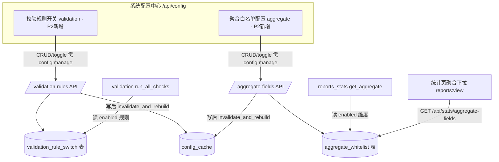

# 产品需求文档（PRD）：IT 资产全生命周期管理系统 — 系统配置模块 P2（校验规则开关 + 聚合白名单可配置）

> 文档版本：v0.1（简单版增量 PRD，供架构师产出设计）
> 作者：许清楚（产品经理）
> 日期：2026-07-10
> 依赖：P0 配置中心（字典/分类）+ P1 配置中心（阶段流转矩阵）均已落地并生产验证：`/api/config` + `config:manage` + 进程内缓存 `invalidate_and_rebuild` + `count_references` 引用保护范式。本文档为**增量**，只描述 P2 新增/变更部分，复用 P0/P1 能力处注明「复用」。
> 配套设计文档（架构师产出后补充）：`DESIGN_系统配置模块_P2.md`

---

## 0. 项目信息

| 项 | 内容 |
|----|------|
| 项目位置 | `D:\workbuddy\运维体系重塑方案\asset-lifecycle-manager` |
| 后端 | `backend/`（FastAPI + SQLAlchemy + SQLite） |
| 前端 | `frontend/index.html`（Vue3 单文件 SPA，CDN 引 vue/element-plus/echarts） |
| 当前系统版本 | v3.0.0（新台账模板 v1.0）+ P0 + P1 配置中心 |
| 编程语言 | Python 3.13（后端）/ Vue3 + Element Plus（前端） |
| 本期范围 | P2：① 资产生命周期校验规则「逐条开启/关闭」可配；② 统计「自定义字段聚合」维度白名单可配。两者均纳入 P0 配置中心体系。 |
| 明确不做 | 阶段门禁（`check_stage_gate`，已由 P1 处理）；报表导出字段白名单；统计口径（各固定报表的 GROUP BY 维度）数据化。 |
| 原始需求复述 | 把系统里两类「写死在代码里」的规则下沉为数据库可配置：（1）`validation.py` 中若干条资产生命周期校验规则（severity 分严重/中等，当前硬编码常开）做成后台逐条开启/关闭开关，默认保持当前行为（全开）；（2）统计「聚合白名单」（`constants.py:AGGREGATE_FIELD_WHITELIST`，专用于 `/api/stats/aggregate`）做成后台可配置，默认 = 当前全部允许项。 |

---

## 1. 产品目标

> 一句话：**将写死在 `validation.py` 与 `constants.py` 的两类校验/聚合规则下沉为数据库可配置，使运维主管/管理员可在后台自助开关校验规则、增删聚合维度，无需开发改代码重启，且默认行为零回退、存量数据零误伤。**

| # | 价值点（清晰、正交） |
|---|----------------------|
| V1 | **去硬编码（校验）**：`run_all_checks` 的 10 项资产生命周期校验由「硬编码常开」改为数据库驱动的逐条开关，关闭即跳过该检查，变更即时生效。 |
| V2 | **去硬编码（聚合维度）**：`/api/stats/aggregate` 的允许聚合字段（维度白名单）由 `constants.py` 常量改为数据库驱动，管理员可增删/启停聚合维度，前端聚合下拉实时同步。 |
| V3 | **默认安全、存量零误伤**：两套配置 seed = 现状（校验全开 / 聚合 11 维度全开），任何改配都不删除、不篡改台账数据，仅改变「是否校验 / 是否可聚合」的口径。 |
| V4 | **可治理、可回滚**：复用 P0/P1 配置中心的 `config:manage` 权限隔离、缓存即时失效、导入导出、引用保护范式；提供「恢复默认」兜底，配置改坏可一键回退。 |

---

## 2. 用户故事（运维主管/管理员视角）

| 角色 | 用户故事 |
|------|----------|
| 运维主管（ops_manager） | 作为运维主管，我希望在后台看到当前 10 条资产生命周期校验规则（哪条开着、哪条关着、严重度如何），并能逐条关闭某条（例如导入历史脏数据期间临时关闭「编号重复」校验避免仪表盘爆红），而不需要找开发改代码，以便临时适配数据治理窗口。 |
| 系统管理员（admin） | 作为系统管理员，我希望在配置中心统一维护「聚合白名单」——增删允许按哪些字段做统计聚合、启停某维度，并能导出做备份、导入做恢复，以便按管理需要开放/收敛统计口径。 |
| 系统管理员（admin） | 作为系统管理员，我希望在配置页能一键「查看当前状态」（哪些校验开着/关着、哪些聚合维度可用），并在误配后「恢复默认」把所有开关/白名单重置为系统出厂值，以便安全治理与快速回滚。 |
| 运维工程师（ops_engineer，无配置权限） | 作为运维工程师，我希望统计页「自定义字段聚合」下拉框只展示当前被允许的维度、校验仪表盘只统计被开启的规则，且配置改错时系统给出明确提示而不是崩溃或返回脏数据。 |
| 只读用户（viewer） | 作为只读用户，我希望「系统配置」入口对我不可见、P2 两项配置不可改，以便职责隔离、降低误操作风险。 |

---

## 3. 需求池（P0 / P1 / P2 分级）

> 优先级：**P2** = 本期必做；**P3** = 可选增强（仅列入，不实现）。
> 标注「复用 P0/P1」＝直接复用已落地能力，不重复建设；「新增」＝P2 新增。
> 验收标准均为可度量条件。

### 3.1 P2 — 校验规则开关可配置（本期必做）

> 控制对象：`backend/validation.py` 的 `run_all_checks(db)` 所执行的 **10 项资产生命周期校验**（见 §7.2，每条含 `check_name` 与 `severity`）。当前全部硬编码常开。**P2 只管这 10 条校验规则开关，不管 `check_stage_gate` 阶段门禁（P1 已处理）。**

#### 3.1.1 数据模型（新增）

| 编号 | 描述 | 优先级 | 验收标准 |
|------|------|--------|----------|
| T-01 | **数据模型 `validation_rule_switch`**（新增于 `database.py`，风格对齐 `StageTransitionRule`）：`id, rule_key(String,唯一,非空), check_name(String), description(Text), severity(String 取值"严重"/"中等"), enabled(Boolean,默认true), remark(Text,可空), is_system(Boolean,默认true), sort_order(Integer,默认0), created_at, updated_at`；含 `to_dict()`。 | P2 | 建表成功；`rule_key` 唯一；`severity` 落库值仅为「严重/中等」且与现状一致。 |
| T-02 | **种子迁移（幂等）**：新增种子脚本（对称 `seed_stage_transitions.py`，建议 `seed_config_p2.py` 或 `seed_validation_rules.py`），仅当 `validation_rule_switch` 表为空时写入 **10 条**当前校验规则（§7.2，`is_system=true`、各 `enabled=true`、severity 与现状一致），挂载进 `main.py` lifespan（与 P0/P1 seed 并列）。 | P2 | 可重跑幂等；seed 后 `run_all_checks` 行为与改造前逐条一致（10 项全开）；存量数据零改动。 |

#### 3.1.2 管理 API（新增，风格对齐 P0/P1 `/api/config`）

| 编号 | 描述 | 优先级 | 验收标准 |
|------|------|--------|----------|
| T-03 | **校验规则 CRUD API**（前缀 `/api/config`，复用 P0 `config_router` 与 `require_permission("config:manage")`）：`GET /validation-rules`（列表，含禁用）、`PUT /validation-rules/{id}`（仅可改 `enabled`/`remark`；`rule_key`/`check_name`/`severity` 只读）、`POST /validation-rules/{id}/toggle`（启停）。写成功后复用 `invalidate_and_rebuild(db)` 重建缓存（复用 P0 `config_cache`）。 | P2 | 经 `config:manage` 保护；无权限返回 403；写后缓存失效；`is_system` 行不可物理删除（仅可停用）。 |
| T-04 | **导入/导出/恢复 API**：`GET /validation-rules/export`（返回 JSON 全量）、`POST /validation-rules/import`（按 `rule_key` upsert，冲突更新）、`POST /validation-rules/reset`（恢复默认：将所有 seed 行的 `enabled` 重置为 true、按 seed 值回写，用于误配回滚）。 | P2 | 导出文件可被同接口重新导入且结果一致；`reset` 后所有规则回到全开出厂态。 |

#### 3.1.3 集成点（需求点明，工程细节归架构师）

| 编号 | 描述 | 优先级 | 验收标准 |
|------|------|--------|----------|
| T-05 | **校验统一走配置表**：`validation.py` 的 `run_all_checks` 改为先读 `validation_rule_switch` 表（经进程内缓存，未建回退查表并重建），仅对 `enabled=true` 的规则执行原检查逻辑并计入 `ValidationDashboard`；`enabled=false` 的规则跳过（不计数、不出现在 checks 列表）。**`/api/validation` 端点与前端校验仪表盘契约不变**。 | P2 | 默认（全开）行为与原硬编码逐条一致；关闭某项后该项从仪表盘消失、存量数据不动；读取走配置表单一数据源。 |
| T-06 | **RBAC 复用 `config:manage`**：校验规则开关不新增权限项，直接复用 P0/P1 的 `config:manage`（已授予 admin/ops_manager，viewer/ops_engineer 无）。 | P2 | viewer/ops_engineer 调接口返回 403；admin/ops_manager 正常；回归不破坏现有权限集。 |

### 3.2 P2 — 聚合白名单可配置（本期必做）

> **聚合白名单在本系统里的精确定义（基于真实代码，详见 §7.3）：** 它只控制 `backend/reports_stats.py` 的 `get_aggregate()` 这一处——即 `/api/stats/aggregate?field=X&metric=count|original_value`「自定义字段聚合」接口中，**允许按 `Asset` 的哪些字段做 `GROUP BY` 维度聚合**。它是**维度白名单（dimension whitelist）**，不是报表导出字段白名单、也不是统计口径（各固定报表 GROUP BY）白名单。**P2 把这份写死常量（`constants.py:AGGREGATE_FIELD_WHITELIST`）改为数据库可配。**

#### 3.2.1 数据模型（新增）

| 编号 | 描述 | 优先级 | 验收标准 |
|------|------|--------|----------|
| T-07 | **数据模型 `aggregate_whitelist`**（新增于 `database.py`，风格对齐 `StageTransitionRule`）：`id, field_key(String,唯一,非空，对应 Asset 字段名), field_label(String,展示名), metric_support(String,默认"count,original_value"), enabled(Boolean,默认true), remark(Text,可空), is_system(Boolean,默认true), sort_order(Integer,默认0), created_at, updated_at`；含 `to_dict()`。 | P2 | 建表成功；`field_key` 唯一；字段名与 `Asset` 模型列名一致（§7.4）。 |
| T-08 | **种子迁移（幂等）**：在同一 P2 种子脚本中，仅当 `aggregate_whitelist` 表为空时写入 **11 条**当前白名单维度（§7.4，`is_system=true`、`enabled=true`，与原 `AGGREGATE_FIELD_WHITELIST` 完全一致），挂载进 `main.py` lifespan。 | P2 | 可重跑幂等；seed 后 `/api/stats/aggregate` 可用维度与原常量完全一致。 |

#### 3.2.2 管理 API（新增，风格对齐 P0/P1 `/api/config`）

| 编号 | 描述 | 优先级 | 验收标准 |
|------|------|--------|----------|
| T-09 | **聚合维度 CRUD API**（前缀 `/api/config`，复用 `config_router` 与 `config:manage`）：`GET /aggregate-fields`（列表，含禁用）、`POST /aggregate-fields`（新增维度，`field_key` 须为 `Asset` 合法列名、唯一）、`PUT /aggregate-fields/{id}`（改 `enabled`/`remark`/`field_label`）、`DELETE /aggregate-fields/{id}`（仅非 `is_system` 且未被引用时可删；`is_system` 行禁删，仅可停用）、`POST /aggregate-fields/{id}/toggle`（启停）。写成功后 `invalidate_and_rebuild(db)`。 | P2 | 经 `config:manage` 保护；非法 `field_key`（非 Asset 列）被拒；写后缓存失效。 |
| T-10 | **导入/导出/恢复 API**：`GET /aggregate-fields/export`、`POST /aggregate-fields/import`（按 `field_key` upsert）、`POST /aggregate-fields/reset`（恢复默认：回写为原 11 维度全开）。 | P2 | 导出→导入往返一致；`reset` 后回到 11 维度出厂态。 |
| T-11 | **前端下拉数据源 API**：新增 `GET /api/stats/aggregate-fields`（权限 `reports:view`）返回当前 `enabled=true` 的维度列表，替代前端统计页硬编码读取 `AGGREGATE_FIELD_WHITELIST`；管理接口仍统一走 `/api/config`（`config:manage`）。 | P2 | 统计页「自定义字段聚合」下拉只展示启用维度；viewer 可读、admin 可改。 |

#### 3.2.3 集成点

| 编号 | 描述 | 优先级 | 验收标准 |
|------|------|--------|----------|
| T-12 | **聚合逻辑统一走配置表**：`reports_stats.py` 的 `get_aggregate()` 将 `if field not in AGGREGATE_FIELD_WHITELIST` 改为「查 `aggregate_whitelist` 表 `enabled=true` 且 `field_key==field` 是否存在」，不存在则维持现状返回 400（"非法聚合字段"）。同时删除/弱化 `constants.py:AGGREGATE_FIELD_WHITELIST` 常量（保留为注释或空，避免双源）。前端统计页聚合下拉改读 T-11 接口。 | P2 | 默认（11 维度全开）行为与原常量一致；禁用某维度后接口对该字段返回 400、前端下拉移除该维度；不读取该维度的历史报表数据不受影响（其它固定报表不读此白名单）。 |
| T-13 | **RBAC 复用 `config:manage`**：聚合白名单管理不新增权限项，复用 P0/P1 的 `config:manage`；T-11 读取接口复用 `reports:view`。 | P2 | 管理接口 viewer/ops_engineer 返回 403；读取接口 reports:view 可用。 |

### 3.3 P3 — 可选增强（仅列入，不实现）

| 编号 | 描述 | 优先级 |
|------|------|--------|
| P3-01 | **校验规则细粒度配置**：除启停外，支持按资产分类/阶段设置规则生效范围（如「编号重复」仅对服务器类生效）。 | P3 |
| P3-02 | **聚合指标扩展**：白名单维度支持更多指标（如 `avg_original_value`、`count_distinct`），由 `metric_support` 列驱动。 | P3 |
| P3-03 | **配置变更审计/版本**：校验开关与聚合白名单的 CRUD 写入 `audit_logs`，并支持快照版本回滚（替代 P2 的「恢复默认」粗粒度回滚）。 | P3 |
| P3-04 | **聚合维度分组（维度组级）**：将 11 个字段按业务域分组（位置类/归属类/规格类），白名单以「组」为粒度启停。 | P3 |

---

## 4. UI 设计稿（系统配置中心 · 新增第 4、第 5 子页）

> 复用 P0 配置页 Tab 结构（`currentTab==='config'` → `el-tabs v-model="configSubTab"`），新增第 4、第 5 个 `el-tab-pane`。下列为文字布局说明（无需改图）。

### 4.1 配置中心 Tab 结构（改造后）

```
系统配置（config，仅 config:manage 可见）
└─ el-tabs v-model="configSubTab"
   ├─ 字典管理 (dict)          [P0 已有]
   ├─ 分类管理 (category)      [P0 已有]
   ├─ 阶段流转配置 (stage)     [P1 已有]
   ├─ 校验规则开关 (validation) [P2 新增]
   └─ 聚合白名单配置 (aggregate)[P2 新增]
```

### 4.2 「校验规则开关」子页布局（自上而下）

```
┌──────────────────────────────────────────────────────────────────┐
│ [恢复默认]                                                        │
│ 规则表格（可开关）                                                │
│ ┌──────┬──────────────┬──────┬────────┬──────┬────────────┬────┐│
│ │#     │规则名称       │严重度│启用    │说明  │操作        │    ││
│ ├──────┼──────────────┼──────┼────────┼──────┼────────────┼────┤│
│ │1     │编号为空       │严重  │●启用   │资产编│编辑(remark)│    ││
│ │2     │SN号为空      │严重  │●启用   │非报废│编辑        │    ││
│ │3     │位置为空       │严重  │●启用   │非报废│编辑        │    ││
│ │4     │责任人为空     │中等  │●启用   │上架/│编辑        │    ││
│ │...   │...           │...   │...     │...   │...         │    ││
│ │10    │分表编号不在主表│中等  │●启用   │7子表 │编辑        │    ││
│ └──────┴──────────────┴──────┴────────┴──────┴────────────┴────┘│
│ [导出规则] [导入规则]                                             │
└──────────────────────────────────────────────────────────────────┘
```
- 「启用」列 = `enabled` 启停开关（复用 P0 的 toggle 交互，点击即 `POST /validation-rules/{id}/toggle`）。
- 「规则名称/严重度/说明」为只读元数据（`check_name`/`severity`/`description`，来自 seed）；「操作」仅允许编辑 `remark`。
- `is_system` 行不可删除（仅可停用），系统内置标记以灰色标签呈现。

### 4.3 「聚合白名单配置」子页布局（自上而下）

```
┌──────────────────────────────────────────────────────────────────┐
│ [恢复默认]                                                        │
│ 维度表格（可增删/启停）                                           │
│ ┌──────┬──────────────┬────────────────────┬──────┬────────┬────┐│
│ │#     │字段(field_key)│展示名(field_label) │指标  │启用    │操作││
│ ├──────┼──────────────┼────────────────────┼──────┼────────┼────┤│
│ │1     │lifecycle_stage│生命周期阶段        │count │●启用   │停用││
│ │2     │asset_category │资产分类            │count │●启用   │停用││
│ │3     │room           │机房                │count │●启用   │停用││
│ │...   │...           │...                 │...   │...     │... ││
│ │11    │project_name   │项目名称            │count │●启用   │停用││
│ └──────┴──────────────┴────────────────────┴──────┴────────┴────┘│
│ [新增维度] [导出] [导入]                                          │
│ 新增维度对话框 → field_key*(下拉取 Asset 列名/或手填校验) +        │
│                 field_label + metric_support + remark            │
└──────────────────────────────────────────────────────────────────┘
```
- 「启用」列 = `enabled` 启停（toggle 交互）。
- 「新增维度」对话框：`field_key` 须为 Asset 合法列名（前端下拉取自 `Asset` 列枚举或后端校验），重复 `field_key` 被拒（400）；`is_system` 维度不可删，仅可停用。
- 统计页「自定义字段聚合」下拉框改为读取 `GET /api/stats/aggregate-fields`（T-11），即时反映启用维度。

### 4.4 数据流（Mermaid）



---

## 5. 数据安全与回滚兜底（高数据完整性风险，必读）

> P2 触及核心校验与统计口径，配置错误可能导致脏数据入库或报表失真。本条为硬约束，所有 P2 实现必须满足。

### 5.1 默认安全（存量零误伤）
- **校验规则开关**：seed 后所有 10 条规则 `enabled=true`（= 当前硬编码全开行为）；任何开关改配**只改变「是否执行该检查」**，从不删除、篡改、回写台账数据。关闭「编号重复」仅让仪表盘不再报该项，已存在的重复编号数据保持原状。
- **聚合白名单**：seed 后 11 个维度 `enabled=true`（= 原 `AGGREGATE_FIELD_WHITELIST`）；禁用/删除某维度**只影响「能否按该维度聚合」**，台账数据与既有固定报表（`get_comprehensive_report` 等）不受影响。
- 配置中心改错（如误关关键校验、误删聚合维度）**不破坏存量**——这是本模块的底线验收项。

### 5.2 引用保护 / 出口保护
- **校验规则开关**：`is_system=true` 的 seed 行**不可物理删除**，只能停用（toggle）；避免「删掉规则」导致系统校验逻辑缺项。自定义禁用后，导出/导入保留其 `enabled` 状态。
- **聚合白名单**：`is_system=true` 的 11 个出厂维度不可物理删除，仅可停用；管理员新增的自定义维度（`is_system=false`）若确认无引用可删。删除/禁用某维度后：
  - 聚合接口对该字段返回 **400「非法聚合字段」**（与现状行为一致，不崩溃）；
  - 前端统计页聚合下拉**实时移除**该维度，已保存的看板若引用了被禁用维度，应显示「该维度已停用」提示而非白屏/报错（前端降级处理）。

### 5.3 回滚兜底（配置改坏可恢复）
- 两个子页均提供**「恢复默认」按钮**，调用 `POST /validation-rules/reset` 与 `POST /aggregate-fields/reset`，将配置重置为 seed 出厂值（校验全开 / 聚合 11 维度全开）。
- 支持**导入导出**（T-04 / T-10）：管理员可先导出当前配置做快照，改坏后用导出文件重新导入恢复（JSON，按 `rule_key`/`field_key` upsert）。
- 缓存一致性：所有写接口成功 commit 后必调 `invalidate_and_rebuild(db)`，确保开关/白名单即时生效且进程内缓存与 DB 一致。

---

## 6. 待确认问题（需主理人/架构师/用户拍板）

| # | 问题 | 建议默认 | 影响 |
|---|------|----------|------|
| O1 | **校验规则开关的粒度**：本期按「单条规则」逐条开关（10 条，与现状一一对应），还是按「严重度分组」开关（如「一键关闭全部中等」）？ | 单条规则粒度（最贴合现状 10 条、最可控），严重度仅作只读元数据 | T-01/T-02/T-05 模型与 seed 范围 |
| O2 | **聚合白名单粒度**：维度级（11 个字段各行独立启停，= 现状结构）还是维度组级（按业务域分组启停）？ | 维度级（字段级），与 `AGGREGATE_FIELD_WHITELIST` 现有结构 1:1，最简单且改动最小 | T-07/T-08/T-12 模型与 seed |
| O3 | **聚合维度可否自定义新增**：是否允许管理员新增非原 11 字段的 `Asset` 列作为聚合维度（如 `device_name`、`contract_no`）？还是本期仅能在原 11 字段内启停、不允许新增？ | 允许新增（新增时校验 `field_key` 为 `Asset` 合法列名），以体现「可配置」价值；但默认 seed 仅 11 条 | T-09 新增接口与校验 |
| O4 | **「删除/禁用」出口保护强度**：`is_system` 出厂项是否允许物理删除？误关关键校验（如「阶段为空」）是否需二次确认？ | 出厂项禁物理删、仅可停用；误关关键校验由前端二次确认 + 「恢复默认」兜底 | T-03/T-09 删除与回滚逻辑 |
| O5 | **回滚机制形态**：「恢复默认」一键重置（粗粒度）是否足够？还是需 P3 的「按版本快照回滚」（细粒度、可回退到任意历史配置）？ | 本期做「恢复默认」+ 导入导出快照（粗粒度够用），版本快照留 P3-03 | T-04/T-10 与 §5.3 |

---

## 7. 源码契约确认（阅读记录 — 聚合白名单与校验规则的精确界定依据）

> 以下为本次 PRD 结论的代码依据，确保与现有代码契约一致、可落地，杜绝范围想象。

### 7.1 已阅读文件
- `backend/validation.py` — `run_all_checks(db)`（10 项校验，逐条 `check_name`+`severity`）、`check_stage_gate`（阶段门禁，**P1 已处理，不在 P2**）。
- `backend/constants.py` — `AGGREGATE_FIELD_WHITELIST`（11 字段，注释「用于 /api/stats/aggregate 接口」）、`LIFECYCLE_STAGES`（维持不变）。
- `backend/import_export_reports.py` — 批量导入/导出与 4 个报表函数（`get_comprehensive_report`/`get_warranty_expiry_report`/`get_fault_analysis_report`/`get_change_frequency_report`），**确认均不读取 `AGGREGATE_FIELD_WHITELIST`**（各自写死 GROUP BY 维度）。
- `backend/reports_stats.py` — `get_aggregate(db, field, metric, stage)`（line 230-258），**唯一使用点**：`if field not in AGGREGATE_FIELD_WHITELIST: raise 400`；路由 `GET /api/stats/aggregate`（line 434-445）。
- `backend/main.py` — `GET /api/validation`（line 1319，调用 `run_all_checks`）、`GET /api/stats/aggregate` 经 `stats_router` 挂载（line 1462）、`/api/config/*` 经 `config_router` 挂载（line 1464）、lifespan seed 挂载点（line 100-114）。
- `backend/config_api.py` — P0/P1 `/api/config` 路由模式（CRUD + `/{id}/toggle` + 导入导出 + `invalidate_and_rebuild` + `config:manage`）。
- `backend/database.py` — `StageTransitionRule` 模型（line 436，P2 模型风格对齐参考）。
- `backend/schemas.py` — `ValidationItem`/`ValidationDashboard`（line 635-647：`check_name`/`severity`/`count`/`details`）。
- `frontend/index.html` — 配置页 `configSubTab` el-tabs 含「字典管理」(1152)/「分类管理」(1190)/「阶段流转配置」(1213) 三个 pane；P2 新增第 4、5 个。

### 7.2 当前 10 项校验规则（精确，seed `validation_rule_switch` 依据）

`validation.py:run_all_checks` 逐项（`check_name` / `severity` / 检查逻辑摘要）：

| # | rule_key（建议稳定键） | check_name | severity | 检查逻辑摘要 |
|---|------------------------|-----------|----------|--------------|
| 1 | `empty_code` | 编号为空 | 严重 | `asset_code` 为空 |
| 2 | `empty_sn` | SN号为空 | 严重 | 非报废阶段 `sn` 为空 |
| 3 | `empty_position` | 位置为空 | 严重 | 非报废阶段 `room/cabinet/u_position` 任一为空 |
| 4 | `empty_responsible` | 责任人为空 | 中等 | 上架/运行/维修阶段无责任人 |
| 5 | `empty_stage` | 阶段为空 | 严重 | `lifecycle_stage` 为空 |
| 6 | `duplicate_code` | 编号重复 | 严重 | `asset_code` 出现 >1 次 |
| 7 | `warranty_expired` | 维保已过期(运行状态) | 中等 | 运行阶段 `warranty_expire_date` 已过期 |
| 8 | `warranty_date_invalid` | 维保到期日早于入场日期 | 严重 | `warranty_expire_date < entry_date` |
| 9 | `retired_no_record` | 已报废但报废表无记录 | 严重 | 阶段='已报废' 且 `Retirement` 表无对应记录 |
| 10 | `orphan_subtable_code` | 分表编号不在主表中 | 中等 | 7 个子表（procurement/change/fault/warranty/retirement/inbound/outbound）的 `asset_code` 不在 `assets` 主表 |

> seed：`rule_key` 与 `check_name` 一一对应且稳定（代码读表时以 `rule_key` 为键匹配原检查分支）；`severity` 落库值固定为「严重/中等」，与现状一致；全部 `enabled=true`、`is_system=true`。

### 7.3 聚合白名单的精确定义（排除法，基于真实代码）

| 候选理解 | 是否成立 | 代码证据 |
|----------|----------|----------|
| 报表导出字段白名单（控制 Excel 导出哪些列） | ❌ 否 | `import_export_reports.py` 的 `export_assets_excel`/`export_subtable_excel`/`download_import_template` **写死列头**（`headers_list`/`col_defs`），不读 `AGGREGATE_FIELD_WHITELIST`。 |
| 跨资产聚合的「分组」白名单（控制哪些资产分组允许聚合） | ❌ 否 | 系统中无「跨资产分组聚合」的单独概念；`get_aggregate` 仅对单表 `Asset` 按单字段 GROUP BY。 |
| 统计口径白名单（控制各固定报表的 GROUP BY 维度） | ❌ 否 | `get_comprehensive_report`/`get_warranty_expiry_report`/`get_fault_analysis_report`/`get_change_frequency_report` 各有**写死**的 GROUP BY 维度，不读该常量。 |
| **自定义字段聚合的「维度白名单」**（控制 `/api/stats/aggregate?field=X` 中 X 的允许取值） | ✅ 是 | `reports_stats.py:get_aggregate` line 232：`if field not in AGGREGATE_FIELD_WHITELIST: raise HTTPException(400, "非法聚合字段")`；常量注释明确「用于 /api/stats/aggregate 接口，仅允许对白名单内字段做 GROUP BY 聚合」。 |

**结论**：P2 的「聚合白名单」= `/api/stats/aggregate`「自定义字段聚合」功能的**允许聚合维度（GROUP BY 字段）白名单**。它控制统计看板里用户能按 `Asset` 的哪些字段做自定义下钻聚合。前端统计页的聚合维度下拉框当前硬编码读 `AGGREGATE_FIELD_WHITELIST`，P2 改为读配置表。

### 7.4 当前聚合白名单 11 维度（精确，seed `aggregate_whitelist` 依据）

`constants.py:AGGREGATE_FIELD_WHELIST`（字段名 → 建议展示名）：

| # | field_key（Asset 列名） | field_label | 是否在 Asset 模型 |
|---|--------------------------|-------------|-------------------|
| 1 | `lifecycle_stage` | 生命周期阶段 | 是 |
| 2 | `asset_category` | 资产分类 | 是 |
| 3 | `room` | 机房 | 是 |
| 4 | `cabinet` | 机柜 | 是 |
| 5 | `department` | 所属部门 | 是 |
| 6 | `ownership` | 产权归属 | 是 |
| 7 | `brand` | 品牌 | 是 |
| 8 | `model` | 型号 | 是 |
| 9 | `responsible_person` | 责任人 | 是 |
| 10 | `warranty_status` | 维保状态 | 是 |
| 11 | `project_name` | 项目名称 | 是 |

> seed：11 行全部 `enabled=true`、`is_system=true`、`metric_support="count,original_value"`（与 `get_aggregate` 当前支持的 `count`/`original_value` 一致）。

### 7.5 集成点与复用清单（供架构师）

- **唯一集成入口（校验）**：`validation.run_all_checks`。改为读 `validation_rule_switch` 后，`GET /api/validation` 与前端校验仪表盘自动切换，无需改动端点/前端契约。
- **唯一集成入口（聚合）**：`reports_stats.get_aggregate` 的 `field not in AGGREGATE_FIELD_WHITELIST` 判断改为读 `aggregate_whitelist`；前端统计页聚合下拉改读 T-11 接口。其它固定报表不受影响。
- **复用 P0/P1 能力（不重复建设）**：
  - 路由前缀与权限：`/api/config` + `require_permission("config:manage")`（来自 `config_api.py`）
  - 缓存失效：`invalidate_and_rebuild(db)`（`config_cache.py`）；P2 需在缓存中新增「校验开关」「聚合白名单」两项（或并入现有重建逻辑）
  - 引用/冲突保护范式：`count_references` + 400/404 错误码约定
  - seed 范式：对称 `seed_stage_transitions.py`，lifespan 并列挂载
  - 前端 `configSubTab` Tab 结构 + 对话框/表格/toggle 交互（新增第 4、5 个 `el-tab-pane`）
- **不在 P2 范围（明确边界）**：`check_stage_gate` 阶段门禁（P1）；各固定报表（`get_comprehensive_report` 等）的 GROUP BY 维度数据化；报表导出列白名单；`LIFECYCLE_STAGES` 数据化。
