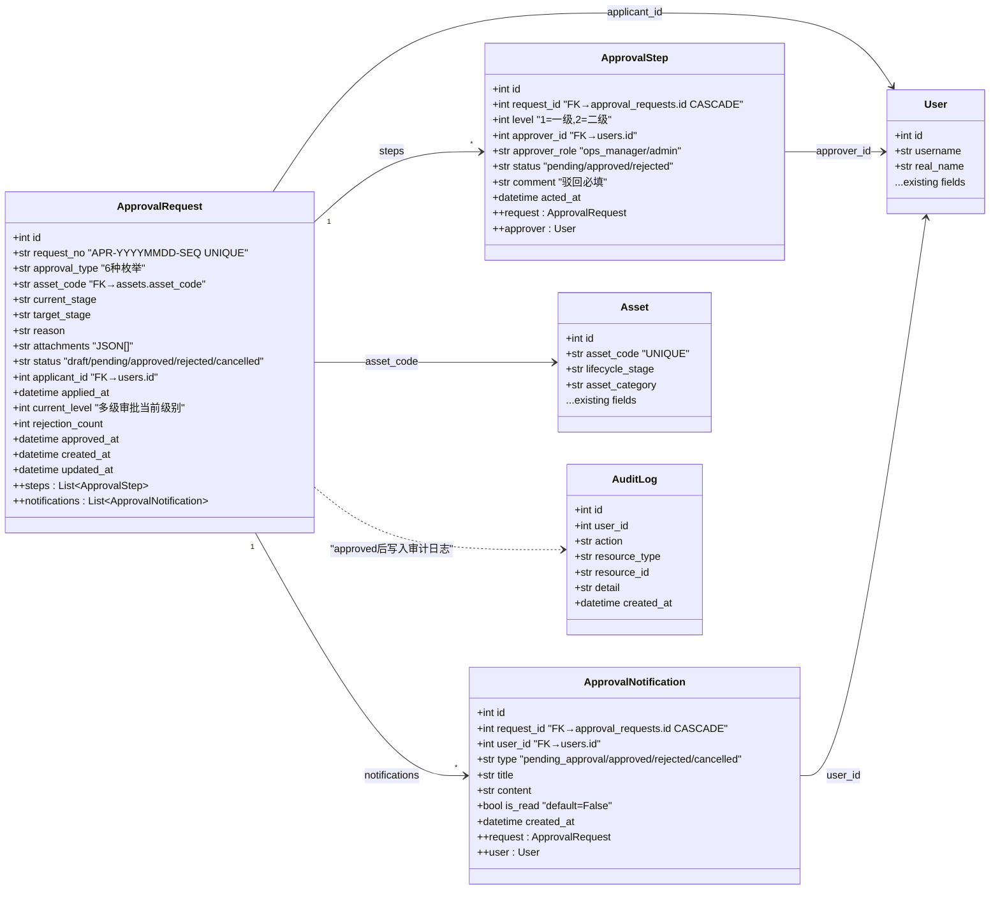
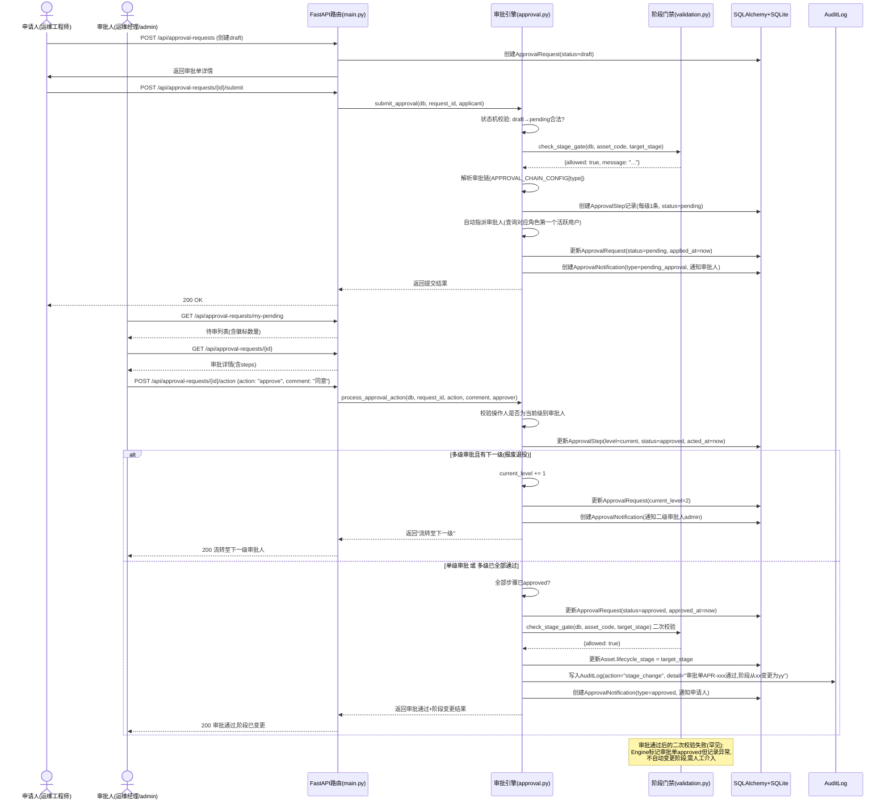
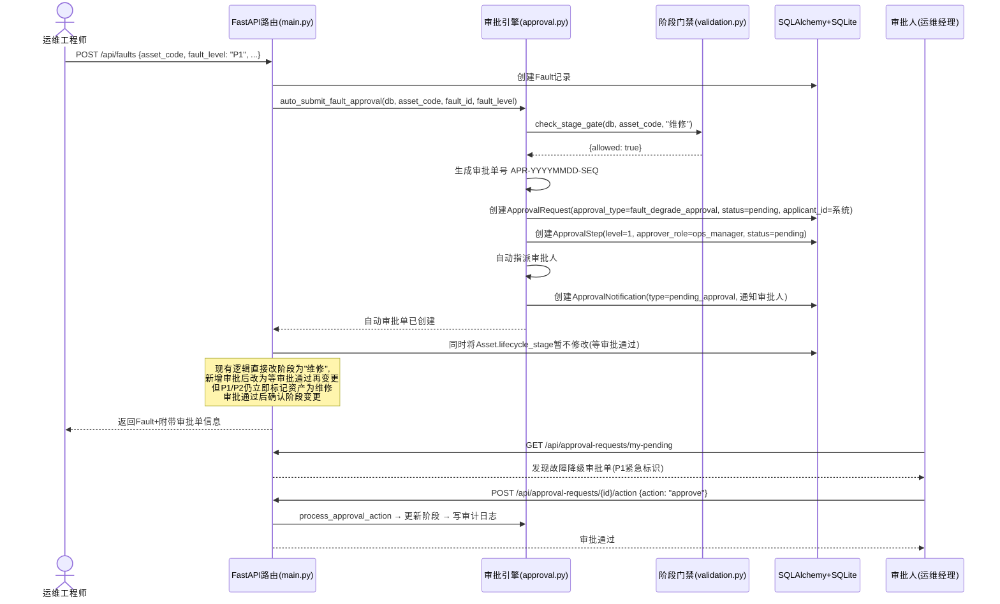

# 审批工作流模块 — 系统架构设计文档

> **架构师**: 高见远 (Gao) | **日期**: 2025-07-11 | **版本**: v1.0
> **项目**: IT资产全生命周期管理系统 — 审批工作流增量模块
> **技术栈**: FastAPI + SQLAlchemy + SQLite + Vue3 + Element Plus (单文件SPA)

---

## Part 1: 实现方案与框架选型

### 1.1 增量开发策略

采用**最小变更 + 新增模块**的增量开发策略：

| 策略 | 说明 |
|------|------|
| 新增独立模块文件 | `backend/approval.py` 作为审批引擎核心，不侵入现有业务逻辑 |
| 扩展而非替换 | 在现有 `database.py` 中追加3个ORM模型（不修改已有模型），在 `schemas.py` 中追加审批相关Pydantic schema |
| 权限扩展注入 | 在 `auth.py` 的 `PERMISSION_DEFINITIONS` 和 `PERMISSION_GROUPS` 中追加审批权限组，更新 `DEFAULT_ROLES` 预设角色的权限列表 |
| 常量扩展 | 在 `constants.py` 中追加审批类型枚举、审批状态枚举、审批链配置映射 |
| 路由追加 | 在 `main.py` 中 `import approval` 模块并追加审批API路由块（约15个端点） |
| 前端追加 | 在 `index.html` 单文件SPA中追加审批菜单项、审批列表页、审批详情页、待办徽标 |
| 数据库迁移 | 利用现有 `Base.metadata.create_all()` 机制，新增3张表在应用启动时自动创建（SQLite无需迁移脚本） |
| 审计日志复用 | 审批驱动的阶段变更直接写入现有 `audit_logs` 表，不做额外日志表 |

### 1.2 框架选型

| 依赖 | 用途 | 选型理由 |
|------|------|---------|
| FastAPI (现有) | API路由框架 | 已有框架，无需新增 |
| SQLAlchemy 2.0 (现有) | ORM | 已有框架，新增模型直接继承 `Base` |
| Pydantic v2 (现有) | Schema验证 | 已有框架，追加审批相关schema |
| SQLite (现有) | 数据库 | 已有数据库，`create_all()` 自动建表 |
| Vue3 + Element Plus (现有) | 前端框架 | 已有SPA，追加审批页面组件 |
| 无新增Python包 | — | 审批工作流纯逻辑实现，无需引入额外状态机库或工作流引擎 |

**不引入第三方工作流引擎的理由**：
- 系统审批链路简单（最多2级），自定义状态机代码量极小（~50行），引入 `workflow-engine` 或 `state-machine` 库反而增加复杂度
- 与现有 `check_stage_gate` 和 `AuditLog` 集成需要细粒度控制，自研引擎可精确控制调用时机
- SQLite单文件数据库不适合引入需要多表复杂查询的工作流引擎

### 1.3 新增文件清单

| 文件 | 类型 | 说明 |
|------|------|------|
| `backend/approval.py` | **新增** | 审批工作流核心引擎：状态机、审批链解析、阶段变更驱动、通知生成 |

### 1.4 需修改的现有文件清单

| 文件 | 修改内容 | 修改量估算 |
|------|---------|-----------|
| `backend/database.py` | 追加 `ApprovalRequest`、`ApprovalStep`、`ApprovalNotification` 3个ORM模型类 | ~70行 |
| `backend/schemas.py` | 追加审批相关Pydantic schema（约12个类） | ~120行 |
| `backend/auth.py` | 追加4项审批权限定义 + 1个权限组 + 更新3个预设角色的权限列表 | ~20行 |
| `backend/constants.py` | 追加审批类型枚举、审批状态枚举、审批链配置映射 | ~30行 |
| `backend/main.py` | 追加import + 审批API路由块（约15个端点） + 修改P1/P2故障创建逻辑 | ~150行 |
| `frontend/index.html` | 追加审批菜单项 + 审批列表页 + 审批详情页 + 待办徽标 + 审批提交对话框 | ~300行 |
| `SPEC.md` | 追加审批模块功能说明 | ~30行 |

### 1.5 数据库迁移策略

**策略：零迁移脚本，依赖 `create_all()` 自动建表**

现有 `database.py` 末尾已有 `Base.metadata.create_all(bind=engine)`，新增的3个ORM模型类继承同一个 `Base`，应用重启后 SQLite 会自动创建 `approval_requests`、`approval_steps`、`approval_notifications` 三张新表。

**不修改已有表结构**：`assets`、`changes`、`retirements` 等表字段保持不变，审批单通过 `asset_code` 字段关联资产（而非FK到 `assets.id`），与现有分表关联方式一致。

**预设角色权限更新策略**：`init_default_data()` 函数在每次启动时检查角色是否存在，若存在则跳过创建。对于 `is_system=True` 的预设角色，需要增加**权限合并逻辑**——如果预设角色的权限列表不含新增审批权限，自动追加。这确保已有部署环境升级后权限自动补齐。

---

## Part 2: 文件列表及相对路径

```
asset-lifecycle-manager/
├── backend/
│   ├── approval.py              # [新增] 审批工作流核心引擎
│   ├── database.py              # [修改] 追加3个ORM模型
│   ├── schemas.py               # [修改] 追加审批相关Pydantic schema
│   ├── auth.py                  # [修改] 追加审批权限定义+更新预设角色
│   ├── constants.py             # [修改] 追加审批枚举+审批链配置
│   ├── main.py                  # [修改] 追加审批API路由+P1/P2自动提交逻辑
│   ├── validation.py            # [不修改] 审批引擎调用其check_stage_gate
│   └── import_export_reports.py # [不修改]
├── frontend/
│   └── index.html               # [修改] 追加审批UI组件
├── deliverables/
│   ├── approval-workflow-architecture.md  # [本文件] 架构设计文档
│   ├── approval-workflow-prd.md           # [已有] PRD文档
├── SPEC.md                      # [修改] 追加审批模块说明
├── start.py                     # [不修改]
├── requirements.txt             # [不修改] 无新增依赖
└── asset_lifecycle.db           # [运行时] 自动新增3张表
```

---

## Part 3: 数据结构和接口设计

### 3.1 新增ORM模型 — 完整字段定义

#### 3.1.1 ApprovalRequest（审批单主表）

```python
class ApprovalRequest(Base):
    __tablename__ = "approval_requests"

    id              = Column(Integer, primary_key=True, autoincrement=True, comment="审批单ID")
    request_no      = Column(String(20), unique=True, nullable=False, comment="审批单号 APR-YYYYMMDD-SEQ")
    approval_type   = Column(String(30), nullable=False, comment="审批类型枚举(6种)")
    asset_code      = Column(String(30), ForeignKey('assets.asset_code'), nullable=False, comment="目标资产编号")
    current_stage   = Column(String(20), nullable=False, comment="申请时资产当前阶段")
    target_stage    = Column(String(20), nullable=False, comment="申请变更目标阶段")
    reason          = Column(Text, nullable=False, comment="变更原因")
    attachments     = Column(Text, default="[]", comment="附件路径列表(JSON数组)")
    status          = Column(String(20), nullable=False, default="draft", comment="审批状态: draft/pending/approved/rejected/cancelled")
    applicant_id    = Column(Integer, ForeignKey('users.id'), nullable=False, comment="申请人ID")
    applied_at      = Column(DateTime, comment="提交时间(status变pending时写入)")
    current_level   = Column(Integer, default=1, comment="当前审批级别(多级审批时递增)")
    rejection_count = Column(Integer, default=0, comment="累计驳回次数")
    approved_at     = Column(DateTime, comment="最终审批通过时间")
    created_at      = Column(DateTime, server_default=func.now(), comment="创建时间")
    updated_at      = Column(DateTime, server_default=func.now(), onupdate=func.now(), comment="更新时间")

    # 关系
    steps = relationship("ApprovalStep", back_populates="request", cascade="all, delete-orphan")
    notifications = relationship("ApprovalNotification", back_populates="request", cascade="all, delete-orphan")
```

**字段约束说明**：
- `request_no`: 唯一约束，格式 `APR-YYYYMMDD-SEQ`，SEQ为当日递增序号（如 `APR-20250711-001`）
- `approval_type`: 6种枚举值之一（见3.5常量定义），非空约束
- `asset_code`: FK关联 `assets.asset_code`，与现有分表关联方式一致
- `status`: 5种状态枚举，默认 `draft`
- `applicant_id`: FK关联 `users.id`
- `current_level`: 单级审批始终为1，多级审批（报废退役）从1递增至2
- `rejection_count`: 驳回后重新提交时递增，超过3次标记争议（本期仅记录，不做强制拦截）

#### 3.1.2 ApprovalStep（审批步骤表）

```python
class ApprovalStep(Base):
    __tablename__ = "approval_steps"

    id            = Column(Integer, primary_key=True, autoincrement=True, comment="步骤ID")
    request_id    = Column(Integer, ForeignKey('approval_requests.id', ondelete='CASCADE'), nullable=False, comment="关联审批单ID")
    level         = Column(Integer, nullable=False, comment="审批级别(1=一级,2=二级)")
    approver_id   = Column(Integer, ForeignKey('users.id'), comment="审批人ID(自动指派时填入)")
    approver_role = Column(String(30), nullable=False, comment="审批人角色编码")
    status        = Column(String(20), nullable=False, default="pending", comment="步骤状态: pending/approved/rejected")
    comment       = Column(Text, comment="审批意见(驳回时必填)")
    acted_at      = Column(DateTime, comment="审批操作时间")

    # 关系
    request = relationship("ApprovalRequest", back_populates="steps")
    approver = relationship("User")
```

**字段约束说明**：
- `request_id`: FK关联审批单，`ondelete='CASCADE'` 确保审批单删除时步骤级联删除
- `level`: 对应审批链配置中的审批级别，报废退役审批有 level=1 和 level=2 两条记录
- `approver_role`: 角色编码（如 `ops_manager`、`admin`），用于自动指派查询
- `approver_id`: 审批提交/指派时从该角色下选第一个活跃用户填入
- `status`: 步骤粒度状态，独立于审批单全局status

#### 3.1.3 ApprovalNotification（审批通知表）

```python
class ApprovalNotification(Base):
    __tablename__ = "approval_notifications"

    id         = Column(Integer, primary_key=True, autoincrement=True, comment="通知ID")
    request_id = Column(Integer, ForeignKey('approval_requests.id', ondelete='CASCADE'), nullable=False, comment="关联审批单ID")
    user_id    = Column(Integer, ForeignKey('users.id'), nullable=False, comment="接收人ID")
    type       = Column(String(30), nullable=False, comment="通知类型: pending_approval/approved/rejected/cancelled")
    title      = Column(String(100), nullable=False, comment="通知标题")
    content    = Column(Text, comment="通知内容")
    is_read    = Column(Boolean, default=False, comment="是否已读")
    created_at = Column(DateTime, server_default=func.now(), comment="创建时间")

    # 关系
    request = relationship("ApprovalRequest", back_populates="notifications")
    user = relationship("User")
```

**字段约束说明**：
- `type`: 4种通知类型，与审批状态机联动生成
  - `pending_approval`: 审批单进入pending时向审批人推送
  - `approved`: 审批通过后向申请人推送
  - `rejected`: 审批驳回后向申请人推送
  - `cancelled`: 审批撤回后向审批人推送
- `is_read`: 默认False，前端标记已读后更新为True

### 3.2 新增Pydantic Schemas列表

| Schema名 | 类型 | 用途 |
|----------|------|------|
| `ApprovalRequestCreate` | Request | 创建审批单（draft），字段：approval_type, asset_code, reason, attachments |
| `ApprovalRequestSubmit` | Request | 提交审批（draft→pending），字段：无额外字段，触发状态机 |
| `ApprovalActionRequest` | Request | 审批操作（approve/reject），字段：action(approve/reject), comment(驳回必填) |
| `ApprovalRequestCancel` | Request | 撤回审批，字段：无额外字段 |
| `ApprovalRequestResubmit` | Request | 驳回后重新提交，字段：reason(可修改), attachments(可修改) |
| `ApprovalRequestResponse` | Response | 审批单详情响应（含steps列表） |
| `ApprovalRequestListResponse` | Response | 审批单列表项（不含steps，轻量） |
| `ApprovalStepResponse` | Response | 审批步骤详情 |
| `ApprovalNotificationResponse` | Response | 通知详情 |
| `ApprovalTypeConfig` | Response | 审批类型配置（6种类型+阶段映射+审批模式） |
| `ApprovalStatsResponse` | Response | 审批待办统计（pending数量、各类型分布） |
| `ApprovalDropdownConfig` | Response | 审批下拉选项（审批类型枚举+审批状态枚举） |

**关键Schema定义**：

```python
class ApprovalRequestCreate(BaseModel):
    approval_type: str = Field(..., description="审批类型枚举")
    asset_code: str = Field(..., max_length=30, description="目标资产编号")
    reason: str = Field(..., min_length=5, description="变更原因(至少5字)")
    attachments: list[str] = Field(default=[], description="附件路径列表")

class ApprovalActionRequest(BaseModel):
    action: str = Field(..., description="审批动作: approve/reject")
    comment: Optional[str] = Field(None, description="审批意见(驳回时必填)")

class ApprovalRequestResponse(BaseModel):
    id: int
    request_no: str
    approval_type: str
    asset_code: str
    current_stage: str
    target_stage: str
    reason: str
    attachments: list[str] = []
    status: str
    applicant_id: int
    applicant_name: Optional[str] = None
    applied_at: Optional[datetime] = None
    current_level: int = 1
    rejection_count: int = 0
    approved_at: Optional[datetime] = None
    created_at: Optional[datetime] = None
    steps: list[ApprovalStepResponse] = []
    class Config:
        from_attributes = True
```

### 3.3 新增API接口列表

| # | 方法 | 路径 | 权限 | 说明 |
|---|------|------|------|------|
| 1 | POST | `/api/approval-requests` | `approval:submit` | 创建审批单（draft状态） |
| 2 | POST | `/api/approval-requests/{id}/submit` | `approval:submit` | 提交审批（draft→pending，触发阶段门禁校验+审批链创建+通知推送） |
| 3 | POST | `/api/approval-requests/{id}/action` | `approval:approve` | 审批操作（approve/reject），通过后驱动阶段变更 |
| 4 | POST | `/api/approval-requests/{id}/cancel` | `approval:submit` | 撤回审批（pending→cancelled），仅申请人可操作 |
| 5 | POST | `/api/approval-requests/{id}/resubmit` | `approval:submit` | 驳回后重新提交（rejected→draft→pending） |
| 6 | GET | `/api/approval-requests` | `approval:view` | 审批单列表（分页+筛选：类型/状态/资产编号/时间） |
| 7 | GET | `/api/approval-requests/{id}` | `approval:view` | 审批单详情（含steps） |
| 8 | GET | `/api/approval-requests/my-pending` | `approval:approve` | 我的待审列表（当前用户是审批人的pending步骤） |
| 9 | GET | `/api/approval-requests/my-applications` | `approval:view` | 我的申请列表（当前用户是申请人的审批单） |
| 10 | GET | `/api/approval-requests/stats` | `approval:view` | 审批待办统计（待审数量、各类型分布） |
| 11 | GET | `/api/approval-requests/by-asset/{asset_code}` | `approval:view` | 按资产编号查询审批历史 |
| 12 | GET | `/api/approval-config/types` | `approval:view` | 审批类型配置（6种类型+阶段映射+审批模式） |
| 13 | GET | `/api/approval-config/dropdowns` | `approval:view` | 审批下拉选项配置 |
| 14 | GET | `/api/approval-notifications` | `approval:view` | 通知列表（分页，按用户过滤） |
| 15 | PUT | `/api/approval-notifications/{id}/read` | `approval:view` | 标记通知已读 |
| 16 | PUT | `/api/approval-notifications/read-all` | `approval:view` | 批量标记所有通知已读 |
| 17 | GET | `/api/approval-notifications/unread-count` | `approval:view` | 未读通知数量（前端徽标用） |

### 3.4 新增权限定义

在 `auth.py` 的 `PERMISSION_DEFINITIONS` 中追加：

```python
# 审批工作流
"approval:view": "查看审批工作流",
"approval:submit": "提交/撤回审批申请",
"approval:approve": "审批操作（通过/驳回）",
"approval:cancel": "取消审批申请",
```

在 `PERMISSION_GROUPS` 中追加：

```python
{
    "name": "审批工作流",
    "permissions": ["approval:view", "approval:submit", "approval:approve", "approval:cancel"]
},
```

**预设角色权限更新**：

| 角色 | 新增权限 | 理由 |
|------|---------|------|
| admin | 全部4项 | admin自动拥有全部权限（现有逻辑） |
| ops_manager | approval:view, approval:submit, approval:approve, approval:cancel | 运维经理是主要审批人+可提交审批 |
| ops_engineer | approval:view, approval:submit | 运维工程师可查看+提交审批，不可审批 |
| viewer | approval:view | 只读用户仅可查看审批记录 |

### 3.5 新增常量定义

在 `constants.py` 中追加：

```python
# ============ 审批类型枚举 ============
APPROVAL_TYPE_PROCUREMENT = "procurement_approval"        # 采购立项审批
APPROVAL_TYPE_INSPECTION = "inspection_approval"           # 验收确认审批
APPROVAL_TYPE_FAULT_DEGRADE = "fault_degrade_approval"     # 故障降级审批
APPROVAL_TYPE_MIGRATION = "migration_approval"             # 变更迁移审批
APPROVAL_TYPE_WARRANTY_RENEWAL = "warranty_renewal_approval"  # 维保续保审批
APPROVAL_TYPE_RETIREMENT = "retirement_approval"           # 报废退役审批

APPROVAL_TYPES = [
    APPROVAL_TYPE_PROCUREMENT,
    APPROVAL_TYPE_INSPECTION,
    APPROVAL_TYPE_FAULT_DEGRADE,
    APPROVAL_TYPE_MIGRATION,
    APPROVAL_TYPE_WARRANTY_RENEWAL,
    APPROVAL_TYPE_RETIREMENT,
]

APPROVAL_TYPE_NAMES = {
    APPROVAL_TYPE_PROCUREMENT: "采购立项审批",
    APPROVAL_TYPE_INSPECTION: "验收确认审批",
    APPROVAL_TYPE_FAULT_DEGRADE: "故障降级审批",
    APPROVAL_TYPE_MIGRATION: "变更迁移审批",
    APPROVAL_TYPE_WARRANTY_RENEWAL: "维保续保审批",
    APPROVAL_TYPE_RETIREMENT: "报废退役审批",
}

# ============ 审批状态枚举 ============
APPROVAL_STATUS_DRAFT = "draft"
APPROVAL_STATUS_PENDING = "pending"
APPROVAL_STATUS_APPROVED = "approved"
APPROVAL_STATUS_REJECTED = "rejected"
APPROVAL_STATUS_CANCELLED = "cancelled"

APPROVAL_STATUSES = [
    APPROVAL_STATUS_DRAFT,
    APPROVAL_STATUS_PENDING,
    APPROVAL_STATUS_APPROVED,
    APPROVAL_STATUS_REJECTED,
    APPROVAL_STATUS_CANCELLED,
]

# ============ 审批步骤状态枚举 ============
APPROVAL_STEP_PENDING = "pending"
APPROVAL_STEP_APPROVED = "approved"
APPROVAL_STEP_REJECTED = "rejected"

# ============ 审批链配置映射 ============
# 每种审批类型 → { 阶段变更, 审批模式(单级/多级), 审批链[每级角色] }
APPROVAL_CHAIN_CONFIG = {
    APPROVAL_TYPE_PROCUREMENT: {
        "current_stage": "规划",
        "target_stage": "在途",
        "mode": "single",
        "chain": [{"level": 1, "role": "ops_manager"}],
    },
    APPROVAL_TYPE_INSPECTION: {
        "current_stage": "在途",
        "target_stage": "上架",
        "mode": "single",
        "chain": [{"level": 1, "role": "ops_manager"}],
    },
    APPROVAL_TYPE_FAULT_DEGRADE: {
        "current_stage": "运行",
        "target_stage": "维修",
        "mode": "single",
        "chain": [{"level": 1, "role": "ops_manager"}],
    },
    APPROVAL_TYPE_MIGRATION: {
        "current_stage": "运行",
        "target_stage": "变更",
        "mode": "single",
        "chain": [{"level": 1, "role": "ops_manager"}],
    },
    APPROVAL_TYPE_WARRANTY_RENEWAL: {
        "current_stage": "维保决策",
        "target_stage": "维保决策",  # 不变更阶段，仅费用审批
        "mode": "single",
        "chain": [{"level": 1, "role": "ops_manager"}],
    },
    APPROVAL_TYPE_RETIREMENT: {
        "current_stage": "运行",
        "target_stage": "待报废",
        "mode": "multi",
        "chain": [
            {"level": 1, "role": "ops_manager"},
            {"level": 2, "role": "admin"},
        ],
    },
}
```

### 3.6 Mermaid类图 — 数据模型关系



---

## Part 4: 程序调用流程

### 4.1 提交审批 → 审批通过 → 自动驱动阶段变更



### 4.2 P1/P2故障自动创建审批单



---

## Part 5: 任务列表

### Task 1: 数据模型 + 常量 + 权限扩展

| 字段 | 值 |
|------|------|
| **任务编号** | T01 |
| **任务名称** | 数据模型+常量+权限扩展 |
| **优先级** | P0 |
| **依赖** | 无 |
| **涉及文件** | `backend/database.py`, `backend/constants.py`, `backend/auth.py` |

**实现摘要**：
1. 在 `database.py` 中追加 `ApprovalRequest`、`ApprovalStep`、`ApprovalNotification` 3个ORM模型类（完整字段定义见Part 3.1），确保 `Base.metadata.create_all()` 自动建表
2. 在 `constants.py` 中追加审批类型枚举（6种）、审批状态枚举（5种）、审批步骤状态枚举（3种）、审批链配置映射 `APPROVAL_CHAIN_CONFIG`（见Part 3.5）
3. 在 `auth.py` 中追加4项审批权限定义到 `PERMISSION_DEFINITIONS`、追加"审批工作流"权限组到 `PERMISSION_GROUPS`、更新 `DEFAULT_ROLES` 中3个预设角色的权限列表（admin/ops_manager/ops_engineer/viewer），修改 `init_default_data()` 增加**权限合并逻辑**——若预设角色已有权限列表不含新增审批权限，自动追加

---

### Task 2: Pydantic Schemas

| 字段 | 值 |
|------|------|
| **任务编号** | T02 |
| **任务名称** | Pydantic审批Schemas |
| **优先级** | P0 |
| **依赖** | T01 |
| **涉及文件** | `backend/schemas.py` |

**实现摘要**：
1. 在 `schemas.py` 末尾追加审批相关Pydantic schema（约12个类，见Part 3.2完整列表）
2. `ApprovalRequestCreate`：创建审批单请求体，含 `approval_type`、`asset_code`、`reason`、`attachments`
3. `ApprovalActionRequest`：审批操作请求体，含 `action`(approve/reject)、`comment`(驳回时必填)
4. `ApprovalRequestResponse`：审批单详情响应，含嵌套 `steps: list[ApprovalStepResponse]`
5. `ApprovalNotificationResponse`、`ApprovalStatsResponse`、`ApprovalTypeConfig`、`ApprovalDropdownConfig` 等辅助响应schema

---

### Task 3: 审批工作流核心引擎

| 字段 | 值 |
|------|------|
| **任务编号** | T03 |
| **任务名称** | 审批工作流核心引擎 |
| **优先级** | P0 |
| **依赖** | T01 |
| **涉及文件** | `backend/approval.py` (新增) |

**实现摘要**：
创建 `approval.py`，实现审批工作流全部核心逻辑（约200行）：

1. **状态机引擎**：
   - `submit_approval(db, request_id)` — draft→pending，校验阶段门禁、创建审批链步骤、自动指派审批人、推送通知
   - `process_approval_action(db, request_id, action, comment, approver_id)` — approve/reject，更新步骤状态；多级审批时判断是否流转下一级；全部通过后调用 `check_stage_gate` 二次校验 → 更新 `Asset.lifecycle_stage` → 写审计日志
   - `cancel_approval(db, request_id, applicant_id)` — pending→cancelled，仅申请人可撤回
   - `resubmit_approval(db, request_id, new_reason, new_attachments)` — rejected→draft→pending，驳回后重新提交

2. **审批链解析**：
   - `create_approval_steps(db, request, chain_config)` — 根据 `APPROVAL_CHAIN_CONFIG[type]` 创建 `ApprovalStep` 记录
   - `auto_assign_approver(db, role_code)` — 查询该角色下第一个 `status=active` 的用户，填入 `approver_id`

3. **审批单号生成**：
   - `generate_request_no(db)` — 格式 `APR-YYYYMMDD-SEQ`，SEQ为当日最大序号+1

4. **通知生成**：
   - `create_notification(db, request_id, user_id, type, title, content)` — 统一通知创建方法
   - `notify_approver(db, request)` — 向当前级别审批人推送 `pending_approval` 通知
   - `notify_applicant(db, request, type)` — 向申请人推送结果通知

5. **阶段变更驱动**（核心集成点）：
   - `drive_stage_change(db, request)` — 审批通过后调用 `check_stage_gate` 二次校验，通过则 `UPDATE assets.lifecycle_stage` 并写入 `AuditLog`，失败则记录异常（不自动变更，人工介入）

6. **P1/P2自动提交**：
   - `auto_submit_fault_approval(db, asset_code, fault_record_id, fault_level)` — 系统自动创建故障降级审批单并直接进入pending

---

### Task 4: 审批API路由

| 字段 | 值 |
|------|------|
| **任务编号** | T04 |
| **任务名称** | 审批API路由 |
| **优先级** | P0 |
| **依赖** | T02, T03 |
| **涉及文件** | `backend/main.py` |

**实现摘要**：
在 `main.py` 中追加审批API路由块（约17个端点，见Part 3.3完整列表）：

1. 追加 `from approval import ...` import块
2. 追加 `from database import ApprovalRequest, ApprovalStep, ApprovalNotification` import
3. 追加审批相关schema import
4. 实现审批单CRUD路由（创建、提交、审批操作、撤回、重新提交、列表、详情）
5. 实现我的待审列表、我的申请列表、按资产查询审批历史
6. 实现审批配置接口（类型配置、下拉选项）
7. 实现通知接口（列表、已读、批量已读、未读数量）
8. 实现审批统计接口（待办数量、各类型分布）

**关键路由逻辑**：
- `POST /api/approval-requests` — 仅创建draft，不触发阶段校验
- `POST /api/approval-requests/{id}/submit` — 调用 `approval.submit_approval()`，触发完整流程
- `POST /api/approval-requests/{id}/action` — 校验当前用户是步骤审批人后调用 `approval.process_approval_action()`

---

### Task 5: 前端审批界面

| 字段 | 值 |
|------|------|
| **任务编号** | T05 |
| **任务名称** | 前端审批界面 |
| **优先级** | P0 |
| **依赖** | T04 |
| **涉及文件** | `frontend/index.html` |

**实现摘要**：
在 `index.html` 单文件SPA中追加审批相关UI组件（约300行）：

1. **侧边栏菜单**：在"资产管理"菜单组下追加"审批工作流"菜单项（图标📋），权限控制 `hasPerm('approval:view')`
2. **审批列表页** (`currentTab==='approvalList'`)：
   - 顶部筛选栏：审批类型、审批状态、资产编号、时间范围
   - Tab切换：我的申请 / 我的待审 / 全部审批
   - 列表表格：审批单号、类型、资产编号、申请人、申请时间、当前级别、状态
   - 状态Tag颜色：draft(灰)、pending(蓝)、approved(绿)、rejected(红)、cancelled(橙)
   - 行点击进入审批详情页
3. **审批详情页** (`currentTab==='approvalDetail'`)：
   - 上半：审批申请信息（类型、资产信息、原→目标阶段、变更原因、附件）
   - 中间：审批链路可视化（步骤Timeline，每级审批人+状态+意见+时间）
   - 下半：审批操作区（通过按钮+驳回按钮+意见文本域），仅审批人可见
   - 申请人操作区：撤回按钮(pending时)、重新提交按钮(rejected时)
4. **审批提交对话框**：从资产详情页/资产列表页触发，弹出El-Dialog：
   - 根据资产当前阶段自动筛选可用审批类型
   - 表单：审批类型(下拉)、变更原因(文本域)、附件(上传)
   - 提交前调用阶段门禁校验API预检
5. **待办徽标**：顶部导航栏右侧追加"待办审批"图标 + `el-badge` 显示未读数量
6. **数据与方法**：追加Vue data属性（approvalList, approvalDetail, approvalNotifications, approvalStats等）和methods（loadApprovals, submitApproval, approveAction, rejectAction等）

---

### Task 6: P1/P2自动提交审批集成

| 字段 | 值 |
|------|------|
| **任务编号** | T06 |
| **任务名称** | P1/P2故障自动提交审批集成 |
| **优先级** | P1 |
| **依赖** | T03, T04 |
| **涉及文件** | `backend/main.py` (修改现有故障创建逻辑) |

**实现摘要**：
修改 `main.py` 中 `create_fault` 路由的P1/P2故障处理逻辑：

**现有逻辑**（line 656-658）：
```python
if data.fault_level in ["P1", "P2"] and asset.lifecycle_stage in ["上架", "运行"]:
    asset.lifecycle_stage = "维修"
```

**新逻辑**：
```python
if data.fault_level in ["P1", "P2"] and asset.lifecycle_stage in ["上架", "运行"]:
    # P1/P2故障：立即将资产标记为维修（应急响应） + 自动创建故障降级审批单
    asset.lifecycle_stage = "维修"
    # 调用审批引擎自动创建审批单
    from approval import auto_submit_fault_approval
    auto_result = auto_submit_fault_approval(db, asset.asset_code, item.id, data.fault_level)
    # 审批单号附加到Fault记录备注中
    if auto_result and auto_result.get("request_no"):
        if item.remarks:
            item.remarks += f"\n[自动审批单: {auto_result['request_no']}]"
        else:
            item.remarks = f"[自动审批单: {auto_result['request_no']}]"
```

**设计决策**：P1/P2故障仍立即变更阶段为"维修"（应急响应优先），但同步创建审批单做事后合规确认。审批人可驳回审批单（如误报P1），此时需人工处理阶段回退。

---

### Task 7: SPEC.md更新

| 字段 | 值 |
|------|------|
| **任务编号** | T07 |
| **任务名称** | SPEC.md更新 |
| **优先级** | P2 |
| **依赖** | T01-T06全部完成 |
| **涉及文件** | `SPEC.md` |

**实现摘要**：
在 `SPEC.md` 中追加审批工作流模块的功能说明，包括：
1. 模块概述（审批工作流解决等保2.0合规风险）
2. 新增3张数据库表说明
3. 6种审批类型+阶段映射
4. 审批状态机流转规则
5. 审批权限体系
6. P1/P2自动提交机制说明

---

### 任务依赖关系总览

```
T01 (数据模型+常量+权限) ──→ T02 (Schemas)
                          ──→ T03 (审批引擎)
T02 ──→ T04 (API路由)
T03 ──→ T04 (API路由)
T04 ──→ T05 (前端界面)
T03+T04 ──→ T06 (P1/P2集成)
T01~T06 ──→ T07 (SPEC更新)
```

---

## Part 6: 依赖包列表

**无需新增Python依赖包**。审批工作流模块全部使用现有技术栈实现：

```
# 现有依赖（无需变更）
- fastapi>=0.104.0: API路由框架
- uvicorn>=0.24.0: ASGI服务器
- sqlalchemy>=2.0.0: ORM框架
- pyjwt>=2.8.0: JWT认证
- passlib>=1.7.4: 密码哈希
- bcrypt>=4.1.0: bcrypt算法
- openpyxl>=3.1.0: Excel操作（未来审批导出可复用）
- python-multipart>=0.0.6: 文件上传（审批附件可复用）

# 前端依赖（无需变更，CDN引入）
- vue@3: 前端框架
- element-plus@2.9.1: UI组件库
```

---

## Part 7: 共享知识

### 7.1 审批单号生成规则

- **格式**: `APR-YYYYMMDD-SEQ`
- **示例**: `APR-20250711-001`, `APR-20250711-002`
- **生成逻辑**: 查询当日已有最大SEQ号（`SELECT MAX(CAST(SUBSTR(request_no, 14) AS INTEGER)) FROM approval_requests WHERE request_no LIKE 'APR-{YYYYMMDD}-%'`），新SEQ = max + 1；若无记录则SEQ = 1
- **与退役表 `application_no` 的关系**: 退役表 `application_no` 字段可填入审批单号作为关联，命名空间不同（退役表为自由文本，审批单号为结构化编号），不冲突

### 7.2 审批状态机流转规则

```
draft → pending      (提交审批，触发阶段门禁校验+审批链创建+通知推送)
pending → approved   (全部审批步骤通过，驱动阶段变更)
pending → rejected   (任一审批步骤驳回)
pending → cancelled  (申请人主动撤回)
rejected → draft     (驳回后重新编辑，可修改reason/attachments)
draft → pending      (重新提交，再次触发完整流程)
```

**状态机校验规则**：
- 仅 `draft` 状态可提交（`submit`）
- 仅 `pending` 状态可审批/撤回（`action`/`cancel`）
- 仅 `rejected` 状态可重新提交（`resubmit`）
- `approved`/`cancelled` 为终态，不可再变更
- 驳回次数(`rejection_count`) 仅记录，本期不设上限拦截

### 7.3 审批链配置规则

| 审批类型 | 审批模式 | 审批链 | 说明 |
|---------|---------|-------|------|
| procurement_approval | 单级(1级) | ops_manager | 采购立项：运维经理审批 |
| inspection_approval | 单级(1级) | ops_manager | 验收确认：运维经理审批 |
| fault_degrade_approval | 单级(1级) | ops_manager | 故障降级：运维经理审批(P1/P2自动提交) |
| migration_approval | 单级(1级) | ops_manager | 变更迁移：运维经理审批 |
| warranty_renewal_approval | 单级(1级) | ops_manager | 维保续保：运维经理审批(费用审批) |
| retirement_approval | 多级(2级) | ops_manager → admin | 报废退役：运维经理一级→系统管理员二级 |

**审批人自动指派规则**：
- 根据审批链中 `approver_role` 查询 `users` 表，筛选条件：`user.status='active'` + `user.roles` 包含该角色code
- 取查询结果的第一个用户作为 `approver_id`
- 若该角色下无活跃用户，审批步骤 `approver_id` 置空，审批单标记异常（需管理员手动指定审批人）

### 7.4 与阶段门禁集成点

**集成点1：审批提交时（前置校验）**
- 时机：`submit_approval()` 函数中，状态从draft→pending之前
- 调用：`check_stage_gate(db, asset_code, target_stage)`
- 逻辑：校验失败则拒绝提交，返回具体不满足条件信息
- 作用：防止非法阶段跳转进入审批流程

**集成点2：审批通过后（二次校验）**
- 时机：全部审批步骤approved后，`drive_stage_change()` 函数中
- 调用：`check_stage_gate(db, asset_code, target_stage)`
- 逻辑：校验通过 → 更新 `Asset.lifecycle_stage` + 写审计日志；校验失败 → 审批单标记approved但记录阶段变更异常，不自动变更阶段，需人工介入
- 作用：防止审批期间资产状态变化导致阶段跳转条件不再满足（如审批期间维保到期、另一审批单已变更阶段等并发场景）

**集成点3：维保续保审批特殊处理**
- `warranty_renewal_approval` 的 `target_stage` 与 `current_stage` 均为"维保决策"（不变更阶段）
- 审批通过后不调用阶段门禁，仅更新 `warranties` 表的 `renewal_decision` 等字段

**阶段变更与现有数据模型联动**：
- `retirement_approval` 通过后 → 阶段变为"待报废" → 后续仍需人工在退役报废表填写完整退役记录（下架日期、数据清除等）
- `migration_approval` 通过后 → 需同步在 `changes` 表创建变更记录，`completion_status` 设为"已完成"
- `fault_degrade_approval` 通过后 → 阶段变为"维修" → Fault记录已存在（P1/P2自动提交时已创建）

### 7.5 审计日志写入规范

审批驱动的阶段变更写入 `audit_logs` 表的格式：

```python
AuditLog(
    user_id=approver_id,  # 审批操作人ID
    action="stage_change_via_approval",
    resource_type="asset",
    resource_id=asset_code,
    detail=f"审批单{request_no}通过，资产{asset_code}阶段从'{current_stage}'变更为'{target_stage}'，审批类型：{approval_type_name}"
)
```

---

## Part 8: 待明确事项

| # | 事项 | 影响范围 | 当前假设 | 建议 |
|---|------|---------|---------|------|
| Q1 | 报废退役多级审批链的具体角色顺序是否为 ops_manager→admin？ | P1-01 多级审批配置 | **假设**: 2级审批链为 ops_manager(一级) → admin(二级) | PRD已明确，本期按此实现，后续可配置化 |
| Q2 | 驳回后是否设置驳回次数上限？ | P0-02 状态机 | **假设**: 不设上限，仅记录 `rejection_count` | 本期仅记录不拦截，P2可考虑超过3次标记"争议单" |
| Q3 | P1/P2自动创建审批单后是否直接进入pending？ | P1-05 | **假设**: 直接进入pending，审批人可在审批时驳回 | 按PRD建议实现，减少严重故障响应延迟 |
| Q4 | 审批人外出/请假时的代办转签机制 | P1 审批链 | **本期不实现** | 作为P1.5在下期迭代 |
| Q5 | 审批通知是否需要邮件/短信渠道？ | P1-03/04 | **本期仅站内通知** | 邮件/短信作为P2延伸 |
| Q6 | 审批单号与退役表application_no的关联方式 | P0-01 数据模型 | **假设**: 退役表application_no可填入审批单号作为关联，不强制FK | 退役表application_no为自由文本字段，审批单号作为推荐值填入 |
| Q7 | 变更迁移审批通过后是否在changes表同步记录？ | P0-03 阶段变更联动 | **假设**: 审批通过后在changes表创建变更记录，completion_status="已完成" | 保持现有数据模型一致性 |
| Q8 | 维保续保审批通过后的具体数据更新逻辑 | P1-01 | **假设**: 审批通过后仅作为费用审批确认，不自动更新warranties表字段 | 维保续保审批主要是费用审批决策，具体续保数据仍需人工在维保续保表录入 |
| Q9 | 审批通过后阶段门禁二次校验失败的处置流程 | P0-03/P0-04 | **假设**: 审批单标记approved但记录阶段变更异常，不自动变更阶段，由管理员手动处理 | 需在前端展示"审批通过但阶段变更待人工处理"的特殊状态 |
| Q10 | 审批附件上传的存储方式 | P0-01 | **假设**: 附件路径存为JSON数组字符串，文件存储在服务器本地目录 | 本期用本地文件存储，后续可扩展为对象存储 |
