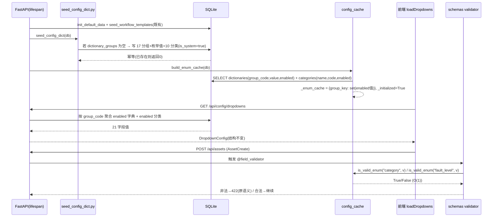
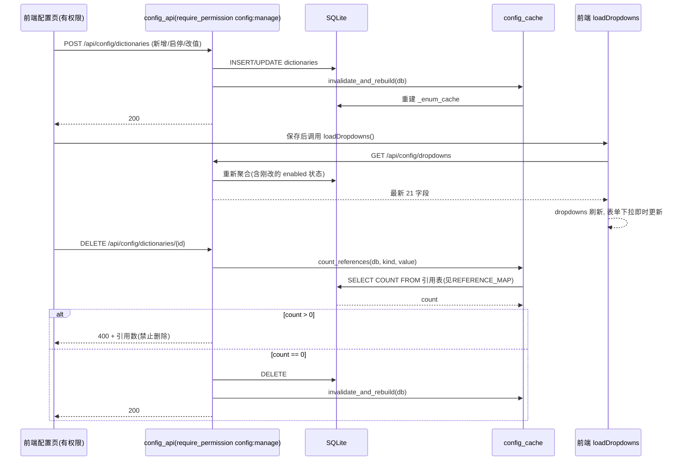
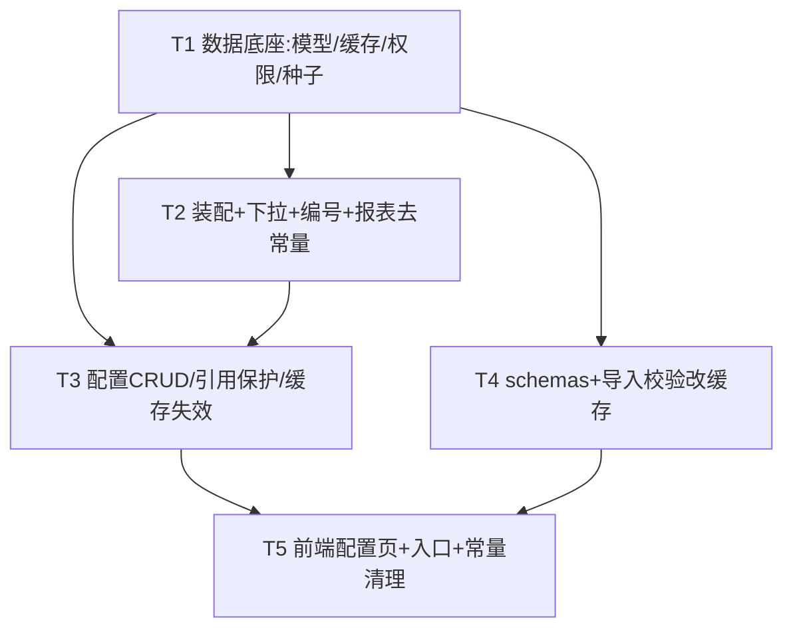

# 架构设计文档：系统配置模块 P0（字典/枚举配置中心 + 资产分类配置）

> 文档版本：v1.0（设计冻结稿）
> 作者：高见远（架构师）
> 日期：2026-07-09
> 关联 PRD：`PRD_系统配置模块_P0.md`（A-01~A-10、B-01~B-07）
> 关联系统：IT 资产全生命周期管理系统 v3.0.0
> 主理人已拍板决策：O1~O8（本文严格遵循）

---

## 0. 设计依据（已读源码契约摘要）

| 契约项 | 结论（以源码为准） |
|--------|-------------------|
| 现有栈 | FastAPI + SQLAlchemy 1.4+ + SQLite；前端 Vue3 单文件 SPA（CDN）。**不引入新依赖、不引入 ORM 迁移工具**。 |
| 审批流范式 | 常量→`workflow_templates` 表 + `seed_workflow_templates.py` 幂等 seed + lifespan 调用。**本模块复用此「常量→DB + lifespan seed」范式**。 |
| `GET /api/config/dropdowns` | `main.py:451`，返回 `DropdownConfig`（21 字段），前端 `loadDropdowns()` + `dropdowns` reactive 唯一依赖。**A-07 必须零结构变更（字段名/类型不变）**。 |
| `category_code_map` 局部字典 | `main.py:865-869`（POST 移入）与 `927-931`（PUT 移入），共 10 键含 `PDU→PDU`；`constants.py` 的 `CATEGORY_CODE_MAP` 缺 `PDU` 键。**O6：seed 以 main.py 局部字典为准，含 配电设备→PDU 与 PDU→PDU**。 |
| `schemas.py` 校验 | 13 处 `@field_validator`（classmethod，无 DB session），校验语义为「非法值 → `ValueError` → FastAPI 返回 422 + 明确文案」。**A-08 须保持该语义**。 |
| `import_export_reports.py` 校验 | `VALID_OPTIONS` dict + `validate_field()`，导入时逐字段校验。**O8：随 P0 一并发，改查 DB/缓存**。 |
| `reports_stats.py` 隐患 | `category_code` 取值来自 `constants.CATEGORY_CODE_MAP`（line 34/102）。**移除 CATEGORY_CODE_MAP 时必须同步改此处**，否则运行期 ImportError。 |
| `auth.py` 权限 | `PERMISSION_DEFINITIONS`（50 项）、`PERMISSION_GROUPS`（无「系统管理」组）、`DEFAULT_ROLES`（admin 用 `list(...keys())` 自动含全部；ops_manager 为显式列表）。`require_permission` 装饰器可复用。 |
| `lifecycle_stage` | **O4：P0 不纳入**，保持 `constants.LIFECYCLE_STAGES` 硬编码；`validation.py` 仅比对字面量「合格」，不依赖枚举常量，无需改。 |
| `AGGREGATE_FIELD_WHITELIST` 等 | **O5：P2 项本期不动、不预留入口**；保留在 `constants.py`。 |

---

## 1. 实现方案 + 框架选型

### 1.1 技术选型

| 层 | 选型 | 理由 |
|----|------|------|
| 后端框架 | **复用 FastAPI** | 零新增框架，复用 `require_permission`、`get_db`、`Depends` |
| 数据库 | SQLAlchemy + SQLite（沿用 `engine`/`SessionLocal`） | 不引入迁移工具；新表由 `Base.metadata.create_all` 自动建 |
| 配置 API | 新增 `backend/config_api.py`（`APIRouter(prefix="/api/config")`） | 与 `reports_stats.py` 风格一致：模块内纯函数 + 路由；`main.py` 仅 `include_router` |
| **枚举校验缓存** | **新增 `backend/config_cache.py`（模块级 dict 缓存）** | 解决「validator 无 DB session」核心难点（详见 §1.3） |
| 种子 | 新增 `backend/seed_config_dict.py`（仿 `seed_workflow_templates.py`） | 幂等 seed；lifespan 调用 |
| 前端 | **复用现有 SPA**（`frontend/index.html`），新增「系统配置」tab | 单文件 SPA，不引入构建工具 |
| 依赖 | **无新增第三方依赖** | 全部复用现有栈 |

### 1.2 架构模式

- 后端：**「DB 单一数据源 + 启动期内存缓存」双轨**。
  - 运行期所有下拉/校验/编号生成**只读 DB**（dictionaries / categories 表）。
  - 启动期（lifespan）把「各 group 当前 enabled 的 value 集合」加载进 `config_cache` 模块级缓存，供 `@field_validator`（无 session）与导入校验做 O(1) 查询。
  - 任何配置写 API 成功后**主动失效并重建缓存**，保证「保存后下拉即时刷新」。
- 前端：**SPA tab 组件式**。新增 `currentTab==='config'` 区块 + 侧边栏入口（`v-if="hasPerm('config:manage')"`）；保存成功后调用既有 `loadDropdowns()` 刷新（O3：不引入版本号）。

### 1.3 关键难点方案（必答项）

#### 难点 1：枚举校验的 DB 会话问题（A-08 核心）

**结论：采用「模块级缓存 `config_cache.py`」方案**（备选「校验移入 API 层」已否决，理由见下）。

**方案要点**：
1. `config_cache.py` 持有模块级 `_enum_cache: dict[str(组key), set[str(enabled值)]]`，进程内单例。
2. lifespan 启动时调用 `build_enum_cache(db)`：遍历 `dictionaries`（enabled=True）按 group_code 聚合 + `categories`（enabled=True）聚为 key=`"category"`，填充 `_enum_cache`；置 `_initialized=True`。
3. `schemas.py` 的 13 处 validator 改为：`if v is not None and not is_valid_enum("<组key>", v): raise ValueError(原文案)`。`is_valid_enum` 查 `_enum_cache`（O(1)）。
4. `import_export_reports.validate_field` 改为查 `is_valid_enum`。
5. 配置写 API（增/删/改/启停/排序）成功后调用 `invalidate_and_rebuild(db)` 重建缓存。

**与「移入 API 层」方案对比取舍**：

| 维度 | 方案 A：模块级缓存（选定） | 方案 B：校验移入 API 层 |
|------|--------------------------|------------------------|
| 错误码/语义 | 保持 Pydantic `ValueError`→422，与改造前一致 ✅ | 需改成 `HTTPException`→400，语义变化 ❌ |
| schemas 侵入 | 极小（validator 内一行替换）✅ | 需删 13 处 validator，在 main.py 每个 create 接口手写校验，重复 13 次 ❌ |
| 导入流程复用 | `validate_field` 同样查缓存，一套逻辑 ✅ | 导入无统一 API 层，需另写，逻辑分裂 ❌ |
| 缓存失效 | 集中在一处 rebuild ✅ | 无需缓存，但每次请求查 DB（QPS 低可接受，但偏离「常量→DB」统一范式） |
| 结论 | **选 A** | 否决 |

> 备注：缓存为空（如极端情况下请求早于 lifespan 完成）时 `is_valid_enum` 回退到「查 DB」一次并重建，保证健壮；正常路径不触发。

#### 难点 2：引用保护查询（A-05 / B-04）

**结论：配置化 `REFERENCE_MAP` + 统一 `count_references(db, kind, value)`**。

- `config_cache.py` 定义 `REFERENCE_MAP: dict[kind, list[(Model, column)]]`，kind = group_code（字典）或 `"category"`（分类）。映射严格按 PRD §6.2.6：

  | kind | 引用表.字段 |
  |------|------------|
  | `category` | `Asset.asset_category`、`AssetInbound.asset_category` |
  | `fault_level` | `Fault.fault_level` |
  | `warranty_status` | `Asset.warranty_status` |
  | `ownership_type` | `Asset.ownership`、`AssetInbound.ownership` |
  | `change_type` | `Change.change_type` |
  | `retire_category` | `Retirement.retire_category` |
  | `disposal_method` | `Retirement.disposal_method` |
  | `data_clear_option` | `Retirement.data_cleared` |
  | `receive_type` | `AssetInbound.receive_type` |
  | `inbound_inspection_result` | `AssetInbound.inspection_result` |
  | `outbound_category` | `AssetOutbound.outbound_category` |
  | `warranty_type` | `Warranty.warranty_type` |
  | `renewal_decision` | `Warranty.renewal_decision` |
  | `procurement_approval_status` | `Procurement.approval_status` |

  > `handle_method`/`root_cause`/`completion_status` **不在映射中**（PRD §6.2.6 未列引用），其删除恒返回 count=0（可删），符合现状。

- `count_references(db, kind, value)` 对 `REFERENCE_MAP[kind]` 逐项 `db.query(func.count()).filter(col==value)`，求和返回 int。
- 删除接口：`count = count_references(...)`；`count>0` → `HTTPException(400, detail=f"该选项被 {count} 条记录引用，禁止删除，仅可停用")`；`count==0` → 物理删除。**O2：被引用项仅允许停用、禁止物理删除**。
- 另提供 `GET /api/config/references?kind=&value=` 供前端删除前预警展示引用数。

#### 难点 3：下拉接口零结构变更（A-07）

`GET /api/config/dropdowns` 重写为「聚合 dictionaries（按 group_code，enabled=True）+ categories（enabled=True）」，但**仍构造并返回 `DropdownConfig` 21 字段、字段名/类型完全不变**。前端 `loadDropdowns()` 零改动。映射见 §3.3。`lifecycle_stages` 仍取自 `constants.LIFECYCLE_STAGES`（O4）。

#### 难点 4：种子迁移幂等（A-04 / B-03）

新增 `seed_config_dict.py`，仿 `seed_workflow_templates.py`：仅当 `dictionary_groups` 表为空才写入 17 分组 + 枚举值 + 10 分类（`is_system=True`）。lifespan 中调用。**O6 reconcile**：分类以 main.py 局部字典为准，写入「配电设备→PDU」与「PDU→PDU」两项（二者 `category_code` 均为 `PDU`，`category_name` 各自唯一）。seed 后存量 100 资产 `asset_category` 全部命中 `categories` 表（零 orphan）。

#### 难点 5：RBAC（A-09）

`auth.py`：`PERMISSION_DEFINITIONS` 新增第 51 项 `config:manage = "系统配置管理"`；`PERMISSION_GROUPS` 新增「系统管理」组（含 `config:manage`）；`DEFAULT_ROLES` 中 `ops_manager` 显式追加 `config:manage`（`admin` 因 `list(PERMISSION_DEFINITIONS.keys())` 自动含）。所有配置写 API 用 `require_permission("config:manage")` 保护。前端侧边栏入口 `v-if="hasPerm('config:manage')"`。

#### 难点 6：CATEGORY_CODE_MAP 彻底移除（B-05）

- `constants.py`：删除 `CATEGORY_CODE_MAP` / `CATEGORY_NAME_BY_CODE`（及后续随校验改造不再需要的枚举列表，见 T5）。
- `main.py`：删除两处 `category_code_map` 局部字典；移入 POST/PUT 编号生成改为 `db.query(Category).filter(category_name==x, enabled=True).first()` 取 `category_code`，缺省 `"OTH"`。
- `reports_stats.py`：`CATEGORY_CODE_MAP.get(cat,"OTH")` 改为查 `categories` 表（经 `config_cache.get_category_code(cat)` helper）。
- 存量验证：三份硬编码字典删除后系统无 `ImportError`、无引用报错。

---

## 2. 文件列表及相对路径

> 相对仓库根目录 `asset-lifecycle-manager/`。**新增 [N] / 修改 [M]**。

| 文件 | 状态 | 职责 |
|------|------|------|
| `backend/database.py` | **[M] 修改** | 新增 `DictionaryGroup` / `Dictionary` / `Category` 三模型 + 索引 + 外键 |
| `backend/config_cache.py` | **[N] 新增** | 模块级枚举缓存 + `FIELD_TO_GROUP` 映射 + `REFERENCE_MAP` + `build/invalidate/is_valid/get_values/count_references` |
| `backend/auth.py` | **[M] 修改** | 新增 `config:manage` 权限 + 「系统管理」分组 + `ops_manager` 授权 |
| `backend/seed_config_dict.py` | **[N] 新增** | 幂等种子（17 分组 + 枚举值 + 10 分类，含 PDU 碰撞） |
| `backend/config_api.py` | **[N] 新增** | `APIRouter(prefix="/api/config")`：分组/枚举/分类 CRUD + 启停 + 排序 + 引用计数；写接口 `require_permission("config:manage")` + 缓存失效 |
| `backend/main.py` | **[M] 修改** | lifespan 调 `seed_config_dict` + `build_enum_cache`；重写 `GET /api/config/dropdowns`；移入编号改查 `categories`；`include_router(config_router)`；清理常量导入 |
| `backend/schemas.py` | **[M] 修改** | 13 处 validator 改查 `config_cache.is_valid_enum`；删除 `_VALID_*` 列表（保留 `_VALID_LIFECYCLE_STAGES` 硬编码） |
| `backend/import_export_reports.py` | **[M] 修改** | `validate_field` 改查 `config_cache`；删除 `VALID_OPTIONS`；模板 tip 改查缓存 |
| `backend/reports_stats.py` | **[M] 修改** | `category_code` 取值改查 `categories` 表（去 `CATEGORY_CODE_MAP` 依赖） |
| `backend/constants.py` | **[M] 修改** | 删除 `CATEGORY_CODE_MAP`/`CATEGORY_NAME_BY_CODE`；T5 中删除已被字典取代的枚举列表（保留 `LIFECYCLE_STAGES`/`ACTIVE_STAGES`/`APPROVAL_*`/`AGGREGATE_FIELD_WHITELIST`） |
| `frontend/index.html` | **[M] 修改** | 侧边栏「系统配置」入口（`hasPerm('config:manage')`）+ config tab（分组树 + 枚举表格 CRUD + 分类管理 + 保存后 `loadDropdowns()`） |

> 注：参照 `deliverables/design-report-module.md` 约定，本模块 Mermaid 图一律内联，不单独落盘，避免覆盖 `deliverables/class-diagram.mermaid` / `sequence-diagram.mermaid`。

---

## 3. 数据模型（dictionary_groups / dictionaries / categories）

### 3.1 `DictionaryGroup`（承载 domain + group 两级，O7）

```python
class DictionaryGroup(Base):
    __tablename__ = "dictionary_groups"
    id = Column(Integer, primary_key=True, autoincrement=True)
    domain_code = Column(String(30), nullable=False, comment="业务域编码 如 fault_repair")
    domain_name = Column(String(50), nullable=False, comment="业务域名称 如 故障维修")
    group_code = Column(String(40), unique=True, nullable=False, comment="分组编码(唯一, dictionaries外键) 如 fault_level")
    group_name = Column(String(50), nullable=False, comment="分组名称 如 故障级别")
    sort_order = Column(Integer, default=0, comment="分组排序")
    is_system = Column(Boolean, default=True, comment="是否系统内置(种子写入)")
    created_at = Column(DateTime, server_default=func.now())
    updated_at = Column(DateTime, server_default=func.now(), onupdate=func.now())
```

### 3.2 `Dictionary`（枚举项）

```python
class Dictionary(Base):
    __tablename__ = "dictionaries"
    id = Column(Integer, primary_key=True, autoincrement=True)
    group_code = Column(String(40), ForeignKey("dictionary_groups.group_code"), nullable=False, comment="所属分组")
    value = Column(String(50), nullable=False, comment="枚举值(用于校验与下拉显示) 如 P1")
    code = Column(String(30), nullable=True, comment="可选编码(枚举一般空; 预留)")
    sort_order = Column(Integer, default=0, comment="排序")
    enabled = Column(Boolean, default=True, comment="是否启用(停用不进新增下拉)")
    is_system = Column(Boolean, default=True, comment="是否系统内置")
    remark = Column(Text, nullable=True, comment="备注")
    created_at = Column(DateTime, server_default=func.now())
    updated_at = Column(DateTime, server_default=func.now(), onupdate=func.now())
    __table_args__ = (
        Index("ix_dictionaries_group_enabled", "group_code", "enabled"),
        UniqueConstraint("group_code", "value", name="uq_dict_group_value"),  # A-01: 同分组内 value 唯一
    )
```

### 3.3 `Category`（资产分类，O1 / O6）

```python
class Category(Base):
    __tablename__ = "categories"
    id = Column(Integer, primary_key=True, autoincrement=True)
    category_name = Column(String(50), unique=True, nullable=False, comment="分类中文名(唯一) 如 服务器/PDU")
    category_code = Column(String(10), nullable=False, comment="分类码 如 SVR/PDU; O6放宽:不唯一(配电设备与PDU同映射PDU)")
    sort_order = Column(Integer, default=0, comment="排序")
    enabled = Column(Boolean, default=True, comment="是否启用")
    is_system = Column(Boolean, default=True, comment="是否系统内置")
    remark = Column(Text, nullable=True, comment="备注")
    created_at = Column(DateTime, server_default=func.now())
    updated_at = Column(DateTime, server_default=func.now(), onupdate=func.now())
    __table_args__ = (
        Index("ix_categories_name", "category_name"),
        Index("ix_categories_code_enabled", "category_code", "enabled"),
        # O6: 仅 category_name 唯一; category_code 不 unique（容纳 PDU 碰撞）
    )
```

> **与 PRD B-01 的差异（遵循 O6）**：B-01 原计划 `category_name` 与 `category_code` 各自唯一；O6 明确要求放宽 `category_code` 唯一约束（仅 `category_name` 唯一），以容纳「配电设备→PDU」与「PDU→PDU」历史碰撞，保证存量资产零 orphan。**以 O6 为准**。

### 3.4 类图（Mermaid 内联）

```mermaid
classDiagram
    class DictionaryGroup {
        +Integer id
        +String domain_code
        +String domain_name
        +String group_code «unique»
        +String group_name
        +Integer sort_order
        +Boolean is_system
    }
    class Dictionary {
        +Integer id
        +String group_code «FK»
        +String value
        +String code «nullable»
        +Integer sort_order
        +Boolean enabled
        +Boolean is_system
        +Text remark
    }
    class Category {
        +Integer id
        +String category_name «unique»
        +String category_code 「PDU碰撞不唯一」
        +Integer sort_order
        +Boolean enabled
        +Boolean is_system
    }
    class ConfigCache {
        <<module: backend/config_cache.py>>
        -_enum_cache: dict
        +build_enum_cache(db) void
        +invalidate_and_rebuild(db) void
        +is_valid_enum(key, value) bool
        +get_enum_values(key) list
        +count_references(db, kind, value) int
        +get_category_code(name) str
    }
    class ConfigAPI {
        <<FastAPI APIRouter /api/config>>
        +CRUD dictionary_groups
        +CRUD dictionaries(启停/排序)
        +CRUD categories(启停)
        +GET /references
    }
    class DropdownConfig {
        <<schemas.py 21字段>>
    }
    class Asset {
        +String asset_category
        +String warranty_status
        +String ownership
    }

    DictionaryGroup ||--o{ Dictionary : group_code
    ConfigAPI ..> DictionaryGroup : CRUD
    ConfigAPI ..> Dictionary : CRUD+引用保护
    ConfigAPI ..> Category : CRUD+引用保护
    ConfigAPI ..> ConfigCache : 写后 invalidate_and_rebuild
    ConfigCache ..> Dictionary : 启动期 build
    ConfigCache ..> Category : 启动期 build
    Dictionary ..> DropdownConfig : 聚合(enabled)
    Category ..> DropdownConfig : 聚合(enabled)
    Asset ..> Category : asset_category 引用
```

### 3.5 下拉字段 → 数据源映射（A-07 聚合依据）

`DROPDOWN_FIELD_TO_SOURCE`（定义在 `config_cache.py`，供 `get_dropdown_config` 使用）：

| DropdownConfig 字段 | 来源 | key |
|---------------------|------|-----|
| `categories` | Category(enabled) | `category` |
| `lifecycle_stages` | `constants.LIFECYCLE_STAGES`（O4 硬编码） | — |
| `warranty_statuses` | Dictionary | `warranty_status` |
| `inspection_results` | Dictionary | `inspection_result` |
| `change_types` | Dictionary | `change_type` |
| `fault_levels` | Dictionary | `fault_level` |
| `handle_methods` | Dictionary | `handle_method` |
| `root_causes` | Dictionary | `root_cause` |
| `renewal_decisions` | Dictionary | `renewal_decision` |
| `retire_categories` | Dictionary | `retire_category` |
| `data_clear_options` | Dictionary | `data_clear_option` |
| `completion_statuses` | Dictionary | `completion_status` |
| `receive_types` | Dictionary | `receive_type` |
| `outbound_categories` | Dictionary | `outbound_category` |
| `procurement_approval_statuses` | Dictionary | `procurement_approval_status` |
| `warranty_types` | Dictionary | `warranty_type` |
| `disposal_methods` | Dictionary | `disposal_method` |
| `ownership_types` | Dictionary | `ownership_type` |
| `inbound_inspection_results` | Dictionary | `inbound_inspection_result` |

> **注意两个同名语义不同的「验收结果」**：`inspection_results`（3 值：合格/不合格/待验收，来源 `inspection_result`）与 `inbound_inspection_results`（2 值：合格/不合格，来源 `inbound_inspection_result`）为**两个独立 group**，须分别 seed、分别校验，以精确保留改造前语义（见 §8）。

---

## 4. 接口清单（CRUD + 下拉改造 + 引用计数）

> 所有写接口权限 `require_permission("config:manage")`；管理列表接口（GET）亦需 `config:manage`（配置页仅对授权用户可见，O3/K4）。`GET /api/config/dropdowns` 保持原权限（`get_current_user`，全员可读）。

| 方法 | 路径 | 权限 | 说明 |
|------|------|------|------|
| GET | `/api/config/dropdowns` | `get_current_user` | **A-07**：聚合 dictionaries+categories，返回 21 字段 `DropdownConfig`（结构不变，enabled 过滤） |
| GET | `/api/config/dictionary-groups` | `config:manage` | 分组树（按 domain 聚合），含 is_system 标记 |
| POST | `/api/config/dictionary-groups` | `config:manage` | 新建分组（domain+group） |
| PUT | `/api/config/dictionary-groups/{id}` | `config:manage` | 改分组名/排序 |
| DELETE | `/api/config/dictionary-groups/{id}` | `config:manage` | 删分组（仅当无子项；is_system 禁止删） |
| GET | `/api/config/dictionaries?group_code=` | `config:manage` | 枚举项列表（**含 disabled**，供管理页显隐/启用） |
| POST | `/api/config/dictionaries` | `config:manage` | 新增枚举值（同 group 内 value 唯一） |
| PUT | `/api/config/dictionaries/{id}` | `config:manage` | 改 value/remark/sort_order |
| DELETE | `/api/config/dictionaries/{id}` | `config:manage` | **A-05 引用保护**：count>0 → 400+引用数；count=0 → 物理删 |
| POST | `/api/config/dictionaries/{id}/toggle` | `config:manage` | 启停（enabled 翻转），写后缓存失效 |
| POST | `/api/config/dictionaries/reorder` | `config:manage` | 批量更新 sort_order |
| GET | `/api/config/categories` | `config:manage` | 分类列表（含 disabled） |
| POST | `/api/config/categories` | `config:manage` | 新增分类（`category_code` 匹配 `^[A-Z0-9]{2,4}$`） |
| PUT | `/api/config/categories/{id}` | `config:manage` | 改分类名/码 |
| DELETE | `/api/config/categories/{id}` | `config:manage` | **B-04 引用保护**：查 Asset/AssetInbound.asset_category；count>0 → 400+引用数 |
| POST | `/api/config/categories/{id}/toggle` | `config:manage` | 启停分类 |
| GET | `/api/config/references?kind=&value=` | `config:manage` | 返回 `{count, referenced}`，供删除前预警 |

**请求/响应示例（枚举项）**：
```jsonc
// POST /api/config/dictionaries  body
{ "group_code": "fault_level", "value": "P1", "sort_order": 1, "remark": "" }
// DELETE /api/config/dictionaries/12  (被 faults 引用 5 条) → 400
{ "detail": "该选项被 5 条记录引用，禁止删除，仅可停用" }
// GET /api/config/references?kind=fault_level&value=P1 → 200
{ "count": 5, "referenced": true }
```

---

## 5. 程序调用流程（时序图 Mermaid 内联）

### 5.1 启动 seed → 下拉 → 校验缓存



### 5.2 配置 CRUD → 缓存失效



---

## 6. 任务列表（有序 / 含依赖 / 按实现顺序）

> 粒度：工程师可批量执行；覆盖 PRD **P0（A-01~A-10、B-01~B-07）**。P1（valid_transitions/P1-02 版本号）、P2（聚合白名单/审计日志）不在范围。

| 任务 | 名称 | 修改文件 | 依赖 | 优先级 | 覆盖 PRD |
|------|------|----------|------|--------|----------|
| **T1** | 数据底座：模型 + 枚举缓存 + 引用计数 + RBAC + 种子数据 | `backend/database.py`、`backend/config_cache.py`、`backend/auth.py`、`backend/seed_config_dict.py` | 无 | P0 | A-01/A-02/A-05/B-01/B-04/K2/K4 底座 |
| **T2** | 启动装配 + 下拉接口改造 + 分类编号数据源 + 报表去常量 | `backend/main.py`、`backend/reports_stats.py`、`backend/constants.py` | T1 | P0 | A-04/A-07/B-03/B-05/B-06/K1/O6 |
| **T3** | 配置管理 CRUD/启停/排序 + 引用保护 API + 缓存失效 | `backend/config_api.py`、`backend/main.py`、`backend/config_cache.py` | T1,T2 | P0 | A-03/A-05/A-06/A-09/A-10/B-02/B-04/B-05/K2/K4 |
| **T4** | 校验改造：schemas 13 处 validator + 导入校验 改查缓存 | `backend/schemas.py`、`backend/import_export_reports.py` | T1 | P0 | A-08/O8/K3 |
| **T5** | 前端配置中心页 + 入口 + 常量最终清理 | `frontend/index.html`、`backend/constants.py`、`backend/main.py`、`backend/schemas.py`、`backend/import_export_reports.py` | T3,T4 | P0 | A-10/B-07/K5/O6 |

### 6.1 任务细化

**T1 — 数据底座（无依赖）**
- `database.py`：新增 `DictionaryGroup` / `Dictionary` / `Category` 三模型（见 §3.1~3.3，`Base.metadata.create_all` 自动建表；新增模型加在 `WorkflowTemplate` 之后、`AssetStageLog` 之前或之后均可）。
- `config_cache.py`：实现 `_enum_cache` 模块级 dict；`build_enum_cache(db)`、`invalidate_and_rebuild(db)`、`is_valid_enum(key, value)`、`get_enum_values(key)`、`count_references(db, kind, value)`、`get_category_code(name)`；模块级常量 `FIELD_TO_GROUP_SCHEMA`、`FIELD_TO_GROUP_IMPORT`、`DROPDOWN_FIELD_TO_SOURCE`、`REFERENCE_MAP`（见 §1.3 / §3.5）。**仅 import `database` 模型，不 import schemas，避免循环依赖**。
- `auth.py`：`PERMISSION_DEFINITIONS` 加 `"config:manage": "系统配置管理"`；`PERMISSION_GROUPS` 加 `{name:"系统管理", permissions:["config:manage"]}`；`DEFAULT_ROLES.ops_manager.permissions` 追加 `"config:manage"`。
- `seed_config_dict.py`：定义 17 分组 + 各枚举值 + 10 分类（§3.5 + §1.3 难点4 的 PDU 碰撞）的 `SEED_GROUPS`/`SEED_DICTIONARIES`/`SEED_CATEGORIES`；`seed_config_dict(db)` 仅当 `db.query(DictionaryGroup).count()==0` 时写入，`is_system=True`，返回写入数（幂等）。

**T2 — 启动装配 + 下拉 + 编号 + 报表去常量（依赖 T1）**
- `main.py`：
  1. 顶部 import 增加 `from config_cache import build_enum_cache, DROPDOWN_FIELD_TO_SOURCE` 与 `from seed_config_dict import seed_config_dict` 与 `Category`（已含于 database）。
  2. `lifespan`：`init_default_data`/`seed_workflow_templates` 之后追加 `seed_config_dict(db)` + `build_enum_cache(db)`。
  3. 重写 `GET /api/config/dropdowns`：遍历 `DROPDOWN_FIELD_TO_SOURCE` 聚合 `dictionaries`（enabled）+ `categories`（enabled），`lifecycle_stages` 仍取 `LIFECYCLE_STAGES`，构造 `DropdownConfig`（21 字段不变）。
  4. 移入 POST（`create_asset_inbound`）与 PUT（`update_asset_inbound`）：删除两处 `category_code_map` 局部字典，改为 `cat = db.query(Category).filter(Category.category_name==(item.asset_category or "其他"), Category.enabled==True).first(); cat_code = cat.category_code if cat else "OTH"`。
  5. 清理顶部 `from constants import (...)`：移除已被字典取代的枚举列表导入（保留 `LIFECYCLE_STAGES`/`ACTIVE_STAGES`/`APPROVAL_*` 等仍使用者）。
- `reports_stats.py`：`from constants import CATEGORY_CODE_MAP` 改为经 `config_cache.get_category_code(cat)`（查 `categories` 表，缺省 `"OTH"`）；删除 CATEGORY_CODE_MAP 导入。
- `constants.py`：删除 `CATEGORY_CODE_MAP` / `CATEGORY_NAME_BY_CODE`（此二处仅被 main 下拉/inbound 与 reports_stats 使用，T2 已解除依赖；其余枚举列表保留至 T5）。

**T3 — 配置管理 API（依赖 T1,T2）**
- `config_api.py`：新建 `APIRouter(prefix="/api/config")`；按 §4 实现全部端点；写接口统一 `Depends(require_permission("config:manage"))`；写成功后 `config_cache.invalidate_and_rebuild(db)`；DELETE 走 `count_references` 引用保护；分类 `category_code` 正则校验 `^[A-Z0-9]{2,4}$`；列表类 GET 返回**全部（含 disabled）**供管理页。
- `main.py`：`from config_api import config_router` + `app.include_router(config_router)`。
- `config_cache.py`：补充 `count_references` 与 `REFERENCE_MAP` 落地（若 T1 仅留接口签名）；确认 `invalidate_and_rebuild` 在写 API 正确调用。

**T4 — 校验改造（依赖 T1）**
- `schemas.py`：删除 13 处 `_VALID_*` 列表（保留 `_VALID_LIFECYCLE_STAGES` 用于 `lifecycle_stage` 硬编码校验，O4）；13 处 `@field_validator` 改为 `if v is not None and not is_valid_enum("<组key>", v): raise ValueError(原文案)`。组 key 映射见 §1.3（如 `asset_category→"category"`、`inspection_result`(InboundCreate)→`"inbound_inspection_result"`、`approval_status`(ProcurementCreate)→`"procurement_approval_status"` 等）。顶部 `from config_cache import is_valid_enum`。
- `import_export_reports.py`：删除 `VALID_OPTIONS` 及 `from constants import (...)` 枚举列表导入；`validate_field(field, value)` 改为经 `config_cache.is_valid_enum(FIELD_TO_GROUP_IMPORT[field], value)`（无法映射的字段跳过）；模板 `tip_map_*` 改用 `config_cache.get_enum_values(...)` 或保留必要常量（如 `LIFECYCLE_STAGES`）。

**T5 — 前端配置页 + 入口 + 常量最终清理（依赖 T3,T4）**
- `frontend/index.html`：
  1. 侧边栏（约 line 211 `retirements` 之后、`approval` 组之前）新增 `<div class="menu-item" v-if="hasPerm('config:manage')" :class="{active: currentTab==='config'}" @click="currentTab='config'; loadConfig()">⚙ 系统配置</div>`。
  2. 新增 `<template v-if="currentTab==='config'">`：业务域页签 → 分组树/页签 → 枚举项 `el-table`（增/删/改/启停/排序）；「分类管理」Tab（分类名+分类码+启停）。
  3. JS：`configData`/`configLoading` reactive；`loadConfig()` 拉取分组树 + 各分组枚举 + 分类；CRUD 调用 `config_api`；**保存/启停成功后调用 `loadDropdowns()`**（O3 主动刷新，无版本号）；删除前调用 `GET /api/config/references` 展示引用数预警。
  4. 资产建档/编辑/移入表单的「资产分类」`el-option` 已绑定 `dropdowns.categories`，随 A-07 自动生效（B-07）。
- `constants.py`：删除已被字典取代的全部枚举列表（`CATEGORIES`/`WARRANTY_STATUSES`/`INSPECTION_RESULTS`/`CHANGE_TYPES`/`FAULT_LEVELS`/`HANDLE_METHODS`/`ROOT_CAUSES`/`RENEWAL_DECISIONS`/`RETIRE_CATEGORIES`/`DATA_CLEAR_OPTIONS`/`COMPLETION_STATUSES`/`RECEIVE_TYPES`/`OUTBOUND_CATEGORIES`/`PROCUREMENT_APPROVAL_STATUSES`/`WARRANTY_TYPES`/`DISPOSAL_METHODS`/`OWNERSHIP_TYPES`/`INBOUND_INSPECTION_RESULTS`），保留 `LIFECYCLE_STAGES`/`ACTIVE_STAGES`/`APPROVAL_*`/`AGGREGATE_FIELD_WHITELIST`（O4/O5 不动项）。
- `main.py` / `schemas.py` / `import_export_reports.py`：清理 §T2/T4 遗留的 `from constants import` 已删名称，确保无 `ImportError`。

---

## 7. 依赖包列表

### 7.1 后端

| 包 | 版本 | 状态 | 用途 |
|----|------|------|------|
| `fastapi` | 已装 | 复用 | Web 框架 |
| `sqlalchemy` | 已装 | 复用 | ORM（`Base.metadata.create_all` 自动建新表） |
| `pydantic` | 已装 | 复用 | 校验（validator 改查缓存） |
| `sqlite3` | 标准库 | 复用 | 无新增 |

> **后端无需新增任何第三方依赖。** 新表经既有 `Base.metadata.create_all(bind=engine)`（database.py 末尾）在下次启动自动创建，无需独立迁移脚本（与 WorkflowTemplate 范式一致）。

### 7.2 前端

| 资源 | 引入方式 | 说明 |
|------|----------|------|
| Vue3 / Element Plus / ECharts | 已存在（CDN） | 复用，无新增 |

> **前端无新增 CDN 资源。**

---

## 8. 共享知识（跨文件约定）

1. **缓存单一数据源**：运行期枚举值唯一真相 = `dictionaries`/`categories` 表；`config_cache._enum_cache` 仅为「启动期/写后」的内存镜像，**仅含 enabled 值**（停用项既不进下拉也不通过校验，A-06）。
2. **`config_cache` 接口约定**：
   - `build_enum_cache(db)`：lifespan 调用一次。
   - `invalidate_and_rebuild(db)`：每个配置写 API 成功后调用。
   - `is_valid_enum(key, value) -> bool`：key ∈ group_code 或 `"category"`；O(1)。
   - `get_enum_values(key) -> list[str]`：供下拉/模板 tip。
   - `count_references(db, kind, value) -> int`：kind ∈ `REFERENCE_MAP` 键。
   - `get_category_code(name) -> str`：查 `categories`，缺省 `"OTH"`。
3. **组 key 命名**：字典用 `group_code`（如 `fault_level`）；分类固定用 `"category"`。`schemas` 与 `import_export_reports` 各自维护 `FIELD_TO_GROUP_*`（字段名→组 key），集中定义在 `config_cache.py` 顶部便于维护。
4. **两个「验收结果」group（重要）**：`inspection_result`（3 值：合格/不合格/待验收）与 `inbound_inspection_result`（2 值：合格/不合格）必须分别 seed、分别校验，不可合并，否则破坏 `InboundCreate` 现有 2 值语义。
5. **引用保护语义**：`count>0` → `HTTPException(400, detail=f"该选项被 {count} 条记录引用，禁止删除，仅可停用")`；`count==0` → 物理删除。前端删除前用 `GET /api/config/references` 预警。
6. **下拉零结构变更**：`GET /api/config/dropdowns` 始终返回 `DropdownConfig` 21 字段；管理页列表接口（`/dictionaries`、`/categories`）返回含 disabled 的全量，便于启停。
7. **PDU 碰撞（O6）**：`categories` 仅 `category_name` 唯一；`配电设备` 与 `PDU` 均 `category_code=PDU`。seed 以 main.py 局部字典为准写入这两项。资产编号 `DC-CL-PDU-NNN` 对两者均有效。
8. **seed 幂等约定**：`seed_config_dict(db)` 仅当 `dictionary_groups` 为空时写入；可重跑；与 `seed_workflow_templates` 对称。
9. **权限约定**：配置写 API 统一 `require_permission("config:manage")`；前端入口 `v-if="hasPerm('config:manage')"`；`admin` 经 `list(PERMISSION_DEFINITIONS.keys())` 自动含该权限。
10. **编号生成数据源**：移入自动建档一律 `db.query(Category).filter(category_name==x, enabled==True).first().category_code`，不再 import 任何硬编码字典（参照 workflow_templates 迁移范式，删除即无引用）。

---

## 9. 待明确事项

**无阻塞性待明确项。** 主理人 O1~O8 已覆盖全部 PRD §5 待确认点。两点已在设计中显式决策（供确认）：

1. `inspection_result` 双 group 拆分（§3.5/§8-4）——保留改造前语义，非新增行为。
2. `category_code` 唯一约束放宽（仅 `category_name` 唯一，O6 优先于 B-01 原文）——已在 §3.3 标注差异。

> 若 QA/PM 后续希望「停用项仍在下拉中灰显可选」，属 UX 增强，本期按 PRD A-06 实现为「停用项不进新增下拉」，不在本期范围。

---

## 10. 存量零破坏验证要点（QA 检查清单雏形）

> 目标：首次启动 seed 后，存量 100 资产（及全部子表）零报错、下拉/校验语义与改造前 100% 一致。

- [ ] **启动幂等**：清空 `dictionary_groups` 后首次启动 seed 写入 17 分组 + 枚举值 + 10 分类；二次启动不重复写入（`seed_config_dict` 返回 0）。
- [ ] **下拉零变更**：`GET /api/config/dropdowns` 返回 21 字段，各字段值集合与改造前 `constants.py` 完全一致（可用既有测试数据对比）。
- [ ] **分类零 orphan**：存量 `assets.asset_category` 与 `asset_inbound.asset_category` 全部 ∈ seed 的 10 个 `category_name`（含 `配电设备`/`PDU` 均命中 `PDU`）。
- [ ] **校验语义一致**：建档/编辑/导入提交**合法**值 → 200/成功；提交**非法**值 → 422（schemas）或 400（导入），错误文案与改造前一致。
- [ ] **编号生成正确**：移入验收合格自动建档，前缀 `DC-CL-{code}-NNN`：`配电设备`/`PDU` → `DC-CL-PDU-001`；`服务器`→`SVR`；未知→`OTH`。
- [ ] **RBAC**：`ops_engineer`/`viewer` 调任一 `/api/config/*` 写接口 → 403；侧边栏无「系统配置」入口；`admin`/`ops_manager` 可见可用。
- [ ] **引用保护**：对 `faults` 中存在的 `fault_level` 调 `DELETE /api/config/dictionaries/{id}` → 400 + 引用数；无引用项可删。
- [ ] **启停联动**：停用某 `warranty_status` 后，`GET /api/config/dropdowns` 不含它；**存量**资产列表中该状态仍正常显示原值（不空白）。
- [ ] **缓存失效**：配置页新增/启停/改值保存后，前端 `loadDropdowns()` 生效，资产表单下拉即时更新（无需刷新页面/重启）。
- [ ] **报表兼容**：`GET /api/stats/category-composition?include_code=true` 返回的 `category_code` 取自 `categories` 表，与改造前 `CATEGORY_CODE_MAP` 一致。
- [ ] **无残留引用**：`grep -rn "CATEGORY_CODE_MAP\|CATEGORY_NAME_BY_CODE\|category_code_map" backend/` 结果为空（O6 彻底移除）。
- [ ] **回归**：现有 50 项权限不受影响；`/api/stats`、`/api/distinct-values`、审批流等既有接口正常。

---

## 附录：任务依赖图（Mermaid）



> 说明：T2/T3/T4 均依赖 T1（模型与缓存底座）；T3 另依赖 T2（下拉已切 DB、lifespan 已 build 缓存）；T5 依赖 T3（API 就绪）与 T4（校验已切缓存）。T2 与 T4 可并行开发（均仅依赖 T1）。
