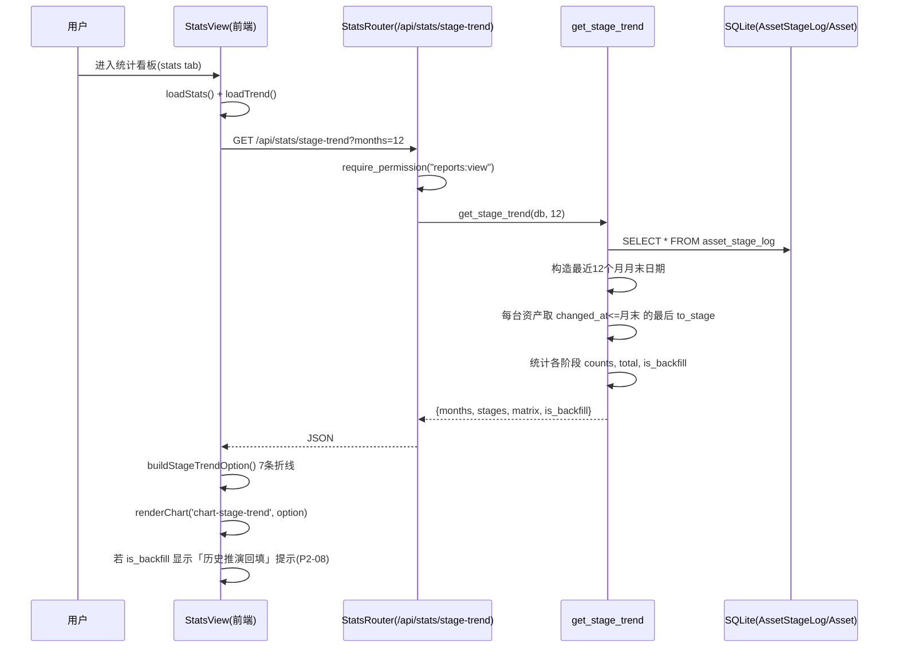
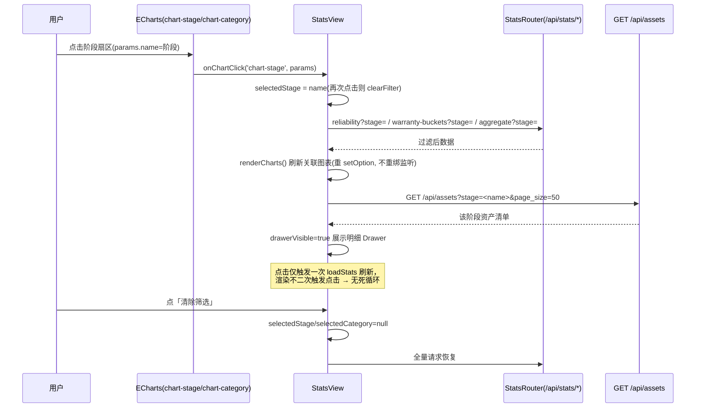
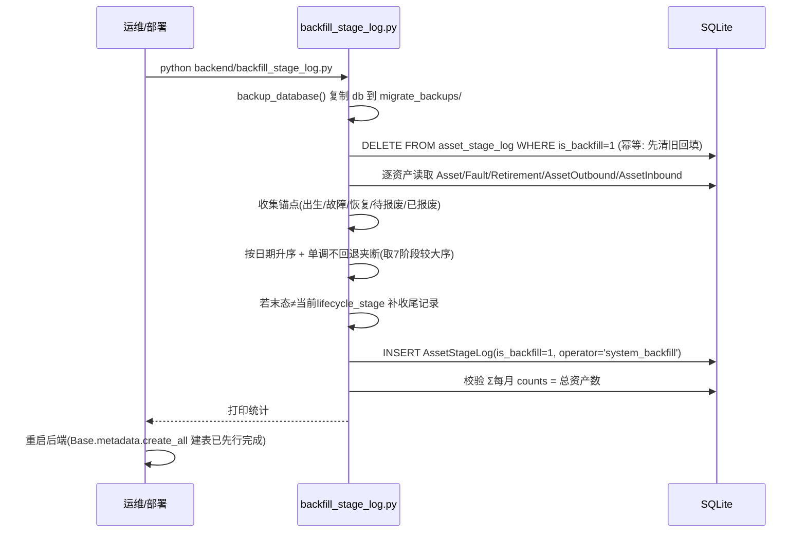
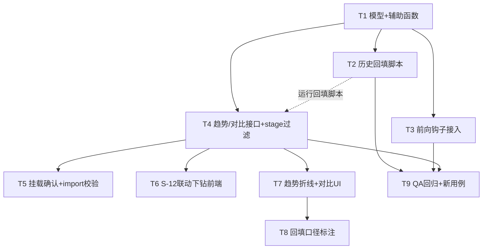

# 增量架构设计：报表统计模块 P2（联动下钻 + 阶段趋势/对比）

> 文档版本：v1.0（增量设计冻结稿）
> 作者：高见远（架构师）
> 日期：2026-07-07
> 关联基础文档：`PRD_报表统计模块.md`、`deliverables/design-report-module.md`（现有 6 接口、Asset 模型、reports_stats.py 结构、前端 stats tab 结构）
> 关联增量 PRD：`PRD_报表统计模块_P2.md`（P2-01 ~ P2-09）
> 关联源码：`backend/database.py`、`backend/reports_stats.py`、`backend/approval.py`、`backend/main.py`、`backend/import_export_reports.py`、`backend/validation.py`、`backend/auth.py`、`frontend/index.html`、`deliverables/qa-test-report-module.py`

---

## 0. 源码契约确认（本次读码结论，覆盖 PRD §6 待确认项）

| 契约项 | 结论（以源码为准） | 证据 |
|--------|-------------------|------|
| `AssetStageLog` 模型 | **不存在**，需新增（`database.py` 无同名模型，无冲突） | 通读 `database.py` 全文 |
| `drive_stage_change` 真实签名 | `drive_stage_change(db: Session, request: ApprovalRequest) -> None`；位于 `approval.py:185`；内部 `asset.lifecycle_stage = request.target_stage`；`request` 含 `current_stage`/`target_stage`/`applicant_id`/`approval_type` | `approval.py:185-206` |
| 故障降级入口 | `main.py:1147 create_fault`：`original_stage = asset.lifecycle_stage`（:1158）→ `asset.lifecycle_stage="维修"`（:1159）→ 调 `auto_submit_fault_approval(..., original_stage)`（:1160） | `main.py:1157-1160` |
| 故障 Excel 导入直接置维修 | `import_export_reports.py:286-289`：`if data.get("fault_level") in ("P1","P2-严重"): asset=...; if asset.lifecycle_stage in ["运行","上架"]: asset.lifecycle_stage="维修"` | `import_export_reports.py:286-289` |
| 资产建档（出生）两个入口 | `main.py:882-892 create_asset_inbound`（验收合格自动建 `lifecycle_stage="上架"`）；`main.py:941-958 update_asset_inbound`（同） | `main.py:888` / `main.py:948` |
| `/api/assets` 过滤参数名 | **`stage`**（:607/:633）→ `Asset.lifecycle_stage==stage`；**`category`**（:606/:631）→ `Asset.asset_category==category`；另有 `search`/`warranty_status`/`page`/`page_size` | `main.py:601-657` |
| `stats_router` 挂载 | 已挂载：`main.py:1447 app.include_router(stats_router)`；新增 2 接口随同文件自动生效，**`main.py` 无需改挂载逻辑** | `main.py:1447` |
| `reports_stats.py` 现有 import | `from database import get_db, Asset, Fault, Retirement`；`from constants import LIFECYCLE_STAGES, ACTIVE_STAGES, CATEGORY_CODE_MAP, AGGREGATE_FIELD_WHITELIST` | `reports_stats.py:29-35` |
| 前端 ECharts 生命周期 | `renderChart(id, option)`（:2460，按 `_domId` 复用实例，初始化仅一次）；`renderCharts()`（:2472）；`disposeCharts()`（:2481）；`watch(currentTab)` 进入 `loadStats()`、离开 `disposeCharts()`（:2969-2979） | `index.html:2460-2979` |
| `validation.py` 是否触发阶段变更 | **否**。`run_all_checks`/`check_stage_gate` 均为**只读**校验，不写 `lifecycle_stage`，**无需改动**（PRD §2.4 / 主理人「可能改 validation.py」→ 结论：不改） | 通读 `validation.py` |
| `changed_at` 字段类型 | 采用主理人「已冻结关键决策 #1」：**`DateTime`**（非 PRD §2.3 的 `Date`）；回填仅含日期时存 `00:00:00` | 冻结决策优先 |

> 关键解读（避免「维修→维修」空转 & 避免双写）：`create_fault` 在 `:1159` **已同步**把 `lifecycle_stage` 置为 `维修`，随后 `auto_submit_fault_approval` 生成的审批单 `current_stage=original_stage`（如「运行」）。因此 `drive_stage_change` 用 `request.current_stage` 作为 `from_stage`（记录「运行→维修」正确），而**故障降级审批路径不再二次写日志**（由 `create_fault` 写一次），既满足 P2-02「一条记录」又避免空转。详见 §4.4 与任务 T3。

---

## 1. 实现方案 + 框架选型

### 1.1 技术选型（不新增任何依赖）

| 层 | 选型 | 理由 |
|----|------|------|
| 后端框架 | **复用 FastAPI** + `reports_stats.py` 的 `stats_router` | 零新增框架；新增 2 接口挂同一 `APIRouter(prefix="/api/stats")` |
| 数据底座 | 新增 `AssetStageLog` 表（SQLAlchemy 模型） | `database.py` 末尾已有 `Base.metadata.create_all(bind=engine)`，**新表自动建表，无需 ALTER 迁移脚本**（对比 `migrate_original_value.py` 是因为那时是给既有 `assets` 加列；本次是全新表，故 `migrate_stage_log.py` 可省略，避免重复基建） |
| 回填脚本 | `backend/backfill_stage_log.py`（SQLAlchemy ORM 读取锚点 + 写入，运行前 `shutil` 备份 DB，幂等） | 复用 `migrate_original_value.py` 的 `backup_database` 思路；用 ORM 便于跨表关联 |
| 前端 | **复用现有 SPA**（Vue3 + Element Plus + ECharts 5.5.0 CDN）；新增趋势/对比卡片 + 联动状态 + 明细 Drawer | 不引入构建工具；图表容器与 `buildXxxOption` 沿用 |
| 权限 | 复用 `reports:view` | 不新增权限项；前端 `v-if="hasPerm('reports:view')"` |

### 1.2 架构模式

- 后端：**函数式聚合层 + 路由层**（沿用基础设计）。`reports_stats.py` 新增 `get_stage_trend` / `get_stage_compare` 纯函数 + 2 条路由；`database.py` 新增 `AssetStageLog` 模型与 `record_stage_change` 辅助函数（模块级函数，非 ORM 方法），在阶段变更入口统一调用。
- 前端：**SPA tab 组件式**（沿用）。在 `index.html` 的 stats tab 内：① 阶段分布卡片下新增「按月趋势」折线区 + 「对比」控件；② 新增 `selectedStage` / `selectedCategory` 联动状态 + 明细 `Drawer`（复用 `/api/assets`）；③ 图表点击监听在 `renderChart` 首次 `init` 时绑定一次（防重复绑定死循环）。
- 权限：所有新增/改造接口 `Depends(require_permission("reports:view"))`。

### 1.3 关键口径（落实冻结决策）

| 口径 | 定义 |
|------|------|
| **`AssetStageLog`** | 阶段变更事件日志：`(id, asset_code, from_stage, to_stage, changed_at[DateTime], operator, reason, is_backfill)`；索引 `(asset_code)`、`(changed_at)` |
| **前向日志** | 真实阶段变更产生 `is_backfill=False`；`from_stage` 一律取变更**前**原始阶段（审批用 `request.current_stage`），`changed_at` 取真实发生时刻 |
| **回填日志** | 历史推演值 `is_backfill=True`，`operator="system_backfill"`，`reason="历史推演回填"`；逐资产按已知日期字段推演锚点，**单调不回退** |
| **趋势口径** | 按月；X 轴=每月末；每月末快照=各资产「`changed_at ≤ 该月末` 的最后一条日志的 `to_stage`」；Σ=总资产数（每台资产至少有「出生」锚点，故恒被计入） |
| **对比口径** | 两窗口 `range_a`/`range_b`（YYYY-MM）各自月末快照；环比=当月 vs 上月；同比=当月 vs 去年同月；`metric ∈ {stage, total_assets, active_assets, original_value, fault_count}`；返回 Δ + Δ% |
| **is_backfill 标注** | `stage-trend` 返回 `is_backfill` 布尔；前端在趋势区/对比区展示「历史数据为推演回填值，真实事件自接入日起记录」 |

---

## 2. 文件列表及相对路径

> 相对仓库根目录 `asset-lifecycle-manager/`。**新增 [N] / 修改 [M]**。

| 文件 | 状态 | 职责 |
|------|------|------|
| `backend/database.py` | **[M]** | 新增 `AssetStageLog` 模型（含索引）+ 模块级 `record_stage_change(...)` 辅助函数 |
| `backend/backfill_stage_log.py` | **[N]** | 历史回填脚本：读 Asset/Fault/Retirement/AssetOutbound/AssetInbound → 推演锚点 → 单调夹断 → 幂等写入 `is_backfill=True`；运行前备份 DB |
| `backend/approval.py` | **[M]** | `drive_stage_change` 调 `record_stage_change`（用 `request.current_stage`；故障降级类型跳过以避免双写） |
| `backend/main.py` | **[M]** | `create_fault`（:1159 后补写 运行→维修 日志）；两处资产建档（:888 / :948 补写 规划→上架 日志）；确认 `stats_router` 已挂载 |
| `backend/import_export_reports.py` | **[M]** | 故障导入分支（:286-289）补写 原阶段→维修 日志 |
| `backend/reports_stats.py` | **[M]** | 新增 `get_stage_trend` + `GET /api/stats/stage-trend`；新增 `get_stage_compare` + `GET /api/stats/compare`；`get_reliability`/`get_warranty_buckets`/`get_aggregate` 增加可选 `stage` 过滤参数 |
| `frontend/index.html` | **[M]** | S-12 联动下钻（点击监听 + `selectedStage`/`selectedCategory` + 明细 Drawer + 清除筛选）；S-16 趋势折线卡片；S-17 对比控件；P2-08 口径标注 |

> 说明：
> - **不新增** `migrate_stage_log.py`：`AssetStageLog` 是全新表，`database.py` 末尾 `Base.metadata.create_all` 在后端重启后自动建表（参照基础设计 §2 的 `original_value` 列也是先改模型再迁移，但那是既有表加列；新表无需 ALTER）。
> - `validation.py` **不改**（只读，不驱动阶段变更）。
> - `auth.py` **不改**（`reports:view` 已含于 4 内置角色）。
> - 基础设计 §8 约定「本模块 Mermaid 图一律内联，不单独落盘，避免覆盖 `deliverables/class-diagram.mermaid` / `sequence-diagram.mermaid`（审批引擎图）」——本增量设计同样**仅内联 Mermaid**，不另写 `docs/*.mermaid`。

---

## 3. 数据结构与接口（类图 Mermaid 内联）

```mermaid
classDiagram
    class AssetStageLog {
        <<tablename: asset_stage_log>>
        +Integer id PK
        +String asset_code  "关联资产编号(索引)"
        +String from_stage  "变更前阶段"
        +String to_stage    "变更后阶段"
        +DateTime changed_at "变更时刻(索引)"
        +String operator    "操作人"
        +String reason      "变更原因"
        +Boolean is_backfill "是否回填推演"
    }
    note for AssetStageLog "7阶段顺序(常量.LIFECYCLE_STAGES):\n规划<在途<上架<运行<维修<待报废<已报废\n__table_args__: Index(asset_code), Index(changed_at)"

    class Database {
        <<module: backend/database.py>>
        +record_stage_change(db, asset_code, from_stage, to_stage, changed_at, operator, reason, is_backfill=False) None
    }
    note for Database "模块级辅助函数，仅 db.add(AssetStageLog)\n不提交(由调用方事务统一commit)\nfrom_stage==to_stage 时跳过(防空转)"

    class ReportsStats {
        <<module: backend/reports_stats.py>>
        +get_stage_trend(db, months=12) dict
        +get_stage_compare(db, range_a, range_b, metric="stage") dict
        +get_reliability(db, top_n, stage=None) dict
        +get_warranty_buckets(db, stage=None) dict
        +get_aggregate(db, field, metric, stage=None) dict
    }

    class StatsRouter {
        <<FastAPI APIRouter prefix=/api/stats>>
        +GET /stage-trend?months=
        +GET /compare?range_a=&range_b=&metric=
        +GET /reliability?top_n=&stage=
        +GET /warranty-buckets?stage=
        +GET /aggregate?field=&metric=&stage=
        +GET /overview /stage-distribution /category-composition /export
    }

    class StageTrendResponse {
        <<response: GET /stage-trend>>
        +list months : [YYYY-MM]
        +list stages : [7阶段]
        +list matrix : [{month, counts:{7阶段:int}, total:int}]
        +bool is_backfill
    }
    class StageCompareResponse {
        <<response: GET /compare>>
        +str metric
        +dict a : {month, snapshot}
        +dict b : {month, snapshot}
        +any delta : (stage→dict) | (number)
        +any delta_pct : (stage→dict) | (number|null)
        +str compare_type : 环比/同比/自定义
    }

    class StatsView {
        <<frontend: index.html stats tab>>
        -ref selectedStage : string|null
        -ref selectedCategory : string|null
        -ref drawerVisible : bool
        -ref drawerAssets : list
        -ref stageTrend : dict
        -ref compareResult : dict
        +loadStats() void
        +onChartClick(domId, params) void
        +loadTrend() void
        +loadCompare() void
        +openDrawer(stageOrCategory) void
        +clearFilter() void
        +buildStageTrendOption() dict
        +buildCompareOption() dict
    }

    StatsRouter --> ReportsStats : 调用聚合函数
    ReportsStats ..> AssetStageLog : SELECT 按月快照/对比
    ReportsStats ..> Asset : SELECT 资产/原值
    ReportsStats ..> Fault : fault_count 窗口统计
    Database ..> AssetStageLog : db.add
    StatsView ..> StatsRouter : GET /api/stats/*
    StatsView ..> AssetsAPI : GET /api/assets?stage=/category=
```

### 3.1 `AssetStageLog` 模型（database.py 新增）

```python
# ============ 阶段变更事件日志（报表统计模块 P2） ============
class AssetStageLog(Base):
    __tablename__ = "asset_stage_log"
    __table_args__ = (
        Index("ix_asset_stage_log_code", "asset_code"),
        Index("ix_asset_stage_log_changed_at", "changed_at"),
    )

    id = Column(Integer, primary_key=True, autoincrement=True)
    asset_code = Column(String(30), nullable=False, comment="关联资产编号(assets.asset_code)")
    from_stage = Column(String(20), comment="变更前阶段")
    to_stage = Column(String(20), nullable=False, comment="变更后阶段")
    changed_at = Column(DateTime, nullable=False, comment="变更发生时刻(前向取真实时刻/回填取推演日期 00:00:00)")
    operator = Column(String(30), comment="操作人(前向取真实操作人/回填=system_backfill)")
    reason = Column(String(200), comment="变更原因")
    is_backfill = Column(Boolean, default=False, comment="是否历史推演回填值")
```

### 3.2 `record_stage_change` 辅助函数（database.py 新增，模块级）

```python
def record_stage_change(db: Session, asset_code: str, from_stage: str, to_stage: str,
                        changed_at, operator: str, reason: str, is_backfill: bool = False) -> None:
    """统一写入阶段变更日志（前向/回填均经此入口）。
    - 仅 db.add，不 commit（由调用方事务统一提交）。
    - from_stage == to_stage 时跳过，避免「维修→维修」空转。
    - changed_at 为 datetime；回填场景传 datetime.combine(date, time.min)。
    """
    if from_stage == to_stage:
        return
    log = AssetStageLog(
        asset_code=asset_code,
        from_stage=from_stage or "",
        to_stage=to_stage,
        changed_at=changed_at,
        operator=operator or "system",
        reason=(reason or "")[:200],
        is_backfill=is_backfill,
    )
    db.add(log)
```

> `database.py` 顶部已 `from datetime import datetime`；需在 `record_stage_change` 调用方按需 `from datetime import timezone, time`。

### 3.3 新增接口契约（reports_stats.py）

| 函数 | 路由 | 入参 | 返回结构 | 权限 |
|------|------|------|----------|------|
| `get_stage_trend(db, months=12)` | `GET /api/stats/stage-trend` | `months`(int, 1~60, 默认 12) | `{months:[YYYY-MM], stages:[7阶段], matrix:[{month, counts:{7阶段:int}, total:int}], is_backfill:bool}` | reports:view |
| `get_stage_compare(db, range_a, range_b, metric="stage")` | `GET /api/stats/compare` | `range_a`(YYYY-MM)、`range_b`(YYYY-MM)、`metric`(stage\|total_assets\|active_assets\|original_value\|fault_count) | `{metric, a:{month,snapshot}, b:{month,snapshot}, delta, delta_pct, compare_type}` | reports:view |

**`get_stage_trend` 伪码（按月末快照）：**

```python
def get_stage_trend(db, months=12):
    months = max(1, min(60, months))
    today = date.today()
    # 构造最近 months 个月的月末日期列表（升序）
    ends = []
    y, m = today.year, today.month
    for _ in range(months):
        ends.append(date(y, m, monthrange(y, m)[1]))
        m -= 1
        if m == 0:
            m = 12; y -= 1
    ends.sort()
    stages = LIFECYCLE_STAGES
    matrix = []
    # 一次性取出全部日志（约 100 资产 × 少量锚点，体量小）
    all_logs = db.query(AssetStageLog).all()
    logs_by_asset = {}
    for lg in all_logs:
        logs_by_asset.setdefault(lg.asset_code, []).append(lg)
    # 当前各资产 lifecycle_stage（用于收尾一致性，见回填脚本已补收尾记录）
    for end in ends:
        counts = {s: 0 for s in stages}
        total = 0
        for code, logs in logs_by_asset.items():
            # 取 changed_at <= end 的最后一条
            cand = [l for l in logs if l.changed_at <= datetime(end.year, end.month, end.day, 23, 59, 59)]
            if not cand:
                continue
            last = max(cand, key=lambda l: l.changed_at)
            counts[last.to_stage] = counts.get(last.to_stage, 0) + 1
            total += 1
        matrix.append({"month": end.strftime("%Y-%m"), "counts": counts, "total": total})
    is_backfill = any(l.is_backfill for l in all_logs)
    return {"months": [e.strftime("%Y-%m") for e in ends],
            "stages": stages, "matrix": matrix, "is_backfill": is_backfill}
```

**`get_stage_compare` 伪码（两窗口月末快照 + Δ + Δ%）：**

```python
def _month_snapshot(db, ym: str, metric: str) -> dict:
    y, m = map(int, ym.split("-"))
    end = date(y, m, monthrange(y, m)[1])
    # 解析每台资产在 end 月末的阶段（同 trend 逻辑）
    stage_of_asset = _resolve_stage_at(db, end)   # dict[asset_code] -> stage
    if metric == "stage":
        counts = {s: 0 for s in LIFECYCLE_STAGES}
        for s in stage_of_asset.values():
            counts[s] += 1
        return {"month": ym, "snapshot": counts}
    # 单值指标
    assets = db.query(Asset).filter(Asset.asset_code.in_(stage_of_asset.keys())).all() if stage_of_asset else []
    if metric == "total_assets":
        val = len(assets)
    elif metric == "active_assets":
        val = sum(1 for a in assets if a.lifecycle_stage in ACTIVE_STAGES)
    elif metric == "original_value":
        val = round(float(sum((a.original_value or 0) for a in assets)), 2)
    elif metric == "fault_count":
        start = date(y, m, 1)
        val = db.query(Fault).filter(Fault.fault_date >= start, Fault.fault_date <= end).count()
    else:
        val = 0
    return {"month": ym, "snapshot": val}

def get_stage_compare(db, range_a, range_b, metric="stage"):
    a = _month_snapshot(db, range_a, metric)
    b = _month_snapshot(db, range_b, metric)
    if metric == "stage":
        delta = {s: b["snapshot"][s] - a["snapshot"][s] for s in LIFECYCLE_STAGES}
        delta_pct = {s: round((b["snapshot"][s] - a["snapshot"][s]) / a["snapshot"][s] * 100, 2)
                     if a["snapshot"][s] else None for s in LIFECYCLE_STAGES}
    else:
        av, bv = a["snapshot"], b["snapshot"]
        delta = bv - av
        delta_pct = round((bv - av) / av * 100, 2) if av else None
    # 推导 compare_type
    ay, am = map(int, range_a.split("-")); by, bm = map(int, range_b.split("-"))
    if by == ay + 1 and bm == am:
        ctype = "同比"
    elif (by * 12 + bm) == (ay * 12 + am) + 1:
        ctype = "环比"
    else:
        ctype = "自定义"
    return {"metric": metric, "a": a, "b": b, "delta": delta, "delta_pct": delta_pct, "compare_type": ctype}
```

> 环比/同比推导说明：PRD 定义「环比=当月 vs 上月」「同比=当月 vs 去年同月」。上式中 `range_b` 为「当月」、`range_a` 为「上月/去年同月」。前端「环比」按钮置 `range_a=上月, range_b=当月`；「同比」按钮置 `range_a=去年同月, range_b=当月`。

### 3.4 现有接口加可选 `stage` 过滤（S-12 联动下钻所需）

| 接口 | 新增参数 | 过滤行为 |
|------|----------|----------|
| `GET /api/stats/reliability` | `stage: Optional[str]` | 若提供：`by_stage_failure_rate` 仅返回该阶段；`top_fault_assets` 仅含当前处于该阶段的资产 |
| `GET /api/stats/warranty-buckets` | `stage: Optional[str]` | 若提供：资产查询加 `Asset.lifecycle_stage == stage`，分桶与清单随之收窄 |
| `GET /api/stats/aggregate` | `stage: Optional[str]` | 若提供：资产聚合查询加 `Asset.lifecycle_stage == stage` |
| `GET /api/stats/category-composition` | （已有 `category`） | 分类点击走既有 `?category=`，无需新增；可选补 `stage` 过滤（实现时一并加，保持一致） |

> 所有 `stage` 参数默认 `None` → 行为与原接口完全一致，**不破坏既有 12/12 回归**；非法 `stage` 值不报错（无匹配即空结果，符合过滤语义）。

### 3.5 前端新增状态与组件（index.html stats tab）

- **联动状态**：`selectedStage`(ref<string|null>)、`selectedCategory`(ref<string|null>)。
- **明细 Drawer**：`drawerVisible`、`drawerTitle`、`drawerAssets`(list)、`drawerLoading`，复用 `/api/assets?stage=` 或 `?category=`（已确认参数名见 §0）。
- **趋势/对比**：`stageTrend`(dict)、`compareResult`(dict)、`compareMetric`(ref, 默认 `stage`)、`rangeA`/`rangeB`(ref, YYYY-MM)。
- **点击监听**：在 `renderChart(id, option)` 首次 `echarts.init` 时 `chart.on('click', p => onChartClick(id, p))` 绑定一次（幂等，防重复绑定死循环）；`onChartClick` 按 `id` 路由：`chart-stage` → `params.name` 为阶段；`chart-category` → `params.name` 为分类。
- **新图表容器**：`chart-stage-trend`（趋势折线）。

---

## 4. 程序调用流程（时序图 Mermaid 内联）

### 4.1 阶段分布趋势查询（stage-trend）



### 4.2 S-12 图表联动下钻（点击 → 过滤 → Drawer）



### 4.3 历史回填脚本执行顺序（backfill_stage_log.py）



### 4.4 前向钩子（drive_stage_change → record_stage_change）

```mermaid
sequenceDiagram
    participant U as 用户/系统
    participant AP as approval.process_approval_action
    participant DS as drive_stage_change
    participant CF as main.create_fault
    participant IM as import_subtable_excel
    participant DB as SQLite(AssetStageLog)
    participant RC as record_stage_change

    Note over U,AP: 审批驱动变更(手动/移出报废)
    AP->>DS: drive_stage_change(db, request)
    DS->>DS: asset.lifecycle_stage = request.target_stage
    alt approval_type != fault_degrade_approval
        DS->>RC: (request.current_stage → target_stage, is_backfill=False)
        RC->>DB: INSERT (真实阶段变更, 无空转)
    end

    Note over U,CF: P1/P2 故障自动降级
    U->>CF: create_fault(P1/P2)
    CF->>CF: original_stage = asset.lifecycle_stage
    CF->>CF: asset.lifecycle_stage = "维修"(同步置)
    CF->>RC: (original_stage → "维修", operator=当前用户, is_backfill=False)
    RC->>DB: INSERT (运行→维修, 一条)
    CF->>AP: auto_submit_fault_approval(..., original_stage)
    Note over AP,DS: 后续审批通过→drive_stage_change 因 fault_degrade 跳过写日志(避免双写)

    Note over U,IM: 故障 Excel 导入
    U->>IM: 导入 P1/P2 故障行
    IM->>IM: orig = asset.lifecycle_stage; asset.lifecycle_stage="维修"
    IM->>RC: (orig → "维修", operator="system_import", is_backfill=False)
    RC->>DB: INSERT
```

---

## 5. 任务列表（有序 / 含依赖 / 覆盖 P2-01 ~ P2-09）

> 粒度：工程师可批量执行。每个任务列出修改文件与依赖关系。覆盖增量 PRD P2-01（模型+建表）~ P2-09（回归）。

| 任务 | 名称 | 修改文件 | 依赖 | 优先级 | 覆盖 PRD |
|------|------|----------|------|--------|----------|
| **T1** | 数据模型与辅助函数 | `backend/database.py` | 无 | P0 | P2-01（模型部分） |
| **T2** | 历史回填脚本 | `backend/backfill_stage_log.py` | T1（需表已建，重启后端后） | P0 | P2-03 |
| **T3** | 前向钩子接入（4 处） | `backend/approval.py`、`backend/main.py`、`backend/import_export_reports.py` | T1 | P0 | P2-02 |
| **T4** | 趋势/对比接口 + 现有接口 stage 过滤 | `backend/reports_stats.py` | T1（读 `AssetStageLog`） | P0 | P2-04、P2-05、P2-06（后端过滤支撑） |
| **T5** | 挂载确认与 import 校验 | `backend/main.py`、`backend/reports_stats.py` | T4 | P0 | P2-04/05 挂载（验证 `stats_router` 已挂、import 完整） |
| **T6** | S-12 联动下钻前端 | `frontend/index.html` | T4（reliability/warranty/aggregate 需支持 `stage` 参数） | P0 | P2-06 |
| **T7** | 趋势折线 + 对比 UI 前端 | `frontend/index.html` | T4（stage-trend/compare 接口） | P1 | P2-07 |
| **T8** | 回填口径标注（前端 is_backfill 展示） | `frontend/index.html` | T4、T7（展示位在趋势/对比区） | P1 | P2-08 |
| **T9** | QA 回归 + 新用例 | `deliverables/qa-test-report-module.py` | T2、T3、T4（需回填已跑、钩子已接、接口已上） | P0 | P2-09 |

### 5.1 任务细化

**T1 — 数据模型与辅助函数**（无依赖）
- `database.py`：新增 §3.1 `AssetStageLog` 模型（含 `__table_args__` 双索引）；新增 §3.2 `record_stage_change(...)` 模块级函数。
- 无需 ALTER 迁移脚本：`Base.metadata.create_all(bind=engine)`（文件末尾已存在）在后端重启后自动建表。
- 部署后**必须重启后端**使 ORM 模型与库表对齐（同基础设计 §7.10 约定）。

**T2 — 历史回填脚本**（依赖 T1 且表已建）
- 新增 `backend/backfill_stage_log.py`：
  - 复用 `migrate_original_value.py` 的 `backup_database` 思路（内联 `shutil.copy2` 到 `migrate_backups/`）。
  - **幂等**：先 `DELETE FROM asset_stage_log WHERE is_backfill=1`，再写入。
  - 锚点收集（逐资产）：
    - 出生：`(entry_date 或 AssetInbound.inbound_date, 上架)`；均无则 `(date(2000,1,1), 规划)`。
    - 故障：`(Fault.fault_date, 维修)`；`recovery_date ≥ fault_date` 追加 `(recovery_date, 运行)`。
    - 待报废：`(Retirement.approval_date 或 uninstall_date, 待报废)`。
    - 已报废：`(Retirement.uninstall_date, 已报废)`；若无 Retirement 但有 `AssetOutbound.outbound_date` → `(outbound_date, 已报废)`。
  - 单调夹断：按日期升序，维护 `cur_idx`，每锚点 `idx = max(cur_idx, stage_index(to_stage))`，覆盖 `to_stage = LIFECYCLE_STAGES[idx]`；同日期多锚点取最大阶段。
  - 收尾：若最后锚点阶段 ≠ 当前 `Asset.lifecycle_stage`，追加 `(today, 末态→当前阶段)`。
  - 全部 `is_backfill=True, operator="system_backfill", reason="历史推演回填"`，`changed_at = datetime.combine(date, time.min)`。
  - 校验打印：每月末 Σcounts 是否 = 总资产数（应为 100）。
- 运行顺序：备份 → 清旧回填 → 推演写入 → 校验。**运行前须 T1 已部署并重启后端**（表已存在）。

**T3 — 前向钩子接入（4 处调用 `record_stage_change`）**（依赖 T1）
- `approval.py` `drive_stage_change`（:185）：在 `asset.lifecycle_stage = request.target_stage` 之后，`if request.approval_type != APPROVAL_TYPE_FAULT_DEGRADE:` 调 `record_stage_change(db, request.asset_code, request.current_stage, request.target_stage, request.approved_at, operator=申请人real_name, reason=type_name, is_backfill=False)`。故障降级类型跳过（避免与 `create_fault` 双写）。
- `main.py` `create_fault`（:1159 之后）：已置 `asset.lifecycle_stage="维修"`，调 `record_stage_change(db, asset.asset_code, original_stage, "维修", datetime.now(timezone.utc), operator=current_user.real_name, reason=f"P{data.fault_level}故障自动降级 故障单{item.id}", is_backfill=False)`。
- `import_export_reports.py` `import_subtable_excel` 故障分支（:286-289）：在 `asset.lifecycle_stage="维修"` 前记录 `orig = asset.lifecycle_stage`，变更后调 `record_stage_change(db, asset.asset_code, orig, "维修", datetime.now(timezone.utc), operator="system_import", reason="Excel导入故障降级", is_backfill=False)`（仅 `orig in ["运行","上架"]` 时写，天然防空转）。
- `main.py` 资产建档两处（:888 / :948）：`record_stage_change(db, generated_code, "规划", "上架", datetime.combine(entry_date或inbound_date或date.today(), time.min), operator=current_user.real_name 或 receiver, reason="资产建档", is_backfill=False)`。
- `database.py` 的 `record_stage_change` 已内置 `from_stage==to_stage` 跳过防护。

**T4 — 趋势/对比接口 + 现有接口 stage 过滤**（依赖 T1）
- `reports_stats.py`：
  - 顶部 import 增加 `from database import ..., AssetStageLog`；`from datetime import date` 已存在，`from calendar import monthrange` 新增。
  - 新增 §3.3 `get_stage_trend(db, months=12)` + 路由 `GET /api/stats/stage-trend?months=`（clamp 1~60）。
  - 新增 §3.3 `get_stage_compare(db, range_a, range_b, metric="stage")` + 路由 `GET /api/stats/compare?range_a=&range_b=&metric=`。
  - `get_reliability` / `get_warranty_buckets` / `get_aggregate` 及对应 `api_*` 路由增加可选 `stage: Optional[str] = Query(None)` 参数，按 §3.4 过滤（默认 `None` → 原行为，不破坏回归）。`category-composition` 一并加可选 `stage` 过滤。
  - 错误码：非法 `metric` → `400`；无 `reports:view` → `403`（沿用 `require_permission`）。

**T5 — 挂载确认与 import 校验**（依赖 T4）
- `main.py:1447` 已 `app.include_router(stats_router)`，`stage-trend`/`compare` 随 `stats_router` 自动挂载，**无需改挂载逻辑**（验证性任务）。
- 确认 `reports_stats.py` 已 `from database import AssetStageLog`，否则补充；确认 `constants` 已导入 `LIFECYCLE_STAGES`/`ACTIVE_STAGES`（已导入）。
- 启动后端冒烟：确认 `/api/stats/stage-trend`、`/api/stats/compare` 可访问（需 T2 回填后才有数据；未回填时返回空矩阵 + `is_backfill=false`）。

**T6 — S-12 联动下钻前端**（依赖 T4）
- `frontend/index.html` stats tab：
  - 新增 `selectedStage` / `selectedCategory` / `drawerVisible` / `drawerTitle` / `drawerAssets` / `drawerLoading` refs。
  - `renderChart(id, option)`：首次 `echarts.init` 时 `chart.on('click', p => onChartClick(id, p))` 绑定一次（`_domId` 复用保证不重复 init/绑定）。
  - `onChartClick(domId, params)`：`chart-stage` → `params.name` 为阶段；`chart-category` → `params.name` 为分类；再次点击同值则 `clearFilter()`；否则置选中态并 `loadStats()`（透传过滤）+ `openDrawer(name)`。
  - `loadStats()`：对 `reliability`/`warranty-buckets`/`aggregate` 在选中时附加 `stage=selectedStage`；对 `category-composition` 附加 `category=selectedCategory`；无选中则省略。
  - `openDrawer(...)`：`GET /api/assets?stage=<阶段>&page_size=50` 或 `?category=<分类>&page_size=50`（参数名已确认见 §0），填充 `drawerAssets`，显示 `el-drawer` + `el-table`（列：资产编号/分类/品牌/型号/阶段/机房/责任人）。
  - 「清除筛选」按钮：置 `selectedStage=selectedCategory=null`，`loadStats()` 恢复全量。
  - 防死循环：点击只触发一次 `loadStats`；`renderCharts` 仅 `setOption`（不重绑监听），渲染不再派发点击。

**T7 — 趋势折线 + 对比 UI 前端**（依赖 T4）
- 阶段分布卡片下新增「按月趋势」`page-card`：容器 `chart-stage-trend`；`loadTrend()` 调 `GET /api/stats/stage-trend?months=12` → `buildStageTrendOption()`（7 条折线/堆叠面积，X=months）；`renderCharts()` 增加 `renderChart('chart-stage-trend', buildStageTrendOption())`。
- 新增「对比」`page-card`：两个月份选择器（`rangeA`/`rangeB`，YYYY-MM）+ 指标 `el-select`（`compareMetric`）+ 「环比」「同比」快捷按钮（自动置 `rangeA`/`rangeB`）+ 手动选月兜底；`loadCompare()` 调 `GET /api/stats/compare?range_a=&range_b=&metric=` → `buildCompareOption()`（表格/柱状展示 Δ 与 Δ%）。
- `watch(currentTab)` 进入 stats 时一并 `loadTrend()`；ECharts 生命周期沿用（`init`/`resize`/`dispose`）。

**T8 — 回填口径标注**（依赖 T4、T7）
- 趋势区与对比结果区展示口径说明文字：「历史数据为推演回填值，真实事件自接入日起记录」。
- 读取 `stageTrend.is_backfill` / `compareResult` 来源，若含回填值则高亮提示（如 `el-tag`「推演值」）。接口 `is_backfill` 字段已由 T4 返回，前端识别即可。

**T9 — QA 回归 + 新用例**（依赖 T2、T3、T4）
- `deliverables/qa-test-report-module.py`：保留既有 12/12 用例（确保新增 `stage` 参数与 2 新路由不破坏既有 7 接口）。
- 新增用例：
  - `stage-trend`：无 token → 401；有 `reports:view` → 200；`months` 非法（>60）→ 夹断或 400（按 T4 夹断到 [1,60]，故验证返回长度 ≤ 60）；`len(matrix) == months`；每月 `total == 100`（回填后）；`is_backfill == true`（回填后）。
  - `compare`：环比（`range_a=上月, range_b=当月, metric=stage`）返回 `compare_type=="环比"`、`delta` 为 7 阶段差值；同比返回 `compare_type=="同比"`；`metric=total_assets` 时 `snapshot` 为单值、`delta_pct` 可计算。
  - 钩子验证（可选）：触发一次 P1 故障创建后，查 `asset_stage_log` 存在一条 `is_backfill=False` 的 `运行→维修` 记录（无 `维修→维修` 空转）。

### 5.2 任务依赖图（Mermaid）



> 说明：T2（回填脚本）与 T3（钩子）可并行开发（均仅依赖 T1）；T2 需在后端重启后**运行一次**以产生回填数据，T9 的 `total==100`/`is_backfill==true` 断言依赖其已运行。T5 为挂载验证，正常情况 `main.py` 无需改动。T6/T7/T8 仅依赖 T4 的接口契约，可并行前端开发。

---

## 6. 依赖包列表

### 6.1 后端

| 包 | 版本 | 状态 | 用途 |
|----|------|------|------|
| `fastapi` | 已装 | 复用 | Web 框架 |
| `sqlalchemy` | 已装 | 复用 | ORM（`AssetStageLog` 模型 + `create_all` 建表） |
| `pydantic` | 已装 | 复用 | 校验 |
| `sqlite3` / `shutil` | Python 标准库 | 复用 | 备份（回填脚本） |
| `calendar` | Python 标准库 | 复用 | `monthrange` 算月末 |

> **后端无需新增任何第三方依赖。**

### 6.2 前端

| 资源 | 引入方式 | 说明 |
|------|----------|------|
| `echarts@5.5.0` | 已存在 CDN | 趋势折线/对比复用，无需新增 |
| Vue3 / Element Plus | 已存在（unpkg） | 复用 |

> **前端无需新增任何依赖。**

---

## 7. 共享知识（跨文件约定，沿用基础设计 §7）

1. **接口前缀**：所有统计接口统一前缀 `/api/stats/*`；`stage-trend`/`compare` 挂同一 `stats_router`，与既有 `GET /api/stats`（dashboard:view）路径不冲突。
2. **权限装饰器**：新增/改造接口统一 `Depends(require_permission("reports:view"))`；前端菜单/按钮 `v-if="hasPerm('reports:view')"`。**不新增权限项**。
3. **统一响应结构**：聚合接口返回纯 `dict`（无全局 envelope）；错误以 `HTTPException` 抛出。
4. **错误码约定**：`400`（非法 `metric` / 非法 `field`）；`403`（无 `reports:view`）；`401`（无 token，沿用既有）。
5. **`/api/assets` 过滤参数名（已确认）**：阶段=`stage`，分类=`category`（见 §0 证据 `main.py:607/633/631`）。明细 Drawer 复用此接口，不新增后端接口。
6. **ECharts 实例生命周期**（前端强约束）：进入 tab `echarts.init` → `setOption`；窗口 `resize` → `chart.resize()`；离开 tab `disposeCharts()`。`图表点击监听在 renderChart 首次 init 时绑定一次`，避免重复绑定导致联动死循环。
7. **迁移/建表约定**：`AssetStageLog` 为**新表**，后端重启后 `Base.metadata.create_all` 自动建表；`backfill_stage_log.py` 运行前自动备份 DB，运行后无需再重启（表已存在）。
8. **回填口径**：`is_backfill=True` 表示历史推演值；前端须展示口径说明（P2-08）。
9. **`record_stage_change` 约定**：统一入口；`from_stage == to_stage` 自动跳过（防空转）；仅 `db.add` 不提交，由调用方事务统一 `commit`。
10. **7 阶段顺序**（常量 `LIFECYCLE_STAGES`）：规划 < 在途 < 上架 < 运行 < 维修 < 待报废 < 已报废；`ACTIVE_STAGES = [上架, 运行, 维修]`。

---

## 8. 待明确事项（已逐项澄清）

| # | 问题 | 结论（以源码/冻结决策为准） |
|---|------|------------------------------|
| 1 | `/api/assets` 过滤参数名 | **`stage`**（阶段）、**`category`**（分类），已在 `main.py:601-657` 确认。明细 Drawer 直接复用。 |
| 2 | `validation.py` 是否需改 | **不改**。`validation.py` 只读校验，不驱动阶段变更（PRD §2.4 / 主理人「可能改 validation.py」→ 确认无需）。 |
| 3 | `changed_at` 字段类型 | 采用主理人冻结决策 **`DateTime`**（非 PRD §2.3 的 `Date`）；回填值存 `00:00:00`。 |
| 4 | 是否新增 `migrate_stage_log.py` | **不新增**。`AssetStageLog` 为新表，`create_all` 自动建表；仅保留 `backfill_stage_log.py`（数据回填）。 |
| 5 | 故障降级「双写/空转」风险 | `create_fault` 写一条 `运行→维修`；`drive_stage_change` 对 `fault_degrade_approval` 类型**跳过**写日志，避免双写与「维修→维修」空转（详见 §4.4 / T3）。 |
| 6 | 对比 `compare_type` 来源 | 由后端据 `range_a`/`range_b` 推导（环比/同比/自定义），随响应返回；前端快捷按钮置对应月份。 |
| 7 | 趋势时间范围起点 | 默认最近 `months`（1~60，默认 12）个月的月末；资产「出生」锚点保证每月 Σ=总资产数（回填后=100）。`min(entry_date)` 自然满足（未出生月份该资产不计入）。 |

> 其余 PRD §6 待确认项（回填推演值可接受、联动弹明细、对比默认 stage+快捷按钮）已由主理人冻结决策与基础设计覆盖，本设计严格遵循。
