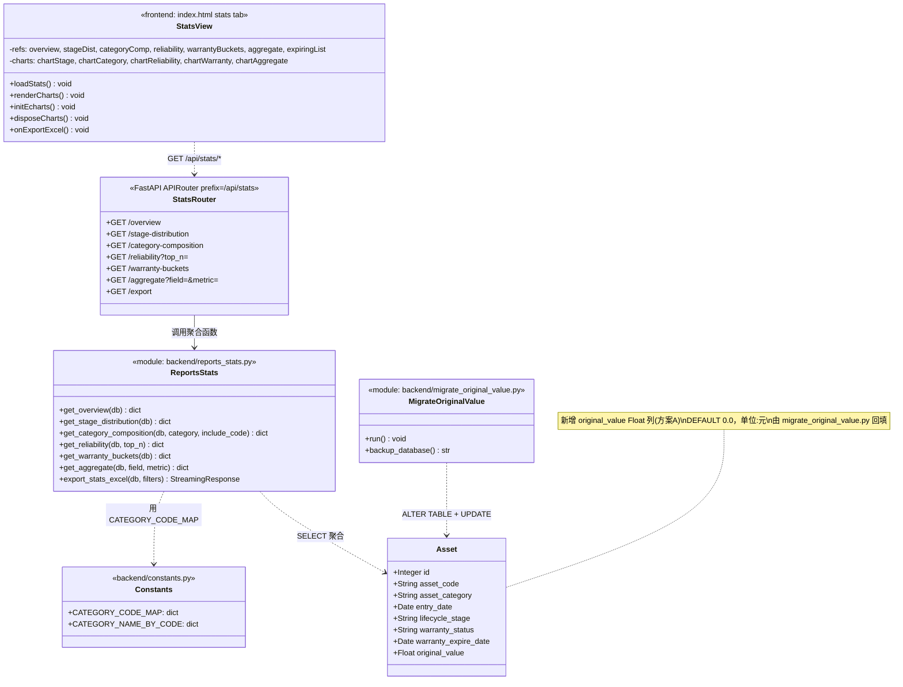
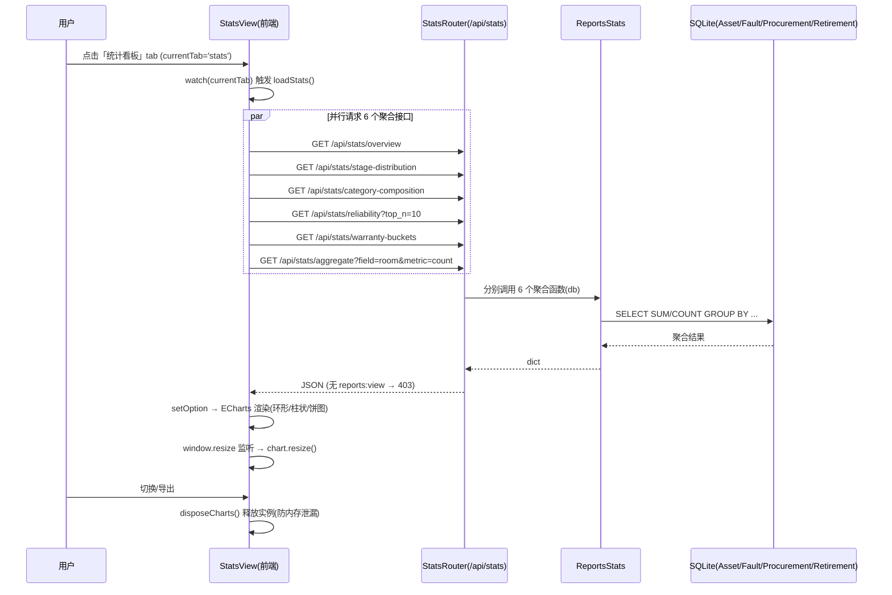
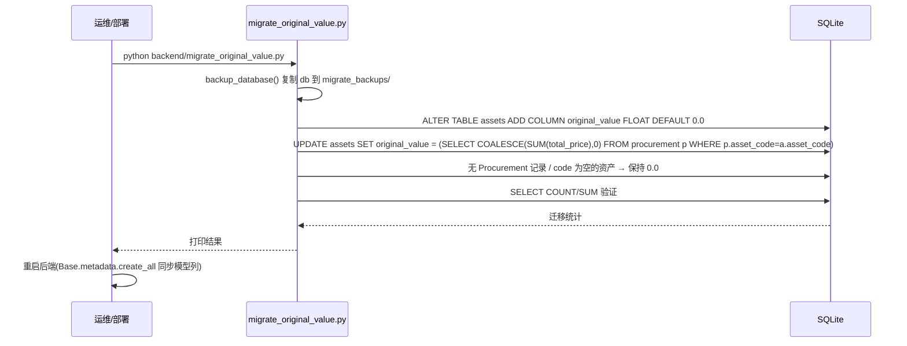
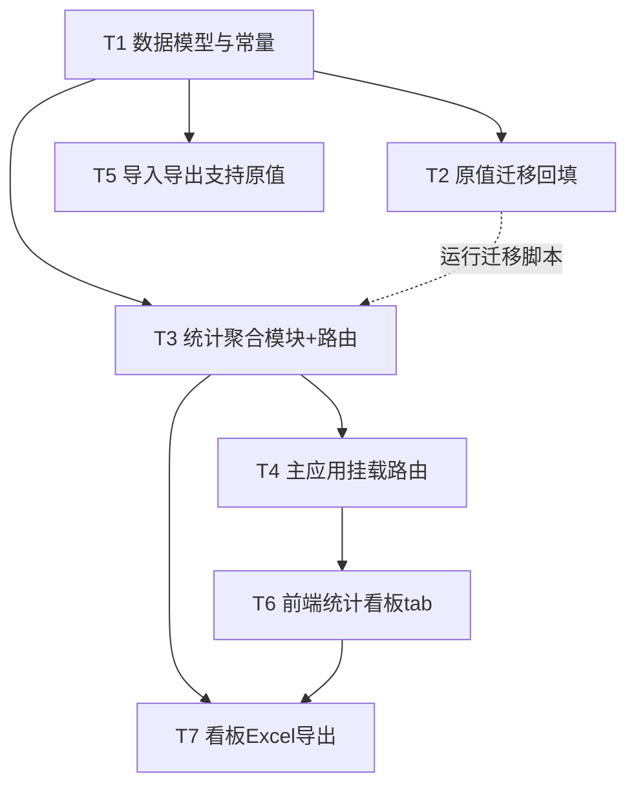

# 架构设计文档：报表统计模块（统计看板）

> 文档版本：v1.0（设计冻结稿）
> 作者：高见远（架构师）
> 日期：2026-07-07
> 关联 PRD：`PRD_报表统计模块.md`（S-01 ~ S-19）
> 关联系统：IT 资产全生命周期管理系统 v3.0.0

---

## 0. 设计依据（已读源码契约摘要）

| 契约项 | 结论（以源码为准） |
|--------|-------------------|
| 现有 `/api/stats` 路由 | **仅 1 条**：`GET /api/stats`（`dashboard:view`，返回 total_assets/by_stage/by_category/warranty_expired/...）。新增 `/api/stats/*` 子路径**无冲突**（FastAPI 按完整路径匹配）。 |
| `Asset` 主表 | 无 `original_value` 字段，需新增（方案 A）。 |
| `Procurement.total_price` | 存在 `Float`，用于按 `asset_code` 最佳努力回填原值。 |
| `ACTIVE_STAGES` | `["上架","运行","维修"]`，维保/故障口径统一以此界定“在保/运行”资产。 |
| 权限体系 | 报表类统一 `reports:view`，已授予全部 4 内置角色（admin/ops_manager/ops_engineer/viewer）。**不新增权限项**。 |
| 前端机制 | `currentTab` 控制 tab；`api(url, opts)` 自动带 `Bearer`；CDN = vue@3.5.13 + element-plus@2.9.1（unpkg）；**无图表库**。 |
| 现有报表聚合 | `import_export_reports.py` 内 `get_comprehensive_report` / `get_warranty_expiry_report` / `get_fault_analysis_report`，风格为「纯函数(db)->dict」。 |
| 导出能力 | `openpyxl 3.1.5` 已安装于 venv；`export_assets_excel` 为现成写法。 |
| 迁移脚本 | `backend/migrate.py` 用 `sqlite3` 直连 + `PRAGMA foreign_keys=OFF`；普通列新增用 `ALTER TABLE ... ADD COLUMN`（SQLite 支持非唯一列）。 |
| 分类码 | 实际映射：`服务器→SVR, 网络设备→NET, 存储设备→STO, 安全设备→SEC, UPS→UPS, 配电设备→PDU, 空调→AC, KVM→KVM, 其他→OTH`（main.py 移入逻辑内局部字典，需抽到 constants.py）。 |

---

## 1. 实现方案 + 框架选型

### 1.1 技术选型

| 层 | 选型 | 理由 |
|----|------|------|
| 后端框架 | **复用 FastAPI**（已存在），新增 `backend/reports_stats.py` 聚合模块 | 零新增框架，复用 `require_permission`、`get_db`、Pydantic 生态 |
| 聚合实现 | 纯函数 `func(db: Session) -> dict` + `APIRouter(prefix="/api/stats")` | 与现有 `import_export_reports.py` 风格一致，便于测试与复用 |
| 数据库 | SQLAlchemy + SQLite（直连，沿用 `engine`/`SessionLocal`） | 不引入 ORM 迁移工具，沿用项目既有方式 |
| 原值字段 | `Asset` 新增 `original_value Float` 列 + `migrate_original_value.py` 回填 | 已冻结决策 #1（方案 A） |
| 前端框架 | **复用现有 SPA**（Vue3 + Element Plus），新增「统计看板」tab | 不引入构建工具，单文件 SPA |
| 图表库 | **ECharts 5.5.0 via CDN**（`cdn.jsdelivr.net`） | 与现有 CDN 风格一致，无需打包 |
| 导出 | **Excel 优先**（openpyxl，复用现有样式写法） | 已冻结决策 #5 |

### 1.2 架构模式

- 后端：**函数式聚合层 + 路由层**。`reports_stats.py` 暴露纯聚合函数（返回 dict），由同文件内 `APIRouter` 挂载到 `/api/stats/*`；`main.py` 仅 `app.include_router(stats_router)`。
- 前端：**SPA tab 组件式**。在 `index.html` 内新增一个 `<template v-if="currentTab==='stats'">` 区块，配独立 `loadStats()` 数据加载与 `renderCharts()` 渲染逻辑；ECharts 实例按容器 id 管理生命周期。
- 权限：所有统计接口与看板 tab 复用 `require_permission("reports:view")`（后端装饰器）+ `v-if="hasPerm('reports:view')"`（前端显隐）。

### 1.3 关键口径（已冻结决策落实）

| 口径 | 定义 |
|------|------|
| **原值 original_value** | `Asset` 新增 `Float` 列，单位元；迁移脚本从 `Procurement` 按 `asset_code` `SUM(total_price)` 回填，无记录/code 空置 `0.0`。 |
| **MTBF（系统级，v1）** | `MTBF(天) = Σ(各资产运营天数) / 全部故障次数`；运营天数 = `min(退役下架日 uninstall_date, 今天) − entry_date`；仅计 `entry_date` 非空资产；分母为**全部 Fault 记录数**。 |
| **维保分桶** | 限定 `lifecycle_stage IN ACTIVE_STAGES`；`expired`(<今天) / `within_30`(≤+30d) / `within_60`(≤+60d) / `within_90`(≤+90d) / `over_90`(>+90d)。 |
| **自定义字段白名单** | `lifecycle_stage, asset_category, room, cabinet, department, ownership, brand, model, responsible_person, warranty_status, project_name`；`metric ∈ {count, original_value}`；非法字段 → 400。 |
| **分类展示** | 默认中文 `asset_category`；接口可选 `?include_code=true` 返回 `category_code`（来自 `CATEGORY_CODE_MAP`）。 |

---

## 2. 文件列表及相对路径

> 相对仓库根目录 `asset-lifecycle-manager/`。**新增 [N] / 修改 [M]**。

| 文件 | 状态 | 职责 |
|------|------|------|
| `backend/reports_stats.py` | **[N] 新增** | 6 个聚合函数 + `APIRouter`（/api/stats/*）+ Excel 导出函数 |
| `backend/database.py` | **[M] 修改** | `Asset` 类新增 `original_value Float` 列 |
| `backend/constants.py` | **[M] 修改** | 新增 `CATEGORY_CODE_MAP`（中文→码）与 `CATEGORY_NAME_BY_CODE`（码→中文） |
| `backend/main.py` | **[M] 修改** | `import` 并 `app.include_router(stats_router)`；从 `reports_stats` 引入路由 |
| `backend/import_export_reports.py` | **[M] 修改** | 资产导入/导出/模板支持 `original_value` 列（与台账同步） |
| `backend/migrate_original_value.py` | **[N] 新增** | ALTER TABLE + 按 asset_code 回填 `original_value` 的迁移脚本 |
| `frontend/index.html` | **[M] 修改** | 新增 ECharts CDN、stats 菜单项、stats tab 模板、KPI/图表/清单/导出逻辑、ECharts 生命周期管理 |

> 注：`deliverables/` 下已存在 `class-diagram.mermaid` / `sequence-diagram.mermaid`（审批流引擎），**本模块 Mermaid 图一律内联在本文件，不单独落盘**，避免覆盖。

---

## 3. 数据结构与接口（类图 Mermaid 内联）



### 3.1 `Asset` 模型变更（database.py）

在 `Asset` 类「保留字段」区（`remarks` 之后、新增字段区之前）新增：

```python
original_value = Column(Float, default=0.0, comment="资产原值(元)，方案A新增，迁移脚本回填")
```

### 3.2 `constants.py` 新增

```python
# 分类中文 → 分类码（与 main.py 移入逻辑保持一致）
CATEGORY_CODE_MAP = {
    "服务器": "SVR", "网络设备": "NET", "存储设备": "STO", "安全设备": "SEC",
    "UPS": "UPS", "配电设备": "PDU", "空调": "AC", "KVM": "KVM", "其他": "OTH",
}
CATEGORY_NAME_BY_CODE = {v: k for k, v in CATEGORY_CODE_MAP.items()}

# 自定义字段聚合白名单（低基数字段）
AGGREGATE_FIELD_WHITELIST = [
    "lifecycle_stage", "asset_category", "room", "cabinet", "department",
    "ownership", "brand", "model", "responsible_person", "warranty_status", "project_name",
]
```

### 3.3 `reports_stats.py` 聚合函数与路由（接口契约）

| 函数 | 路由 | 入参 | 返回结构（dict 关键字段） | 权限 |
|------|------|------|--------------------------|------|
| `get_overview(db)` | `GET /api/stats/overview` | — | `total_assets, total_original_value, total_faults, warranty_expiring_soon`(30天内) | reports:view |
| `get_stage_distribution(db)` | `GET /api/stats/stage-distribution` | — | `stages:[{stage,count,ratio}]`（7 阶段全覆盖，ratio=count/total） | reports:view |
| `get_category_composition(db, category=None, include_code=False)` | `GET /api/stats/category-composition` | `?category=&include_code=` | `by_category:[{category,count,original_value,category_code?}], by_model:[{model,category,count,original_value}]` | reports:view |
| `get_reliability(db, top_n=10)` | `GET /api/stats/reliability` | `?top_n=` | `total_faults, mtbf_days, by_stage_failure_rate:[{stage,asset_count,fault_count,rate}], top_fault_assets:[{asset_code,fault_count}]` | reports:view |
| `get_warranty_buckets(db)` | `GET /api/stats/warranty-buckets` | — | `buckets:{expired,within_30,within_60,within_90,over_90}, expiring_list:[{asset_code,category,days_left,warranty_expire_date,...}]` | reports:view |
| `get_aggregate(db, field, metric="count")` | `GET /api/stats/aggregate` | `?field=&metric=` | `field, metric, rows:[{value,count,original_value}]`（按 count 降序）；非法 field→`HTTPException(400)` | reports:view |
| `export_stats_excel(db, filters)` | `GET /api/stats/export` | （可选筛选参数透传） | `StreamingResponse`（.xlsx，含 KPI + 各维度汇总） | reports:view |

**MTBF 计算（伪码）：**
```python
today = date.today()
total_operational_days = 0
for a in db.query(Asset).filter(Asset.entry_date != None):
    end = a.entry_date  # 占位
    ret = db.query(Retirement).filter(Retirement.asset_code==a.asset_code).first()
    end_date = ret.uninstall_date if (ret and ret.uninstall_date) else today
    total_operational_days += (end_date - a.entry_date).days
total_faults = db.query(Fault).count()
mtbf_days = round(total_operational_days / total_faults, 1) if total_faults else 0
```

**各阶段故障率（伪码）：**
```python
for stage in LIFECYCLE_STAGES:
    asset_count = db.query(Asset).filter(Asset.lifecycle_stage==stage).count()
    codes = [a.asset_code for a in db.query(Asset).filter(Asset.lifecycle_stage==stage)]
    fault_count = db.query(Fault).filter(Fault.asset_code.in_(codes)).count() if codes else 0
    rate = round(fault_count / asset_count, 4) if asset_count else 0
```

### 3.4 迁移脚本 `migrate_original_value.py`（核心逻辑）

```python
# 复用 migrate.py 的 backup_database 思路
def run():
    backup_database()
    conn = sqlite3.connect(DB_PATH)
    conn.execute("PRAGMA foreign_keys=OFF")
    # 1. 新增列（非唯一列，ALTER 即可）
    conn.execute("ALTER TABLE assets ADD COLUMN original_value FLOAT DEFAULT 0.0")
    # 2. 按 asset_code 最佳努力回填：SUM(total_price)
    conn.execute("""
        UPDATE assets SET original_value = COALESCE(
            (SELECT SUM(total_price) FROM procurement p WHERE p.asset_code = assets.asset_code), 0.0)
        WHERE asset_code IN (SELECT DISTINCT asset_code FROM procurement WHERE asset_code IS NOT NULL)
    """)
    # 3. 其余资产保持 0.0（DEFAULT 已覆盖）
    conn.commit()
    conn.execute("PRAGMA foreign_keys=ON")
    # 4. 验证 COUNT/SUM
    conn.close()
```

### 3.5 前端 `StatsView` 结构（index.html 内）

- 顶部 KPI 卡片区（4 张）：总资产 / 总原值 / 故障总数 / 30天内即将到期
- 筛选条：`阶段多选`、`时间范围`（P1，S-11，依赖 T6 基础结构，联动刷新）
- 图表网格（5 卡片）：阶段环形图、分类/型号构成+原值、可靠性故障（等级/根因/TopN 条形）、维保分桶柱状+清单表、自定义字段聚合（字段选择+指标选择）
- 维保即将到期清单表（S-15）：分页/排序，显示剩余天数与到期日
- 导出按钮（S-13 Excel / S-14 PDF 占位）

---

## 4. 程序调用流程（时序图 Mermaid 内联）

### 4.1 看板加载与渲染



### 4.2 迁移脚本执行顺序



---

## 5. 任务列表（有序 / 含依赖 / 按实现顺序）

> 粒度：工程师可批量执行。覆盖 PRD **P0 (S-01~S-10)** 与 **P1 中导出/筛选可落地部分 (S-11/S-13/S-15)**。P2 (S-12/S-16~S-19) 不在本次范围。

| 任务 | 名称 | 修改文件 | 依赖 | 优先级 | 覆盖 PRD |
|------|------|----------|------|--------|----------|
| **T1** | 数据模型与常量底座 | `backend/database.py`、`backend/constants.py` | 无 | P0 | S-01/S-03/S-06 基础 |
| **T2** | 原值迁移与回填脚本 | `backend/migrate_original_value.py`（新增） | T1 | P0 | 方案A 落库 |
| **T3** | 统计聚合模块 + 路由 | `backend/reports_stats.py`（新增） | T1 | P0 | S-01/S-02/S-03/S-04/S-05/S-06/S-07 |
| **T4** | 主应用挂载统计路由 | `backend/main.py` | T3 | P0 | S-01/S-10 |
| **T5** | 台账导入导出支持原值 | `backend/import_export_reports.py` | T1 | P0 | 原值全链路同步 |
| **T6** | 前端统计看板 tab | `frontend/index.html` | T4 | P0/P1 | S-08/S-09/S-11/S-15 |
| **T7** | 看板 Excel 导出 | `backend/reports_stats.py`(export 函数) + `frontend/index.html`(导出按钮) | T3, T6 | P1 | S-13 |

### 5.1 任务细化

**T1 — 数据模型与常量底座**（无依赖）
- `database.py`：`Asset` 类新增 `original_value = Column(Float, default=0.0, comment="资产原值(元)")`（放在 `remarks` 之后）。
- `constants.py`：新增 `CATEGORY_CODE_MAP`、`CATEGORY_NAME_BY_CODE`、`AGGREGATE_FIELD_WHITELIST`（见 §3.2）。

**T2 — 原值迁移与回填脚本**（依赖 T1）
- 新增 `backend/migrate_original_value.py`：复用 `migrate.py` 的 `backup_database` 模式；`sqlite3` 直连；`PRAGMA foreign_keys=OFF`；`ALTER TABLE assets ADD COLUMN original_value FLOAT DEFAULT 0.0`；`UPDATE ... (SELECT SUM(total_price) FROM procurement ...)`；验证后提交；`__main__` 入口可直接 `python backend/migrate_original_value.py` 运行。
- 运行后重启后端使 ORM 模型与库表列对齐。

**T3 — 统计聚合模块 + 路由**（依赖 T1，字段已可用）
- 新增 `backend/reports_stats.py`，实现 §3.3 的 6 个聚合纯函数 + 1 个 `APIRouter(prefix="/api/stats")`，每个路由用 `Depends(require_permission("reports:view"))` 与 `Depends(get_db)`。
- 聚合均基于 `Asset/Fault/Procurement/Retirement` 直接 `func.count/func.sum/group_by`，风格对齐 `import_export_reports.py`。
- `aggregate` 接口校验 `field in AGGREGATE_FIELD_WHITELIST`，否则 `HTTPException(400, "非法聚合字段")`。

**T4 — 主应用挂载统计路由**（依赖 T3）
- `main.py`：`from reports_stats import stats_router`，并在合适位置 `app.include_router(stats_router)`。
- 不改动既有 `GET /api/stats`（dashboard:view），二者路径无冲突。

**T5 — 台账导入导出支持原值**（依赖 T1）
- `import_export_reports.py`：
  - `import_assets_excel`：在 `expected_cols` 增加 `"原值(元)": "original_value"`（数值解析为 float）。
  - `export_assets_excel`：在 `headers_list` 与取值 `values` 中增加「原值(元)」列（格式化 `¥{val:.2f}` 或空）。
  - `download_import_template`：在 `assets` 模板表头与示例增加「原值(元)」。
- （如移入自动建资产需带原值，可在 `main.py` 的 `create_asset_inbound` 同步，但本期移入不强制填原值，置 0.0 即可。）

**T6 — 前端统计看板 tab**（依赖 T4 接口契约）
- `frontend/index.html`：
  1. `<head>` 增加 `<script src="https://cdn.jsdelivr.net/npm/echarts@5.5.0/dist/echarts.min.js"></script>`。
  2. 侧边栏「报表统计」分组（line ~181，reports 之后）新增 `<div class="menu-item" v-if="hasPerm('reports:view')" :class="{active: currentTab==='stats'}" @click="currentTab='stats'">📊 统计看板</div>`。
  3. 新增 `<template v-if="currentTab==='stats'">`：KPI 卡片（4 张）、筛选条（阶段多选 + 时间范围，S-11 基础）、5 个图表卡片容器（各带 `id`）、维保即将到期清单 `el-table`（S-15）、导出按钮（S-13）。
  4. JS：新增 `reactive` refs（`overview/stageDist/categoryComp/reliability/warrantyBuckets/aggregate/expiringList`）、`loadStats()`（并行 `await Promise.all([...api('/api/stats/*')])`）、`renderCharts()`（`echarts.init` 每个容器 + `setOption`）、`disposeCharts()`；`watch(currentTab)`：`val==='stats'` 时 `loadStats()`，`val!=='stats'` 时 `disposeCharts()`；`onMounted` 后 `window.addEventListener('resize', ... chart.resize())`。
  5. 图表类型：阶段=环形图(doughnut)；分类/型号=柱状+饼图+原值；可靠性=故障等级/根因饼图 + TopN 条形；维保=分桶柱状 + 清单；自定义=动态柱状/饼图（字段/指标下拉切换重新请求 `aggregate`）。

**T7 — 看板 Excel 导出**（依赖 T3、T6）
- 后端 `reports_stats.py` 新增 `export_stats_excel(db, filters)` 复用 openpyxl 样式（对照 `export_assets_excel`），输出多 sheet：KPI 汇总、阶段分布、分类构成、可靠性、维保分桶+清单；新增 `GET /api/stats/export` 路由（reports:view）。
- 前端 `index.html` 导出按钮：用 `fetch(API+'/api/stats/export'+params, {headers:{Authorization}})` 下载 `.xlsx`（复用 `doExport` 的 blob 下载写法）。PDF（S-14）本期仅留按钮占位，后续用浏览器打印实现。

---

## 6. 依赖包列表

### 6.1 后端

| 包 | 版本 | 状态 | 用途 |
|----|------|------|------|
| `fastapi` | 已装 | 复用 | Web 框架 |
| `sqlalchemy` | 已装 | 复用 | ORM |
| `openpyxl` | **3.1.5（已装，venv 已验证）** | 复用 | Excel 导出（T5/T7） |
| `pydantic` | 已装 | 复用 | 校验 |
| `sqlite3` | Python 标准库 | 复用 | 迁移脚本 |
| `echarts` | — | **不进依赖**（前端 CDN） | 图表渲染 |

> 后端**无需新增第三方依赖**。openpyxl 已确认在 venv 中（`import openpyxl` → 3.1.5）。

### 6.2 前端

| 资源 | 引入方式 | 说明 |
|------|----------|------|
| `echarts@5.5.0` | `<script src="https://cdn.jsdelivr.net/npm/echarts@5.5.0/dist/echarts.min.js"></script>` | CDN，无需打包 |
| Vue3 / Element Plus | 已存在（unpkg） | 复用 |

---

## 7. 共享知识（跨文件约定）

1. **接口前缀**：所有新增统计接口统一前缀 `/api/stats/*`；既有 `GET /api/stats`（dashboard:view）保留不动，二者路径不冲突。
2. **权限装饰器**：后端路由统一 `Depends(require_permission("reports:view"))`；前端菜单/按钮统一 `v-if="hasPerm('reports:view')"`。**不新增权限项**。
3. **统一响应结构**：各聚合接口返回纯 `dict`（与现有 `/api/reports/*` 一致），字段见 §3.3；无全局 envelope。错误以 `HTTPException` 抛出。
4. **错误码约定**：
   - `400`：`aggregate` 非法 `field` / 非法 `metric`；
   - `403`：无 `reports:view`；
   - `404`：资产不存在等（沿用既有）。
5. **原值口径**：单位**元**，`Float`；`0.0` 表示未知/未回填；统计 `SUM` 时直接 `func.sum(Asset.original_value)`。
6. **MTBF 口径**：系统级，分母=全部 Fault 记录；分子=各 `entry_date` 非空资产的 `min(uninstall_date, today) − entry_date` 之和（见 §3.3）。
7. **维保分桶口径**：严格 `lifecycle_stage IN ACTIVE_STAGES`；5 桶互斥且覆盖全部在保资产（见 §1.3）。
8. **分类码**：展示默认中文；`?include_code=true` 返回 `category_code`，取值来自 `constants.CATEGORY_CODE_MAP`。
9. **ECharts 实例生命周期**（前端强约束）：
   - 进入 tab（`currentTab==='stats'`）：`echarts.init(dom)` → `setOption`；
   - 窗口 resize：`chart.resize()`；
   - 离开 tab：`disposeCharts()` 释放所有实例，**防止内存泄漏与重复 init 报错**。
10. **迁移约定**：`migrate_original_value.py` 运行前自动 `backup_database()`；运行后**必须重启后端**使 ORM 模型与新增列对齐。

---

## 8. 待明确事项

**无。** 所有 PRD §5 待确认项已由「已冻结决策」主理人拍板 + 用户范围确认覆盖：

1. 原值 → 方案 A（Asset 加列 + 迁移回填）✅
2. MTBF → 系统级，分母全部故障，仅计 entry_date 非空 ✅
3. 自定义字段白名单 → 11 字段，支持 count/original_value ✅
4. 权限 → 复用 reports:view，不新增 ✅
5. 导出 → Excel 优先（PDF 占位）✅
6. tab 关系 → 与 reports 并行共存，不取代 ✅
7. 分类口径 → 中文展示，可选返回码（CATEGORY_CODE_MAP 集中定义）✅
8. 维保分桶 → 限定 ACTIVE_STAGES，5 桶互斥 ✅

---

## 附录：任务依赖图（Mermaid）



> 说明：T5 与 T3/T4 无强依赖，可与 T3 并行开发（均依赖 T1）；T7 依赖 T3（导出函数）与 T6（导出按钮 UI）。
