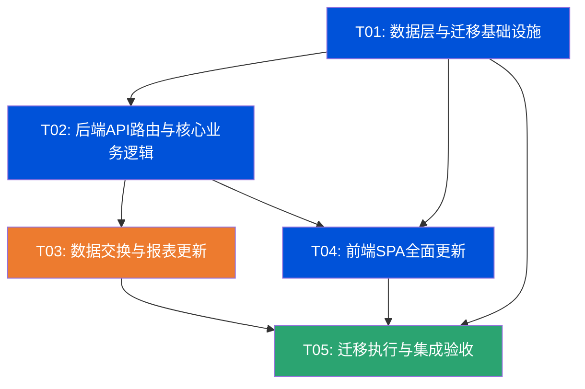

# IT资产全生命周期管理系统 v2.3.0 → v3.0.0 增量架构设计

> **版本**: incremental-design-v1.0  
> **日期**: 2026-07-01  
> **架构师**: 高见远  
> **基线版本**: v2.3.0 (FastAPI + Vue3 + SQLite 单文件SPA)  
> **目标版本**: v3.0.0  

---

## 一、实现方案

### 1.1 核心技术挑战

| # | 挑战 | 难度 | 解决策略 |
|---|------|------|---------|
| C1 | SQLite不支持DROP COLUMN | 高 | 表重建策略：CREATE新表→INSERT数据→DROP旧表→RENAME新表 |
| C2 | Asset主表+23字段/-2字段的大规模重构 | 高 | 一次性重建assets表，避免多次ALTER TABLE导致碎片化 |
| C3 | location→room/cabinet/u_position的正则解析迁移 | 中 | 编写专用迁移脚本，处理多种旧格式（详见§2.6） |
| C4 | P2→P2-严重枚举值变更需跨4文件同步 | 中 | constants.py→schemas.py→approval.py→main.py四点联动 |
| C5 | 移入验收合格→自动创建Asset的触发逻辑 | 中 | 在update_asset_inbound端点中检测inspection_result变更时触发 |
| C6 | 移出报废→自动创建Retirement+审批流的级联触发 | 中 | 在create_asset_outbound端点中检测outbound_type="报废"时触发 |
| C7 | Procurement移除asset_code外键后的数据一致性 | 中 | asset_code改为nullable，采购记录可独立存在 |
| C8 | 校验仪表盘13项→10项重构 | 低 | 删除3项+修改location相关2项，保留8项不变 |
| C9 | 前端单文件SPA(~4000行)的大规模表单修改 | 高 | 模块化修改，每个表单区域独立更新 |

### 1.2 迁移策略选择

| 操作类型 | SQLite支持 | 采用策略 | 适用表 |
|----------|-----------|---------|--------|
| ADD COLUMN | ✅ 支持 | ALTER TABLE ADD COLUMN | faults, warranties |
| DROP COLUMN | ❌ 不支持(版本<3.35) | 表重建 | assets, changes, procurement |
| CREATE TABLE | ✅ 支持 | CREATE TABLE | asset_inbound, asset_outbound |
| 数据转换 | — | 迁移脚本 | assets(location解析), faults(P2→P2-严重) |

**迁移执行顺序**：
1. 备份 asset_lifecycle.db → asset_lifecycle.db.bak
2. 创建新表 asset_inbound / asset_outbound
3. 重建 assets 表（+23字段, -location/-ip_address, +room/cabinet/u_position）
4. 重建 procurement 表（移除asset_code FK约束, +新字段）
5. 重建 changes 表（+4字段, -6字段）
6. ALTER TABLE faults ADD COLUMN fault_no / repair_cost
7. ALTER TABLE warranties ADD COLUMN warranty_no / warranty_type / warranty_supplier
8. 执行数据迁移脚本（location解析, P2→P2-严重, procurement外键解绑）
9. 验证数据完整性（行数对比, 外键完整性检查）

### 1.3 架构模式

保持现有 **单体FastAPI + 单文件SPA** 架构不变。增量变更不引入新架构模式，仅在现有文件内扩展：
- 后端：6个Python文件内修改（database/schemas/constants/auth/approval/validation/main/import_export_reports）
- 前端：1个index.html文件内修改
- 新增：1个migrate.py迁移脚本

---

## 二、文件列表及修改类型

### 2.1 后端文件修改清单

| 文件 | 修改类型 | 修改概要 | 涉及函数/类 |
|------|---------|---------|------------|
| database.py | **重大修改** | Asset模型+23/-2字段; Procurement重构; Change+4/-6字段; Fault+2字段; Warranty+3字段; 新增AssetInbound/AssetOutbound模型 | Asset, Procurement, Change, Fault, Warranty, Retirement(枚举注释), AssetInbound(新), AssetOutbound(新) |
| schemas.py | **重大修改** | 所有Asset Pydantic类重构; Procurement类重构; Change类+4/-6字段; Fault类+2字段; Warranty类+3字段; 新增Inbound/Outbound Pydantic类; 更新枚举校验列表; 更新DropdownConfig | AssetBase/Create/Update/Response, ProcurementBase/Create/Update/Response, ChangeBase/Create/Update/Response, FaultBase/Create/Update/Response, WarrantyBase/Create/Update/Response, RetirementBase/Create/Response, AssetInbound*(新), AssetOutbound*(新), DropdownConfig, _VALID_*枚举 |
| constants.py | **重大修改** | FAULT_LEVELS P2→P2-严重; CHANGE_TYPES移除"IP变更"; 新增WARRANTY_TYPES/INBOUND_TYPES/OUTBOUND_TYPES/PROCUREMENT_APPROVAL_STATUSES; 新增DISPOSAL_METHODS枚举; 更新RETIRE_CATEGORIES; 新增2种审批类型(inbound_approval/outbound_approval); 更新APPROVAL_CHAIN_CONFIG | FAULT_LEVELS, CHANGE_TYPES, WARRANTY_TYPES(新), INBOUND_TYPES(新), OUTBOUND_TYPES(新), PROCUREMENT_APPROVAL_STATUSES(新), DISPOSAL_METHODS(新), RETIRE_CATEGORIES, APPROVAL_TYPE_INBOUND(新), APPROVAL_TYPE_OUTBOUND(新), APPROVAL_TYPES, APPROVAL_TYPE_NAMES, APPROVAL_CHAIN_CONFIG |
| auth.py | **修改** | PERMISSION_DEFINITIONS新增8项(inbound/outbound); PERMISSION_GROUPS新增2组; DEFAULT_ROLES权限列表更新 | PERMISSION_DEFINITIONS, PERMISSION_GROUPS, DEFAULT_ROLES(ops_manager/ops_engineer/viewer) |
| main.py | **重大修改** | 新增8个移入/移出CRUD端点; 更新assets端点(新字段搜索/筛选); 更新procurement端点(移除asset_code必填校验); 更新changes端点; 更新faults端点(P2→P2-严重); 更新warranties端点; 更新retirements端点(新枚举); 更新stats端点(P1/P2统计卡片); 更新distinct-values端点; 更新dropdown-config端点 | list_assets, create_asset, update_asset, list_procurements, create_procurement, list_changes, create_change, list_faults, create_fault(P2-严重), get_stats, get_distinct_values, get_dropdown_config, +8个新端点 |
| approval.py | **修改** | P2判断改为"P2-严重"; 新增outbound_retirement_auto_submit函数; auto_submit_fault_approval中P2→P2-严重 | auto_submit_fault_approval(P2→P2-严重), outbound_retirement_auto_submit(新) |
| validation.py | **重大修改** | 13项→10项校验; 位置相关检查改为room/cabinet/u_position; 删除P1/P2未恢复/报废无记录/孤儿记录 | run_all_checks(重构10项), check_stage_gate(更新位置相关门禁) |
| import_export_reports.py | **重大修改** | 更新所有6种导入导出模板和列映射; 新增inbound/outbound导入导出; 更新VALID_OPTIONS; 更新报表字段 | import_assets_excel, import_subtable_excel, export_assets_excel, export_subtable_excel, download_import_template, get_comprehensive_report, get_warranty_expiry_report, VALID_OPTIONS |

### 2.2 新增文件

| 文件 | 类型 | 说明 |
|------|------|------|
| backend/migrate.py | **新增** | 数据迁移脚本：location正则解析、P2→P2-严重更新、procurement外键解绑、表重建执行 |

### 2.3 前端文件修改

| 文件 | 修改类型 | 修改概要 |
|------|---------|---------|
| frontend/index.html | **重大修改** | Asset表单+23/-2字段(location→3字段, 移除IP); Procurement表单重构; Change表单+4/-6字段; Fault表单+2字段; Warranty表单+3字段; Retirement表单(新枚举); 新增Inbound/Outbound页面; 校验仪表盘13→10+统计卡片; 下拉选项更新; 菜单+2项(移入/移出); RBAC权限检查+8项 |

### 2.4 辅助文件

| 文件 | 修改类型 | 修改概要 |
|------|---------|---------|
| start.py | **微调** | 版本号更新 v2.3.0 → v3.0.0 |

---

## 三、数据结构变更

### 3.1 Asset主表 — 表重建（+23字段 / -2字段）

**旧字段移除**：
| 字段 | 类型 | 说明 |
|------|------|------|
| location | String(30) | →拆分为room+cabinet+u_position |
| ip_address | String(50) | →直接移除 |

**新字段增加（23项）**：
| # | 字段 | 类型 | 约束 | 说明 |
|---|------|------|------|------|
| 1 | asset_category_2 | String(50) | nullable | 二级分类(自由文本,非枚举) |
| 2 | room | String(30) | nullable | 机房位置(如"5-4机房") |
| 3 | cabinet | String(20) | nullable | 机柜编号(如"R-03") |
| 4 | u_position | String(20) | nullable | U位(如"15-16U") |
| 5 | owner_company | String(50) | nullable | 归属公司 |
| 6 | department | String(50) | nullable | 所属部门(与owner_company独立) |
| 7 | asset_name | String(100) | nullable | 资产名称 |
| 8 | asset_status | String(20) | nullable | 资产状态 |
| 9 | purchase_date | Date | nullable | 采购日期 |
| 10 | acceptance_date | Date | nullable | 验收日期 |
| 11 | deployment_date | Date | nullable | 部署/上线日期 |
| 12 | original_value | Float | nullable | 原值(元) |
| 13 | current_value | Float | nullable | 当前估值(元) |
| 14 | depreciation_years | Integer | nullable | 折旧年限(年) |
| 15 | supplier | String(100) | nullable | 供应商 |
| 16 | maintenance_period | Integer | nullable | 维保期限(月) |
| 17 | last_inspection_date | Date | nullable | 上次巡检日期 |
| 18 | next_inspection_date | Date | nullable | 下次巡检日期 |
| 19 | config_info | Text | nullable | 配置信息(CPU/内存/磁盘等) |
| 20 | rack_unit | Integer | nullable | 占用U数 |
| 21 | power_consumption | Float | nullable | 功耗(W) |
| 22 | network_zone | String(20) | nullable | 网络区域 |
| 23 | critical_level | String(20) | nullable | 重要等级 |

**完整DDL — assets表重建**：

```sql
-- Step 1: 创建新表
CREATE TABLE assets_new (
    id              INTEGER PRIMARY KEY AUTOINCREMENT,
    asset_code      VARCHAR(30) UNIQUE NOT NULL,       -- 资产编号
    asset_category  VARCHAR(20) NOT NULL,              -- 资产分类(一级)
    asset_category_2 VARCHAR(50),                      -- 二级分类(自由文本)
    asset_name      VARCHAR(100),                      -- 资产名称
    brand           VARCHAR(50),                       -- 品牌
    model           VARCHAR(100),                      -- 型号
    sn              VARCHAR(50) UNIQUE,                -- SN序列号
    room            VARCHAR(30),                       -- 机房位置
    cabinet         VARCHAR(20),                       -- 机柜编号
    u_position      VARCHAR(20),                       -- U位
    lifecycle_stage VARCHAR(20) NOT NULL DEFAULT '规划', -- 生命周期阶段
    asset_status    VARCHAR(20),                       -- 资产状态
    entry_date      DATE,                              -- 入场日期
    purchase_date   DATE,                              -- 采购日期
    acceptance_date DATE,                              -- 验收日期
    deployment_date DATE,                              -- 部署上线日期
    responsible_person VARCHAR(30),                    -- 责任人
    owner_company   VARCHAR(50),                       -- 归属公司
    department      VARCHAR(50),                       -- 所属部门
    warranty_status VARCHAR(20),                       -- 维保状态
    warranty_expire_date DATE,                         -- 维保到期日
    maintenance_period INTEGER,                        -- 维保期限(月)
    supplier        VARCHAR(100),                      -- 供应商
    original_value  FLOAT,                             -- 原值
    current_value   FLOAT,                             -- 当前估值
    depreciation_years INTEGER,                        -- 折旧年限
    config_info     TEXT,                              -- 配置信息
    rack_unit       INTEGER,                           -- 占用U数
    power_consumption FLOAT,                           -- 功耗(W)
    network_zone    VARCHAR(20),                       -- 网络区域
    critical_level  VARCHAR(20),                       -- 重要等级
    last_inspection_date DATE,                         -- 上次巡检日期
    next_inspection_date DATE,                         -- 下次巡检日期
    last_updated    DATETIME DEFAULT CURRENT_TIMESTAMP,
    remarks         TEXT
);

-- Step 2: 迁移数据(含location正则解析)
-- 见 migrate.py 中的 migrate_assets_data() 函数
-- location格式如 "5-4机房-R-03-15-16U" 解析为 room="5-4机房", cabinet="R-03", u_position="15-16U"

INSERT INTO assets_new (
    id, asset_code, asset_category, brand, model, sn,
    room, cabinet, u_position,
    lifecycle_stage, entry_date, responsible_person,
    warranty_status, warranty_expire_date, last_updated, remarks
)
SELECT id, asset_code, asset_category, brand, model, sn,
    -- location解析由迁移脚本处理,以下为简化示例
    '', '', location,  -- 临时:u_position暂存旧location值,后续由脚本解析
    lifecycle_stage, entry_date, responsible_person,
    warranty_status, warranty_expire_date, last_updated, remarks
FROM assets;

-- Step 3: 删除旧表 + 重命名
DROP TABLE assets;
ALTER TABLE assets_new RENAME TO assets;
```

> ⚠️ **注意**: 实际location解析在migrate.py中执行,而非SQL内。上述DDL仅为结构示意。

### 3.2 Procurement表 — 表重建（移除asset_code外键 + 字段调整）

```sql
CREATE TABLE procurement_new (
    id               INTEGER PRIMARY KEY AUTOINCREMENT,
    procurement_no   VARCHAR(50) UNIQUE,              -- 采购单号(主标识)
    asset_code       VARCHAR(30),                     -- 关联资产编号(nullable,验收后回填)
    asset_category   VARCHAR(20),                     -- 采购资产分类
    asset_category_2 VARCHAR(50),                     -- 二级分类
    brand            VARCHAR(50),                     -- 品牌
    model            VARCHAR(100),                    -- 型号
    quantity         INTEGER DEFAULT 1,               -- 数量
    unit_price       FLOAT,                           -- 单价
    total_price      FLOAT,                           -- 总价(自动计算)
    contract_no      VARCHAR(50),                     -- 合同号
    supplier         VARCHAR(100),                    -- 供应商
    approval_status  VARCHAR(20) DEFAULT '审批中',    -- 审批状态
    arrival_date     DATE,                            -- 到货日期
    inspector        VARCHAR(30),                     -- 验收人
    inspection_result VARCHAR(20),                    -- 验收结果
    install_date     DATE,                            -- 上架日期
    remarks          TEXT
);

INSERT INTO procurement_new (
    id, procurement_no, asset_code, quantity, unit_price, total_price,
    contract_no, supplier, arrival_date, inspector, inspection_result,
    install_date, remarks
)
SELECT id, purchase_order, asset_code, quantity, unit_price, total_price,
    contract_no, supplier, arrival_date, inspector, inspection_result,
    install_date, remarks
FROM procurement;

-- procurement_no从原purchase_order字段迁移,空值则生成默认编号
DROP TABLE procurement;
ALTER TABLE procurement_new RENAME TO procurement;
```

### 3.3 Change表 — 表重建（+4字段 / -6字段）

**移除字段**：old_location, new_location, old_ip, new_ip, old_responsible, new_responsible  
**新增字段**：work_order_no, change_content, old_config, new_config

```sql
CREATE TABLE changes_new (
    id              INTEGER PRIMARY KEY AUTOINCREMENT,
    asset_code      VARCHAR(30) NOT NULL,             -- 关联资产编号
    change_type     VARCHAR(20) NOT NULL,             -- 变更类型
    work_order_no   VARCHAR(50),                      -- 施工单号(新增)
    change_content  TEXT,                              -- 变更内容(新增)
    old_config      TEXT,                              -- 原配置(新增)
    new_config      TEXT,                              -- 新配置(新增)
    change_reason   TEXT,                              -- 变更原因
    approver        VARCHAR(30),                      -- 审批人
    executor        VARCHAR(30),                      -- 执行人
    execute_date    DATE,                              -- 执行日期
    completion_status VARCHAR(20) DEFAULT '进行中',   -- 完成状态
    remarks         TEXT
);

INSERT INTO changes_new (
    id, asset_code, change_type, change_reason, approver,
    executor, execute_date, completion_status, remarks
)
SELECT id, asset_code, change_type, change_reason, approver,
    executor, execute_date, completion_status, remarks
FROM changes;

DROP TABLE changes;
ALTER TABLE changes_new RENAME TO changes;
```

### 3.4 Fault表 — ALTER TABLE ADD COLUMN（+2字段）

```sql
ALTER TABLE faults ADD COLUMN fault_no VARCHAR(50);      -- 故障单号
ALTER TABLE faults ADD COLUMN repair_cost FLOAT;          -- 维修费用
```

### 3.5 Warranty表 — ALTER TABLE ADD COLUMN（+3字段）

```sql
ALTER TABLE warranties ADD COLUMN warranty_no VARCHAR(50);       -- 维保单号
ALTER TABLE warranties ADD COLUMN warranty_type VARCHAR(20);     -- 维保类型
ALTER TABLE warranties ADD COLUMN warranty_supplier VARCHAR(100); -- 维保供应商
```

### 3.6 Retirement表 — 无DDL变更（仅枚举值变更）

retire_category和disposal_method字段类型不变(String),仅枚举可选值变更,通过constants.py和前端下拉选项控制。

### 3.7 AssetInbound新表 — CREATE TABLE（22字段）

```sql
CREATE TABLE asset_inbound (
    id               INTEGER PRIMARY KEY AUTOINCREMENT,
    inbound_no       VARCHAR(50) UNIQUE NOT NULL,     -- 移入单号 IB-YYYYMMDD-SEQ
    asset_code       VARCHAR(30),                     -- 关联资产编号(验收合格后回填)
    procurement_id   INTEGER,                         -- 关联采购记录ID(nullable)
    inbound_type     VARCHAR(20) NOT NULL,            -- 移入类型(新购/调拨/归还/其他)
    asset_category   VARCHAR(20) NOT NULL,            -- 资产分类(一级)
    asset_category_2 VARCHAR(50),                     -- 二级分类
    asset_name       VARCHAR(100),                    -- 资产名称
    brand            VARCHAR(50),                     -- 品牌
    model            VARCHAR(100),                    -- 型号
    sn               VARCHAR(50),                     -- SN序列号
    quantity         INTEGER DEFAULT 1,               -- 数量
    inbound_date     DATE,                            -- 移入日期
    source_location  VARCHAR(100),                    -- 来源位置
    room             VARCHAR(30),                     -- 目标机房
    cabinet          VARCHAR(20),                     -- 目标机柜
    u_position       VARCHAR(20),                     -- 目标U位
    inspector        VARCHAR(30),                     -- 验收人
    inspection_result VARCHAR(20),                    -- 验收结果
    inspection_date  DATE,                            -- 验收日期
    responsible_person VARCHAR(30),                   -- 责任人
    remarks          TEXT,
    created_at       DATETIME DEFAULT CURRENT_TIMESTAMP,
    updated_at       DATETIME DEFAULT CURRENT_TIMESTAMP
);
```

### 3.8 AssetOutbound新表 — CREATE TABLE（14字段）

```sql
CREATE TABLE asset_outbound (
    id               INTEGER PRIMARY KEY AUTOINCREMENT,
    outbound_no      VARCHAR(50) UNIQUE NOT NULL,     -- 移出单号 OB-YYYYMMDD-SEQ
    asset_code       VARCHAR(30) NOT NULL,            -- 关联资产编号(必填)
    outbound_type    VARCHAR(20) NOT NULL,            -- 移出类型(报废/调拨/归还/其他)
    outbound_date    DATE,                            -- 移出日期
    destination      VARCHAR(100),                    -- 目标位置/去向
    outbound_reason  TEXT,                             -- 移出原因
    approver         VARCHAR(30),                     -- 审批人
    executor         VARCHAR(30),                     -- 执行人
    uninstall_date   DATE,                             -- 下架日期
    data_cleared     VARCHAR(20),                     -- 数据清除确认
    data_clear_person VARCHAR(30),                    -- 数据清除人
    disposal_method  VARCHAR(30),                     -- 处置方式
    remarks          TEXT,
    created_at       DATETIME DEFAULT CURRENT_TIMESTAMP,
    updated_at       DATETIME DEFAULT CURRENT_TIMESTAMP
);
```

---

## 四、枚举变更清单

### 4.1 变更枚举

| 枚举名 | 旧值 | 新值 | 变更原因 |
|--------|------|------|---------|
| FAULT_LEVELS | ["P1", "P2", "P3", "P4"] | ["P1", "P2-严重", "P3", "P4"] | 决策#9: P2→P2-严重 |
| CHANGE_TYPES | ["位置变更", "配置变更", "归属变更", "IP变更", "其他"] | ["位置变更", "配置变更", "归属变更", "其他"] | IP地址字段移除,IP变更类型不再适用 |
| RETIRE_CATEGORIES | ["正常报废", "损坏报废", "技术淘汰", "其他"] | ["正常报废", "损坏报废", "技术淘汰", "强制报废", "其他"] | 增加强制报废类别 |
| DISPOSAL_METHODS | _(原无独立枚举)_ | ["回收处理", "拆解利用", "捐赠", "报废销毁", "其他"] | 新增独立枚举(原为自由文本) |

### 4.2 新增枚举

| 枚举名 | 值 | 说明 |
|--------|---|------|
| WARRANTY_TYPES | ["整机维保", "部件维保", "延保服务", "现场支持"] | 决策#2: 维保类型枚举 |
| INBOUND_TYPES | ["新购", "调拨", "归还", "其他"] | 移入类型 |
| OUTBOUND_TYPES | ["报废", "调拨", "归还", "其他"] | 移出类型 |
| PROCUREMENT_APPROVAL_STATUSES | ["审批中", "已通过", "已驳回"] | 决策#8: 采购审批状态 |
| CRITICAL_LEVELS | ["核心", "重要", "一般"] | 资产重要等级 |
| ASSET_STATUSES | ["在用", "闲置", "维修中", "已报废"] | 资产状态(区别于lifecycle_stage) |

### 4.3 新增审批类型

| 审批类型code | 名称 | 阶段变更 | 审批模式 |
|-------------|------|---------|---------|
| inbound_approval | 移入验收审批 | 规划→在途(新购场景) | single(ops_manager) |
| outbound_retirement_approval | 移出报废审批 | 运行→待报废 | multi(ops_manager→admin) |

---

## 五、RBAC权限新增

### 5.1 新增8项权限

| 权限代码 | 权限说明 | 所属分组 |
|---------|---------|---------|
| inbound:view | 查看资产移入 | 资产移入(新分组) |
| inbound:create | 新增移入记录 | 资产移入 |
| inbound:edit | 编辑移入记录 | 资产移入 |
| inbound:delete | 删除移入记录 | 资产移入 |
| outbound:view | 查看资产移出 | 资产移出(新分组) |
| outbound:create | 新增移出记录 | 资产移出 |
| outbound:edit | 编辑移出记录 | 资产移出 |
| outbound:delete | 删除移出记录 | 资产移出 |

### 5.2 默认角色权限更新

| 角色 | 新增权限 |
|------|---------|
| admin(系统管理员) | 全部8项(自动) |
| ops_manager(运维主管) | inbound:*, outbound:*, approval:approve(移出报废审批) |
| ops_engineer(运维工程师) | inbound:view+create+edit, outbound:view+create+edit |
| viewer(只读用户) | inbound:view, outbound:view |

---

## 六、业务逻辑变更

### 6.1 移入验收合格 → 自动创建Asset

**触发条件**: 更新AssetInbound记录时, inspection_result 从非"合格"变为"合格"  
**自动操作**:
1. 创建Asset记录, 填充: asset_code(自动生成或使用inbound_no关联), asset_category, asset_category_2, brand, model, sn, entry_date=inbound_date, room, cabinet, u_position, responsible_person, lifecycle_stage="在途"
2. 回填inbound.asset_code = 新创建的Asset.asset_code
3. 写审计日志

### 6.2 移出报废 → 自动创建Retirement + 审批流

**触发条件**: 创建AssetOutbound记录时, outbound_type="报废"  
**自动操作**:
1. 创建Retirement记录, 填充: asset_code, retire_reason=outbound_reason, retire_category, disposal_method, uninstall_date, uninstall_person=executor, data_cleared, data_clear_person, residual_value
2. 自动提交retirement_approval审批流(类似P1/P2应急模式)
3. Asset.lifecycle_stage → "待报废"(审批通过后生效)

### 6.3 P1/P2-严重故障自动降级逻辑更新

**变更点**: 原判断 `fault_level in ["P1", "P2"]` → `fault_level in ["P1", "P2-严重"]`  
**影响范围**: main.py create_fault(), import_export_reports.py import_subtable_fault, approval.py auto_submit_fault_approval()

### 6.4 校验仪表盘 13项 → 10项 + 统计卡片

| # | 保留/变更 | 检查项 | 变更说明 |
|---|---------|--------|---------|
| 1 | ✅保留 | 编号空值 | 不变 |
| 2 | ✅保留 | SN空值 | 不变 |
| 3 | 🔧变更 | 机房/机柜/U位空值 | 替代原"位置空值",检查room/cabinet/u_position |
| 4 | ✅保留 | 责任人空值 | 不变 |
| 5 | ✅保留 | 阶段空值 | 不变 |
| 6 | ✅保留 | 编号重复 | 不变 |
| 7 | 🔧变更 | 机柜U位重复 | 替代原"位置重复",检查cabinet+u_position组合 |
| 8 | ✅保留 | 维保过期 | 不变 |
| 9 | ✅保留 | 维保即将到期 | 不变 |
| 10 | ✅保留 | 日期矛盾 | 不变 |
| — | ❌移除 | 报废无记录(原#11) | 移出报废流程自动创建retirement记录,此检查不再需要 |
| — | ❌移除 | 孤儿记录(原#12) | procurement移除asset_code外键后,采购记录不再必须关联资产 |
| — | ❌移除 | P1/P2未恢复(原#13) | 决策#10:移至仪表盘统计卡片,不作为校验error |

**统计卡片新增**: P1/P2-严重未恢复故障数(仅展示,不计入校验error/warning)

---

## 七、location迁移正则解析规则

### 7.1 旧格式 → 新字段映射

| 旧格式示例 | 解析规则 | room | cabinet | u_position |
|-----------|---------|------|---------|------------|
| "5-4机房-R-03-15-16U" | `(?P<room>.*机房)-(?P<cabinet>[A-Z]-\d+)-(?P<u_position>\d+-\d+U)` | "5-4机房" | "R-03" | "15-16U" |
| "A01-R03-U15" | `(?P<room>[A-Z]\d+)-(?P<cabinet>[A-Z]-\d+)-(?P<u_position>U\d+)` | "A01" | "R-03" | "U15" |
| "机房B-列3-柜05-U20" | `(?P<room>.*机房)-列(?P<cabinet>\d+)-柜(?P<u_position>U\d+)` | "机房B" | "3-05" | "U20" |
| "3号楼-2层-R01-U10" | `(?P<room>.*号楼.*层)-(?P<cabinet>[A-Z]\d+)-(?P<u_position>U\d+)` | "3号楼-2层" | "R01" | "U10" |
| 纯数字/其他 | 无法解析 | "" | "" | 旧location值存入u_position |

### 7.2 迁移脚本核心逻辑

```python
import re

LOCATION_PATTERNS = [
    # 格式1: "机房名-列号-柜号-U位" (如 "5-4机房-R-03-15-16U")
    re.compile(r'^(?P<room>.*?机房)?[-]?(?P<cabinet>[A-Z]-\d+)?[-](?P<u_position>\d+[-]\d+U|\d+U|U\d+[-]\d+|U\d+)$'),
    # 格式2: "区域-列-柜-U位" (如 "A01-R03-U15")
    re.compile(r'^(?P<room>[A-Z]\d+)?[-](?P<cabinet>[A-Z]-\d+)?[-](?P<u_position>U\d+[-]\d+|U\d+)$'),
    # 格式3: "XX机房-列N-柜M-UX" (如 "机房B-列3-柜05-U20")
    re.compile(r'^(?P<room>.*机房)?[-]?列(?P<cabinet>\d+)?[-]?柜(?P<u_position>U\d+)$'),
    # 格式4: "楼-层-柜-U位" (如 "3号楼-2层-R01-U10")
    re.compile(r'^(?P<room>.*号楼[-].*层)?[-](?P<cabinet>[A-Z]\d+)?[-](?P<u_position>U\d+)$'),
]

def parse_location(location_str: str) -> dict:
    """解析旧location格式为room/cabinet/u_position"""
    if not location_str:
        return {"room": "", "cabinet": "", "u_position": ""}
    for pattern in LOCATION_PATTERNS:
        m = pattern.match(location_str)
        if m:
            return {
                "room": m.group("room") or "",
                "cabinet": m.group("cabinet") or "",
                "u_position": m.group("u_position") or location_str,
            }
    # 无法解析: 原值存入u_position
    return {"room": "", "cabinet": "", "u_position": location_str}
```

---

## 八、任务列表

```json
[
  {
    "task_id": "T01",
    "title": "数据层与迁移基础设施",
    "description": "修改所有ORM模型(PyAsset新增23字段/移除location+ip_address,Procurement重构移除asset_code外键,Change+4/-6字段,Fault+2字段,Warranty+3字段,新增AssetInbound/AssetOutbound模型);修改所有Pydantic schemas(对应字段变更+新增inbound/outbound schemas+枚举校验更新);更新constants.py所有枚举(FAULT_LEVELS P2→P2-严重,CHANGE_TYPES移除IP变更,新增WARRANTY_TYPES/INBOUND_TYPES/OUTBOUND_TYPES/PROCUREMENT_APPROVAL_STATUSES/DISPOSAL_METHODS/CRITICAL_LEVELS/ASSET_STATUSES,新增2种审批类型及链配置);更新auth.py权限定义(+8项inbound/outbound权限+2个权限分组+默认角色权限更新);编写migrate.py迁移脚本(location正则解析/P2→P2-严重数据更新/procurement外键解绑/表重建DDL执行/数据完整性校验)",
    "files": [
      "backend/database.py",
      "backend/schemas.py",
      "backend/constants.py",
      "backend/auth.py",
      "backend/migrate.py"
    ],
    "depends_on": [],
    "priority": "P0"
  },
  {
    "task_id": "T02",
    "title": "后端API路由与核心业务逻辑",
    "description": "main.py: 新增8个移入/移出CRUD端点(list/create/update/delete for inbound/outbound);更新assets端点(搜索字段增加room/cabinet/u_position/asset_name等,移除location/ip_address搜索,移除ip_address筛选);更新procurement端点(移除asset_code必填校验,新增approval_status字段,新增procurement_no字段);更新changes端点(移除old/new_location/old/new_ip/old/new_responsible字段,新增work_order_no/change_content/old_config/new_config);更新faults端点(P2→P2-严重判断,新增fault_no/repair_cost字段);更新warranties端点(新增warranty_no/warranty_type/warranty_supplier字段);更新retirements端点(新枚举下拉);更新stats端点(P1/P2-严重统计卡片);更新distinct-values端点(移除ip_address/locations,增加room/cabinet/u_position相关);更新dropdown-config端点(新增6个枚举);approval.py: P2→P2-严重判断更新(auto_submit_fault_approval中fault_level检查);新增outbound_retirement_auto_submit函数(移出报废→自动创建retirement_approval审批流);validation.py: 重构run_all_checks为10项(位置空值→机房机柜U位空值,位置重复→机柜U位重复,移除报废无记录/孤儿记录/P1/P2未恢复);更新check_stage_gate中的位置相关检查(room/cabinet/u_position);新增P1/P2-严重统计卡片返回(不计入error/warning)",
    "files": [
      "backend/main.py",
      "backend/approval.py",
      "backend/validation.py"
    ],
    "depends_on": ["T01"],
    "priority": "P0"
  },
  {
    "task_id": "T03",
    "title": "数据交换与报表更新",
    "description": "import_export_reports.py: 更新VALID_OPTIONS映射(新增warranty_type/inbound_type/outbound_type/approval_status/disposal_method/critical_level/asset_status枚举校验);更新import_assets_excel(列映射增加23新字段,移除location/ip_address列);更新export_assets_excel(列映射增加23新字段,移除location/ip_address列,维保告警条件格式保留);更新import_subtable_excel(procurement列映射重构,change列映射+4/-6,fault+2,warranty+3,新增inbound/outbound导入);更新export_subtable_excel(对应列映射更新,新增inbound/outbound导出);更新download_import_template(所有6种模板+2种新模板列名更新,提示行枚举更新);更新get_comprehensive_report(增加新字段统计如critical_level分布/资产价值统计);更新get_warranty_expiry_report(location→room+cabinet+u_position);更新get_fault_analysis_report(P1/P2→P1/P2-严重标签);main.py中导入导出路由: api_import_subtable增加inbound/outbound类型支持;api_export_subtable增加inbound/outbound类型支持;api_download_template增加inbound/outbound类型",
    "files": [
      "backend/import_export_reports.py",
      "backend/main.py",
      "backend/start.py"
    ],
    "depends_on": ["T01", "T02"],
    "priority": "P1"
  },
  {
    "task_id": "T04",
    "title": "前端SPA全面更新",
    "description": "frontend/index.html: (1)侧边栏菜单新增2项:资产移入/资产移出;(2)资产管理-资产台账:表单重构(移除location单字段→room/cabinet/u_position三字段,移除ip_address,新增23个字段分区块展示:基础信息区/位置信息区/财务信息区/维保信息区/运维信息区);表格列调整;(3)采购入库表单重构(procurement_no必填,asset_code改为可选,新增approval_status/asset_category等字段);(4)变更迁移表单重构(移除old/new_location等6字段,新增work_order_no/change_content/old_config/new_config 4字段);(5)故障维修表单(新增fault_no/repair_cost 2字段);(6)维保续保表单(新增warranty_no/warranty_type/warranty_supplier 3字段);(7)退役报废表单(更新retire_category/disposal_method为新枚举下拉);(8)新增移入管理页面(完整CRUD表单+表格+验收合格自动创建资产提示);(9)新增移出管理页面(完整CRUD表单+表格+报废类型自动创建退役提示);(10)校验仪表盘重构13→10项+P1/P2-严重统计卡片;(11)仪表盘统计卡片更新(P1/P2→P1/P2-严重标签);(12)下拉选项配置接口调用更新(新增6个枚举);(13)RBAC权限检查+8项(inbound/outbound);(14)distinct-values接口调用更新(移除ip_addresses/locations,新增rooms/cabinets/u_positions等)",
    "files": [
      "frontend/index.html",
      "backend/migrate.py",
      "backend/constants.py"
    ],
    "depends_on": ["T01", "T02"],
    "priority": "P0"
  },
  {
    "task_id": "T05",
    "title": "迁移执行与集成验收",
    "description": "执行migrate.py迁移脚本(备份DB→创建新表→重建assets/procurement/changes表→ALTER faults/warranties→数据迁移location解析→P2→P2-严重更新→数据完整性校验);更新start.py版本号v2.3.0→v3.0.0;验证所有CRUD端点正常(assets/procurement/change/fault/warranty/retirement/inbound/outbound);验证校验仪表盘10项检查正常;验证枚举下拉选项正确(FAULT_LEVELS含P2-严重/CHANGE_TYPES无IP变更/WARRANTY_TYPES等);验证P1/P2-严重自动降级+审批流;验证移入验收合格→自动创建Asset;验证移出报废→自动创建Retirement+审批流;验证导入导出模板正确;验证RBAC 8项新权限生效",
    "files": [
      "backend/migrate.py",
      "start.py",
      "asset_lifecycle.db"
    ],
    "depends_on": ["T01", "T02", "T03", "T04"],
    "priority": "P2"
  }
]
```

---

## 九、依赖包列表

| 包 | 版本 | 新增/已有 | 说明 |
|----|------|---------|------|
| fastapi | ≥0.104.0 | 已有 | 无需变更 |
| uvicorn | ≥0.24.0 | 已有 | 无需变更 |
| sqlalchemy | ≥2.0.0 | 已有 | 无需变更 |
| pydantic | ≥2.0.0 | 已有 | 无需变更 |
| PyJWT | ≥2.8.0 | 已有 | 无需变更 |
| passlib | ≥1.7.4 | 已有 | 无需变更 |
| bcrypt | ≥4.1.0 | 已有 | 无需变更 |
| python-multipart | ≥0.0.6 | 已有 | 无需变更 |
| openpyxl | ≥3.1.0 | 已有 | 无需变更 |

> **结论**: 本次增量无新增第三方依赖包。所有变更均在现有技术栈内完成。

---

## 十、共享知识（跨文件约定）

### 10.1 枚举值同步约定

**规则**: 任何枚举值变更必须同时更新以下4个位置，缺一不可：

| 位置 | 文件 | 同步内容 |
|------|------|---------|
| ① 常量定义 | constants.py | 枚举列表值 |
| ② 校验列表 | schemas.py | `_VALID_*` 变量 + `@field_validator` |
| ③ 下拉配置 | main.py → /api/config/dropdowns | DropdownConfig字段 |
| ④ 前端下拉 | frontend/index.html | el-select选项列表 |

**本次需同步的枚举变更**：
- FAULT_LEVELS: P2 → P2-严重 (4点联动)
- CHANGE_TYPES: 移除"IP变更" (4点联动)
- WARRANTY_TYPES: 新增 (4点联动)
- INBOUND_TYPES: 新增 (4点联动)
- OUTBOUND_TYPES: 新增 (4点联动)
- PROCUREMENT_APPROVAL_STATUSES: 新增 (4点联动)
- DISPOSAL_METHODS: 新增为独立枚举 (4点联动)
- RETIRE_CATEGORIES: 增加选项 (4点联动)

### 10.2 P2 → P2-严重 同步约定

**规则**: fault_level值"P2-严重"必须同时更新以下4个位置：

| 位置 | 文件 | 函数/行 |
|------|------|---------|
| ① 常量 | constants.py | FAULT_LEVELS列表 |
| ② Schema校验 | schemas.py | `_VALID_FAULT_LEVELS` + `validate_fault_level()` |
| ③ 自动降级逻辑 | main.py | `create_fault()`中 `fault_level in ["P1", "P2-严重"]` |
| ④ 审批引擎 | approval.py | `auto_submit_fault_approval()` 中P2判断 |
| ⑤ 导入逻辑 | import_export_reports.py | `import_subtable_excel()`中P1/P2-严重判断 |
| ⑥ 统计 | main.py | `get_stats()`中P1/P2-严重查询 |
| ⑦ 前端标签 | frontend/index.html | fault_level显示映射 |

### 10.3 location → room/cabinet/u_position 约定

**规则**: 旧location字段不再使用，所有位置相关逻辑改用room/cabinet/u_position：

| 旧引用 | 新引用 | 影响文件 |
|--------|--------|---------|
| Asset.location | Asset.room + Asset.cabinet + Asset.u_position | database.py, schemas.py, main.py, validation.py, import_export_reports.py, frontend |
| 搜索Asset.location | 搜索Asset.room/cabinet/u_position | main.py list_assets, frontend |
| Change.old/new_location | 移除(用change_content+old/new_config替代) | database.py, schemas.py, main.py, frontend |
| distinct_values locations | rooms + cabinets + u_positions | main.py |
| 校验位置空值/重复 | 校验room+cabinet+u_position空值/重复 | validation.py |

### 10.4 新表编号生成约定

| 表 | 编号格式 | 生成函数 |
|----|---------|---------|
| AssetInbound | IB-YYYYMMDD-SEQ | generate_inbound_no() (类似generate_request_no) |
| AssetOutbound | OB-YYYYMMDD-SEQ | generate_outbound_no() (类似generate_request_no) |
| Procurement | 保留原purchase_order字段作为procurement_no | 由用户输入或自动生成 |

### 10.5 外键约束约定

| 关系 | 外键 | 约束 | 说明 |
|------|------|------|------|
| AssetInbound → Asset | inbound.asset_code → assets.asset_code | nullable | 验收合格后回填 |
| AssetInbound → Procurement | inbound.procurement_id → procurement.id | nullable | 可选关联 |
| AssetOutbound → Asset | outbound.asset_code → assets.asset_code | NOT NULL | 移出必须关联已有资产 |
| Procurement → Asset | procurement.asset_code → assets.asset_code | nullable(原为NOT NULL) | **重大变更**:采购不再必须关联已有资产 |

---

## 十一、风险点

### 11.1 数据迁移风险

| # | 风险 | 严重度 | 影响 | 缓解措施 |
|---|------|--------|------|---------|
| R1 | location正则解析无法覆盖所有旧格式 | 中 | 约100条资产中可能有5-10条无法自动解析 | 迁移脚本将无法解析的location原值存入u_position,人工后续修正;迁移后输出未解析记录清单 |
| R2 | 表重建过程中DB文件损坏 | 高 | 全部数据丢失 | 迁移前强制备份asset_lifecycle.db → asset_lifecycle.db.bak;提供回滚脚本 |
| R3 | P2→P2-严重迁移遗漏 | 中 | 旧P2故障记录仍为"P2",导致校验/审批逻辑失效 | 迁移脚本使用UPDATE faults SET fault_level='P2-严重' WHERE fault_level='P2';迁移后验证count(P2)=0 |
| R4 | Procurement外键解绑后asset_code指向不存在的资产 | 低 | 孤立引用 | 迁移脚本检查并报告无效asset_code引用;不自动删除(保留数据) |
| R5 | approval_requests表中已有P2审批单的reason字段包含"P2"文本 | 低 | 文本中"P2"不影响逻辑,仅影响显示 | 不做迁移(仅枚举值变更,文本中的P2不影响业务逻辑) |

### 11.2 兼容性风险

| # | 风险 | 严重度 | 影响 | 缓解措施 |
|---|------|--------|------|---------|
| C1 | 前端缓存旧DropdownConfig导致下拉选项不匹配 | 中 | 用户操作时枚举校验失败 | 前端每次加载时重新获取/api/config/dropdowns,不缓存 |
| C2 | 现有审批单的approval_type不含inbound/outbound类型 | 低 | 旧审批单不受影响 | 新审批类型仅用于新创建的审批单,不影响旧数据 |
| C3 | 导入模板旧版本仍包含location/ip_address列 | 中 | 用户用旧模板导入会出错 | download_import_template接口返回新模板;旧模板导入时忽略未知列(当前逻辑已支持) |
| C4 | 用户角色permissions JSON不含新8项权限 | 中 | 新功能菜单/按钮不显示 | auth.py init_default_data()自动合并新权限到已有角色(现有逻辑已支持) |
| C5 | Change表移除6字段后,旧变更记录数据丢失 | 中 | 原old/new_location等数据不可查询 | 迁移脚本将旧6字段值合并写入change_content字段(格式: "原位置:A01→新位置:B02;原IP:1.1→新IP:2.2;原责任人:张三→新责任人:李四") |

### 11.3 SQLite特定风险

| # | 风险 | 缓解措施 |
|---|------|---------|
| S1 | SQLite ALTER TABLE不支持DROP COLUMN | 采用表重建策略(见§1.2) |
| S2 | 表重建期间外键约束导致INSERT失败 | 临时禁用PRAGMA foreign_keys,重建完成后重新启用 |
| S3 | 大量表重建可能锁DB较长时间 | 约100条记录,耗时<1秒,风险极低 |
| S4 | RENAME TABLE可能因并发访问失败 | 迁移在应用停止状态下执行 |

---

## 十二、迁移脚本设计概要 (migrate.py)

```python
"""数据迁移脚本 v2.3.0 → v3.0.0"""

def migrate():
    """主迁移流程"""
    # 0. 备份
    backup_database()
    
    # 1. 禁用外键
    execute("PRAGMA foreign_keys=OFF")
    
    # 2. 创建新表
    create_asset_inbound_table()
    create_asset_outbound_table()
    
    # 3. 重建assets表
    rebuild_assets_table()  # 含location→room/cabinet/u_position解析
    
    # 4. 重建procurement表
    rebuild_procurement_table()  # 含asset_code FK→nullable
    
    # 5. 重建changes表
    rebuild_changes_table()  # 含旧6字段→change_content合并
    
    # 6. ALTER faults/warranties
    alter_faults_add_columns()
    alter_warranties_add_columns()
    
    # 7. 数据迁移
    migrate_location_data()     # 正则解析旧location
    migrate_p2_to_p2_severe()   # UPDATE faults SET fault_level='P2-严重' WHERE fault_level='P2'
    migrate_change_old_fields() # 旧6字段值合并到change_content
    
    # 8. 启用外键
    execute("PRAGMA foreign_keys=ON")
    
    # 9. 验证
    verify_migration()  # 行数对比, 枚举值检查, 外键完整性
    
    # 10. 输出报告
    print_migration_report()
```

---

## 十三、Anything UNCLEAR

| # | 不确定点 | 假设 | 待确认 |
|---|---------|------|--------|
| U1 | Asset +23字段的具体字段名和类型 | 基于数据中心资产管理最佳实践定义了23个字段(见§3.1) | 需PRD确认完整字段清单 |
| U2 | Procurement重构后保留哪些原字段 | 保留全部原字段+新增procurement_no/asset_category/asset_category_2/brand/model/approval_status | 需PRD确认procurement完整字段清单 |
| U3 | AssetInbound 22字段的具体定义 | 基于移入业务场景定义22字段(见§3.7) | 需PRD确认 |
| U4 | AssetOutbound 14字段的具体定义 | 基于移出业务场景定义14字段(见§3.8) | 需PRD确认 |
| U5 | RETIRE_CATEGORIES新枚举完整值 | 增加了"强制报废"选项 | 需PRD确认完整枚举列表 |
| U6 | DISPOSAL_METHODS新枚举完整值 | 定义为["回收处理","拆解利用","捐赠","报废销毁","其他"] | 需PRD确认 |
| U7 | 移入验收合格→自动创建Asset的asset_code生成规则 | 使用移入单号作为临时asset_code,或按DC-CL-XXX格式自动生成 | 需确认编号生成策略 |
| U8 | 移出报废审批流的具体审批链配置 | 假设与retirement_approval相同(ops_manager→admin双级) | 需确认是否复用retirement_approval还是新审批类型 |
| U9 | Procurement的procurement_no是自动生成还是手动输入 | 假设手动输入(保留原purchase_order字段语义) | 需确认 |
| U10 | 校验仪表盘移除"报废无记录"和"孤儿记录"的合理性 | 假设移除(新流程保证数据一致性) | 需确认是否真的移除这两项 |

---

## 十四、任务依赖图



---

## 附录A：完整SQL DDL汇总（执行顺序）

```sql
-- =====================================================
-- IT资产全生命周期管理系统 v2.3.0 → v3.0.0 迁移DDL
-- 执行前: 备份 asset_lifecycle.db
-- 执行时: PRAGMA foreign_keys=OFF
-- =====================================================

-- A1. 创建asset_inbound新表
CREATE TABLE asset_inbound (
    id               INTEGER PRIMARY KEY AUTOINCREMENT,
    inbound_no       VARCHAR(50) UNIQUE NOT NULL,
    asset_code       VARCHAR(30),
    procurement_id   INTEGER,
    inbound_type     VARCHAR(20) NOT NULL,
    asset_category   VARCHAR(20) NOT NULL,
    asset_category_2 VARCHAR(50),
    asset_name       VARCHAR(100),
    brand            VARCHAR(50),
    model            VARCHAR(100),
    sn               VARCHAR(50),
    quantity         INTEGER DEFAULT 1,
    inbound_date     DATE,
    source_location  VARCHAR(100),
    room             VARCHAR(30),
    cabinet          VARCHAR(20),
    u_position       VARCHAR(20),
    inspector        VARCHAR(30),
    inspection_result VARCHAR(20),
    inspection_date  DATE,
    responsible_person VARCHAR(30),
    remarks          TEXT,
    created_at       DATETIME DEFAULT CURRENT_TIMESTAMP,
    updated_at       DATETIME DEFAULT CURRENT_TIMESTAMP
);

-- A2. 创建asset_outbound新表
CREATE TABLE asset_outbound (
    id               INTEGER PRIMARY KEY AUTOINCREMENT,
    outbound_no      VARCHAR(50) UNIQUE NOT NULL,
    asset_code       VARCHAR(30) NOT NULL,
    outbound_type    VARCHAR(20) NOT NULL,
    outbound_date    DATE,
    destination      VARCHAR(100),
    outbound_reason  TEXT,
    approver         VARCHAR(30),
    executor         VARCHAR(30),
    uninstall_date   DATE,
    data_cleared     VARCHAR(20),
    data_clear_person VARCHAR(30),
    disposal_method  VARCHAR(30),
    remarks          TEXT,
    created_at       DATETIME DEFAULT CURRENT_TIMESTAMP,
    updated_at       DATETIME DEFAULT CURRENT_TIMESTAMP
);

-- A3. 重建assets表(详见§3.1,此处为结构示意)
-- 实际由migrate.py执行: CREATE assets_new → INSERT(含location解析) → DROP assets → RENAME

-- A4. 重建procurement表(详见§3.2)
-- 实际由migrate.py执行

-- A5. 重建changes表(详见§3.3)
-- 实际由migrate.py执行

-- A6. Fault表增加字段
ALTER TABLE faults ADD COLUMN fault_no VARCHAR(50);
ALTER TABLE faults ADD COLUMN repair_cost FLOAT;

-- A7. Warranty表增加字段
ALTER TABLE warranties ADD COLUMN warranty_no VARCHAR(50);
ALTER TABLE warranties ADD COLUMN warranty_type VARCHAR(20);
ALTER TABLE warranties ADD COLUMN warranty_supplier VARCHAR(100);

-- A8. P2 → P2-严重 数据迁移
UPDATE faults SET fault_level = 'P2-严重' WHERE fault_level = 'P2';

-- A9. 恢复外键约束
PRAGMA foreign_keys=ON;
```

---

*文档结束。工程师应按T01→T02→T03→T04→T05顺序逐任务实现，每个任务完成后验证对应功能点。*
