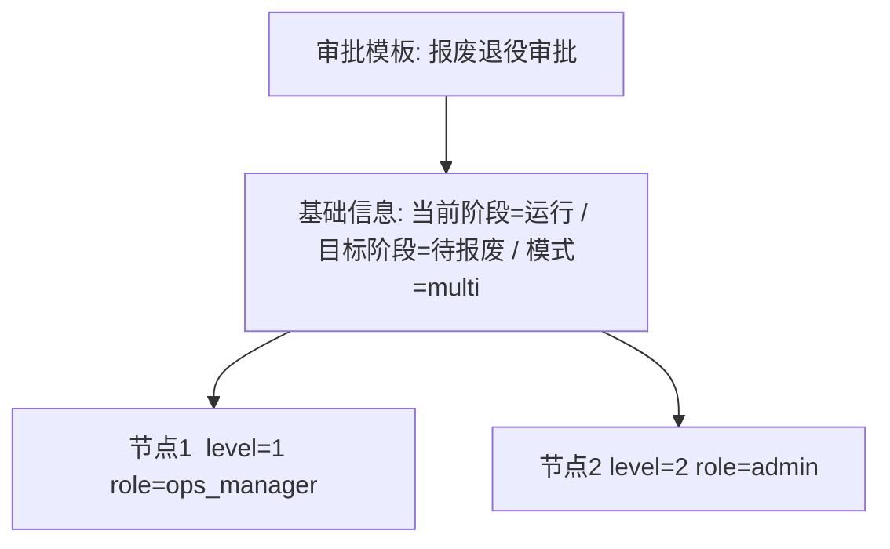

# 产品需求文档（PRD）：IT 资产全生命周期管理系统 v3.0.0 — 审批流引擎改造

- **文档版本**：v1.0（简单版，不含竞品分析）
- **作者**：许清楚（产品经理）
- **适用范围**：阶段 1（审批模板数据库化） + 阶段 2（通用运行时解释器）
- **相关代码**：`backend/approval.py`、`backend/constants.py`（APPROVAL_CHAIN_CONFIG）、`backend/database.py`、`backend/main.py`

---

## 0. 文档范围与边界

| 项目 | 说明 |
| --- | --- |
| 本期做 | 阶段 1：审批模板数据库化；阶段 2：通用运行时解释器 |
| 本期不做 | 阶段 3：会签 AND / 或签 OR / 条件网关 / 超时升级 / 前端可视化拖拽设计器（见 §4，仅列名不展开） |
| 对外契约 | 现有 20+ 个 `/api/approval-*` 端点的输入输出、权限、错误码保持不变；前端 SPA 本期零改动 |
| 行为基线 | 改造后新建审批单的步骤、级别、阶段驱动、通知、审计**与现状完全一致** |

---

## 1. 产品目标

当前 8 类审批的审批链（节点数量、审批人角色、阶段映射、单级/多级模式）**硬编码**在 `backend/constants.py` 的 `APPROVAL_CHAIN_CONFIG` 字典中。任何审批规则调整（如增减审批节点、更换审批角色、修改目标阶段、切换单级/多级）都必须改代码 → 提交 → 发版 → 重启后端。运维场景下审批规则随组织架构调整、合规要求变化、岗位职责重划而**频繁变动**，硬编码模式导致规则响应慢、变更风险高（每次都是代码级改动），且非研发人员无法自助调整。

本期目标：把审批定义从「代码」迁到「数据库 + 后台可配置」，并引入运行时解释器按模板推进审批步骤，使业务侧可在后台自助增删改审批节点/角色/阶段，**无需改代码、无需重启服务**即对新发起的审批生效；同时严格保持与现状一致的对外行为、交互与数据模型，不引入破坏性变更。

---

## 2. 用户故事

- **US-1**：作为**系统管理员**，我希望在后台配置/编辑每类审批的节点与审批人角色，以便随时调整审批规则而无需研发发版。
- **US-2**：作为**运维主管/工程师**，我希望发起审批时系统按后台最新配置自动生成审批步骤，以便在规则变更后新发起的审批自动沿用最新规则。
- **US-3**：作为**审批人（ops_manager / admin）**，我希望在「我的待办」中看到待我审批的单据并正常审批/驳回，以便日常审批体验与现状一致、零学习成本。
- **US-4**：作为**运维工程师**，我登记 P1/P2 故障或把资产移出「报废」类别时，审批单仍需被自动创建并提交，以便关键风险操作不漏审。
- **US-5**：作为**系统管理员**，我希望查看每类审批模板的当前生效配置，以便审计与核对线上实际运行的审批规则。

---

## 3. 需求池

### 3.1 P0 — 本期必须（硬性交付）

| 编号 | 描述 | 验收标准 |
| --- | --- | --- |
| **P0-1** | **模板数据模型**：新增 `WorkflowTemplate` 表（或等价结构），覆盖现状 `APPROVAL_CHAIN_CONFIG` 全部语义：`approval_type`（唯一）、`approval_type_name`、`current_stage`、`target_stage`、`mode`（single/multi）、`chain`（节点列表，每节点含 `level` + `role`），以及启用状态/备注等运维字段。 | ① 该表在数据库中可建、可 CRUD；② 字段足以完整表达全部 8 类现有配置；③ `approval_type` 与 `ApprovalRequest.approval_type` 取值对齐。 |
| **P0-2** | **8 类审批迁移**：将 `APPROVAL_CHAIN_CONFIG` 中 8 类定义（采购立项 / 验收确认 / 故障降级 / 变更迁移 / 维保续保 / 报废退役 / 资产移入 / 资产移出）全量写入 `WorkflowTemplate`，作为系统初始模板，与现有枚举 `APPROVAL_TYPES`、`APPROVAL_TYPE_NAMES` 一一对应。 | ① 8 类模板均入库；② 迁移后新建审批单生成的步骤与现状逐条一致（可用历史数据比对验证）；③ 故障降级的 `current_stage="*"` 被正确保留。 |
| **P0-3** | **通用解释器替换硬编码**：新写 `WorkflowEngine`，在运行时读取 `WorkflowTemplate`，按节点推进审批步骤，替换 `approval.py` 中 `create_approval_steps` 按 `APPROVAL_CHAIN_CONFIG` 硬生成步骤的逻辑；`process_approval_action` 中按 `mode`（single/multi）决定的单级/多级推进同样改为读模板。 | ① 不再从 `APPROVAL_CHAIN_CONFIG` 读取步骤定义；② 新发起审批的步骤、级别、最终阶段驱动与现状一致；③ 复用现有状态机、通知、审计、阶段门禁（`submit_approval` 逻辑）。 |
| **P0-4** | **自动触发类仍需工作**：`auto_submit_fault_approval` / `outbound_retirement_auto_submit` 在登记 P1/P2 故障、移出「报废」时仍自动建单并提交，且其步骤生成也走新解释器（读模板）。 | ① 故障/移出自动审批流与现状行为一致；② 步骤按模板生成；③ 跳过阶段门禁检查的逻辑保留（`skip_gate_types`）。 |
| **P0-5** | **现有 API 行为不变**：20+ 个 `/api/approval-*` 端点（创建/提交/审批动作/撤回/重提/统计/我的待办/通知/配置查询等）的输入输出契约、权限（`require_permission`）、错误码保持不变。 | ① 前端 `index.html` SPA 无需改动即可正常工作；② 核心端点有回归测试覆盖；③ `/api/approval-config/types`、`/api/approval-config/dropdowns` 返回内容与现状等价。 |
| **P0-6** | **后台「审批模板管理」页面**：新增后台管理页，包含模板列表（8 类 + 状态）+ 模板查看 + 编辑节点/审批人角色（抽屉式）。仅 `admin` 可访问。 | ① 可查看全部模板；② 可在后台修改节点 `role`、增删节点、改 `mode`/`target_stage`（在待确认范围内）；③ 保存后即时对新发起审批生效。 |
| **P0-7** | **配置查询/校验数据源切换**：`/api/approval-config/types` 及 `main.py` 创建审批单时读取的 `current_stage` 阶段校验逻辑，改为读取 `WorkflowTemplate` 而非 `APPROVAL_CHAIN_CONFIG`（含 `current_stage="*"` 的任意活跃阶段判定）。 | ① 前端下拉/类型配置展示与后台模板一致；② 阶段校验与现状等价（含故障降级的多阶段允许逻辑）。 |

### 3.2 P1 — 重要但可妥协

| 编号 | 描述 | 验收标准 |
| --- | --- | --- |
| **P1-1** | **模板启用/停用开关**：每个模板可启用/停用；停用后该类审批不可发起（或明确提示）。 | 停用后创建该类审批单被拒并给出明确提示。 |
| **P1-2** | **模板编辑审计日志**：对模板的增删改记录到 `AuditLog`。 | 任何模板变更在审计日志可追溯（谁/何时/改了什么）。 |
| **P1-3** | **数据初始化/迁移脚本**：提供一次性迁移脚本或启动时 seed，确保存量库也能生成模板且幂等。 | 旧库升级后模板存在且正确；脚本可重复执行不报错。 |

### 3.3 P2 — 可选增强

| 编号 | 描述 | 验收标准 |
| --- | --- | --- |
| **P2-1** | **模板「复制为新类型」**：基于已有模板快速复制并改造成新审批类型。 | 复制后生成独立模板，可改。 |
| **P2-2** | **模板配置导入/导出（JSON）**：支持导出/导入模板配置，便于多环境同步。 | JSON 往返一致、可还原。 |

---

## 4. 后续规划 / Out of Scope（阶段 3，本期不做）

> 仅列出名称，不展开设计。数据模型可预留扩展位，但本期不实现。

- 会签 **AND** / 或签 **OR** 多审批人节点
- 条件网关（按资产属性 / 金额 / 类别分支）
- 超时升级 / 自动流转
- 前端可视化拖拽流程设计器

---

## 5. UI 设计稿（文字 + Mermaid，不出图）

### 5.1 审批模板管理列表页

- **入口**：后台导航「审批模板」菜单。
- **布局**：顶部标题 + 说明文案（"审批规则由后台配置，修改即时对新发起审批生效"）；下方表格。
- **表格字段**：`审批类型编码` | `审批类型名称` | `当前阶段` | `目标阶段` | `模式（单级/多级）` | `节点数` | `状态（启用/停用）` | `操作（查看 / 编辑）`。
- **权限**：仅 `admin` 可见与可操作。

### 5.2 模板编辑抽屉（Drawer）

从列表点「编辑」侧滑出抽屉（不改路由，不跳转整页）：

- **头部**：审批类型名称（是否允许改类型本身见 §6-Q1）+ 启用/停用切换。
- **基础区**：`当前阶段`（下拉自 `LIFECYCLE_STAGES`，或 `*` 表示任意活跃阶段，仅故障降级可用）| `目标阶段`（下拉）| `模式`（single / multi 单选）。
- **节点列表**：每行 = `级别 level`（自动编号）+ `审批人角色 role`（下拉取自 `roles` 表）+ 删除按钮；底部「新增节点」。
- **底部**：`保存` / `取消`。保存即写库，对新发起审批生效。

### 5.3 发起审批时选择模板的交互

- 现状：前端「发起审批」表单直接选 `approval_type`，后端按配置生成步骤。
- 改造后：`approval_type` 的选择与表单**保持不变**，仅后端步骤生成改读 `WorkflowTemplate`。
- **结论：本期前端 SPA 零改动**（显式「选模板」交互可作为 P2，不在本期）。

### 5.4 Mermaid — 模板编辑抽屉节点结构示意

> 说明：该图仅示意「模板 → 基础信息 + 节点」的数据结构，非流程流转逻辑。

---

## 6. 待确认问题（需用户 / 架构师拍板）

1. **类型可变性**：模板编辑是否允许修改「审批类型本身」（`approval_type` 编码/名称），还是类型固定、仅可编辑节点/阶段/角色？→ 影响列表页是否开放类型编辑。
2. **版本管理**：模板是否需要版本管理（编辑保留历史版本、可回滚）？本期还是下期？
3. **进行中实例**：编辑模板是否影响「进行中」的审批实例？建议：仅对新发起审批生效，进行中实例沿用提交时的快照/旧模板。需确认。
4. **审批人规则**：除「按角色自动指派」（取该角色下首个 active 用户）外，本期是否需支持「指定具体人」固化到模板？（注：`submit` 时手动 `approver_ids` 覆盖已存在，问题仅在是否要作为模板可配项。）
5. **multi 语义**：模板的 `multi` 模式是否严格等同现状（按 `chain` 顺序逐级、全部通过才最终 approve）？确认本期解释器不含并行会签（会签属阶段 3）。
6. **`current_stage="*"` UI**：仅故障降级使用「任意活跃阶段」，模板编辑 UI 是否对其它类型隐藏/禁用该选项？
7. **旧配置归宿**：迁移后 `constants.py` 的 `APPROVAL_CHAIN_CONFIG` 是否彻底移除，还是保留为 fallback？建议移除，由 `WorkflowEngine` 单一数据源。
8. **权限粒度**：模板管理页仅 `admin` 可访问，是否需要更细粒度（如运维主管也可编辑某几类）？

---

## 7. 关联事实索引（供架构师参考，非 PRD 正文）

| 现状代码点 | 改造后预期 |
| --- | --- |
| `constants.py` `APPROVAL_CHAIN_CONFIG`（8 类） | 迁移至 `WorkflowTemplate` 表；`constants.py` 不再作为步骤数据源 |
| `approval.py` `create_approval_steps`（读 config 硬生成步骤） | 由 `WorkflowEngine` 读模板实现 |
| `approval.py` `process_approval_action`（读 `config["mode"]` 决定单/多级） | 由 `WorkflowEngine` 读模板 `mode` |
| `approval.py` `auto_submit_fault_approval` / `outbound_retirement_auto_submit`（内部调 `submit_approval`） | 步骤生成自动走新解释器 |
| `main.py` `create_approval_request`（L1484 读 config 做阶段校验） | 改读 `WorkflowTemplate` |
| `main.py` `/api/approval-config/types`（L1664 遍历 config） | 改读 `WorkflowTemplate` |
| `database.py` `ApprovalRequest` / `ApprovalStep` / `ApprovalNotification` | **复用，不改动结构** |
